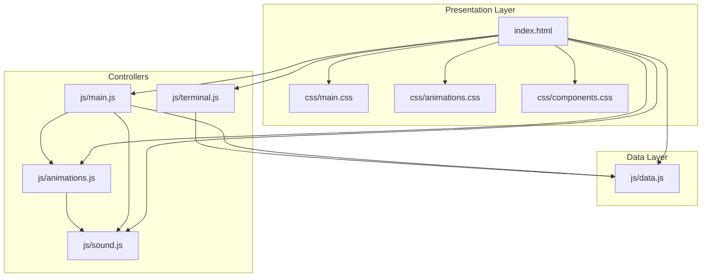
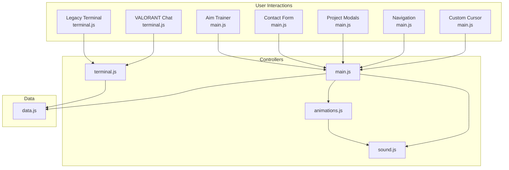
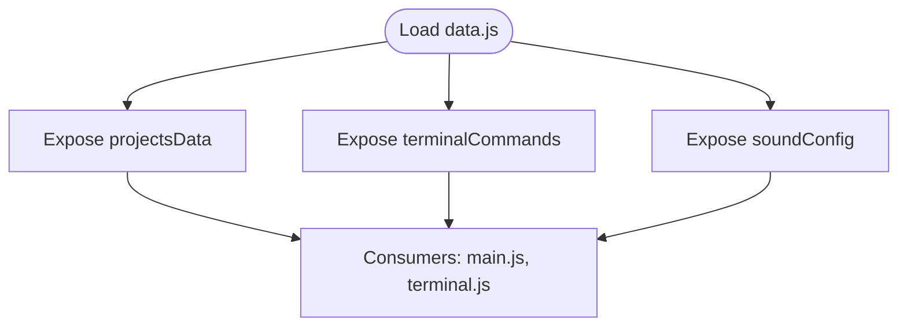
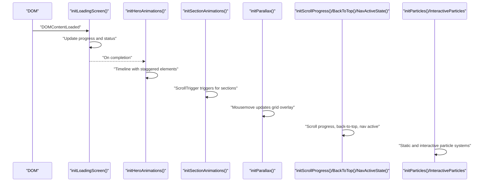
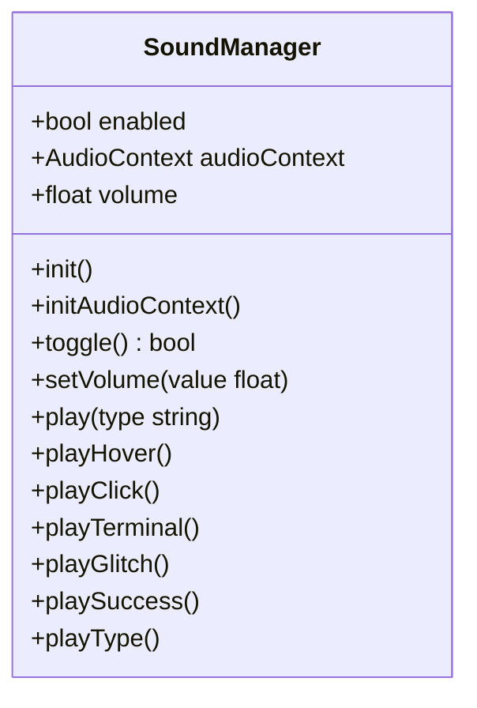
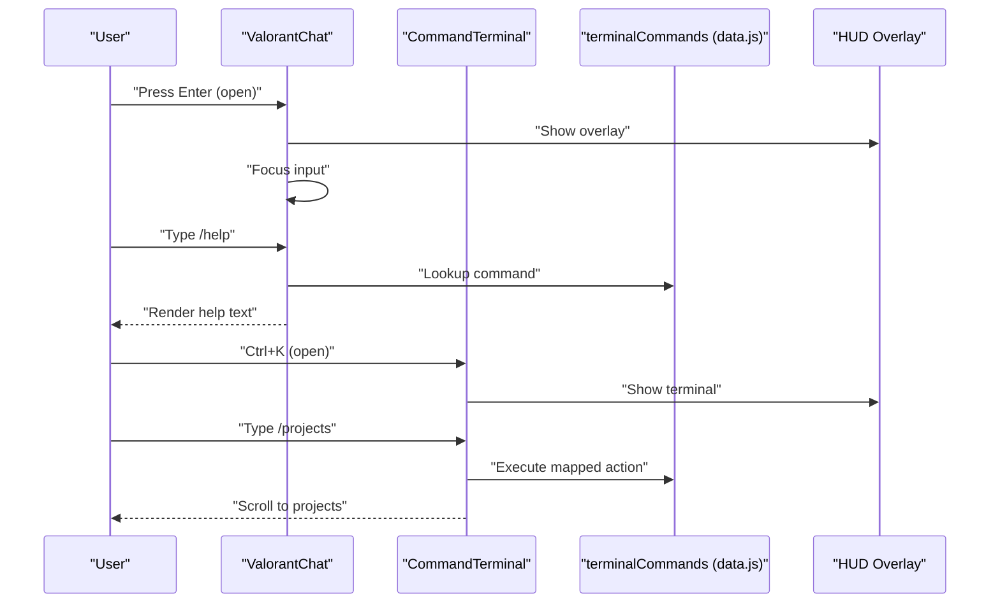
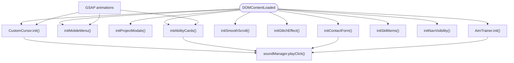
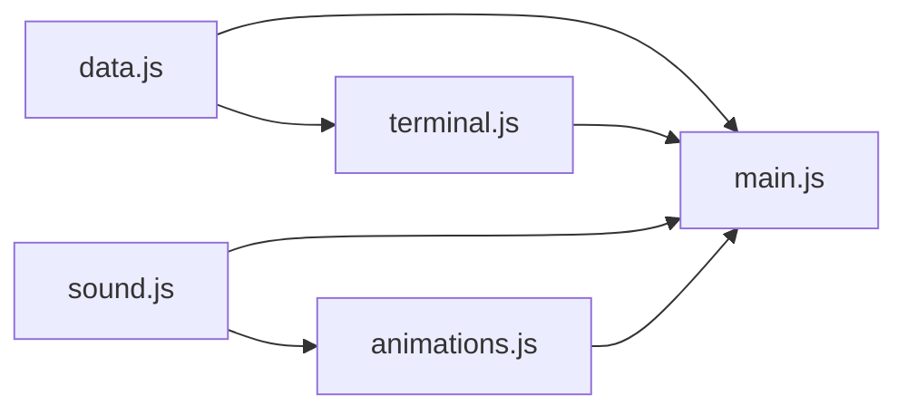

# Architecture Overview

<cite>
**Referenced Files in This Document**
- [index.html](file://portfolio/index.html)
- [data.js](file://portfolio/js/data.js)
- [main.js](file://portfolio/js/main.js)
- [animations.js](file://portfolio/js/animations.js)
- [sound.js](file://portfolio/js/sound.js)
- [terminal.js](file://portfolio/js/terminal.js)
- [main.css](file://portfolio/css/main.css)
- [animations.css](file://portfolio/css/animations.css)
- [components.css](file://portfolio/css/components.css)
</cite>

## Table of Contents
1. [Introduction](#introduction)
2. [Project Structure](#project-structure)
3. [Core Components](#core-components)
4. [Architecture Overview](#architecture-overview)
5. [Detailed Component Analysis](#detailed-component-analysis)
6. [Dependency Analysis](#dependency-analysis)
7. [Performance Considerations](#performance-considerations)
8. [Troubleshooting Guide](#troubleshooting-guide)
9. [Conclusion](#conclusion)

## Introduction
This document presents the architecture of the JAJA Portfolio system, a gaming-inspired interactive portfolio site. It follows a modular JavaScript architecture with event-driven interactions and component-based styling. The system separates concerns across:
- Static data (data.js): centralized configuration and content
- Interactive views (HTML/CSS): presentation and visual components
- Controller logic (JavaScript modules): orchestration of behavior and state

Integration patterns include cursor management, sound effects, terminal chat, and animation controllers. The design philosophy draws from gaming aesthetics (VALORANT theme) to create immersive, responsive experiences with precise feedback loops.

## Project Structure
The project is organized into a clear separation of concerns:
- HTML: page layout, navigation, modals, HUD overlays, and terminal/chat UI
- CSS: theming, components, animations, and visual effects
- JS: modular controllers for data, animations, sound, terminal/chat, and main interactions

**Diagram sources**
- [index.html:1-902](file://portfolio/index.html#L1-L902)
- [data.js:1-165](file://portfolio/js/data.js#L1-L165)
- [main.js:1-1510](file://portfolio/js/main.js#L1-L1510)
- [animations.js:1-774](file://portfolio/js/animations.js#L1-L774)
- [sound.js:1-155](file://portfolio/js/sound.js#L1-L155)
- [terminal.js:1-683](file://portfolio/js/terminal.js#L1-L683)
- [main.css:1-200](file://portfolio/css/main.css#L1-L200)
- [animations.css:1-200](file://portfolio/css/animations.css#L1-L200)
- [components.css:1-200](file://portfolio/css/components.css#L1-L200)

**Section sources**
- [index.html:1-902](file://portfolio/index.html#L1-L902)

## Core Components
- Data module: centralizes project metadata, terminal commands, and sound configurations
- Animation module: orchestrates loading, scroll-triggered reveals, parallax, and interactive particle systems
- Sound module: Web Audio API-based sound manager with volume control and contextual effects
- Terminal module: VALORANT-themed chat and legacy command terminal with command parsing and HUD integration
- Main module: custom cursor, mobile menu, modals, forms, game mechanics, and cross-module integrations

These modules collaborate to deliver a cohesive, event-driven experience with immediate feedback and persistent state across interactions.

**Section sources**
- [data.js:1-165](file://portfolio/js/data.js#L1-L165)
- [animations.js:1-774](file://portfolio/js/animations.js#L1-L774)
- [sound.js:1-155](file://portfolio/js/sound.js#L1-L155)
- [terminal.js:1-683](file://portfolio/js/terminal.js#L1-L683)
- [main.js:1-1510](file://portfolio/js/main.js#L1-L1510)

## Architecture Overview
The system employs a modular, event-driven architecture with clear boundaries:
- MVC-like separation:
  - Model: data.js (static content and configuration)
  - View: index.html + CSS (presentation and components)
  - Controller: js modules (event handling, state transitions, UI updates)
- Cross-cutting concerns:
  - Animation controller: animations.js
  - Sound controller: sound.js
  - Terminal/controller: terminal.js
  - Interaction controller: main.js

External dependencies:
- GSAP: ScrollTrigger and timeline-based animations
- Web Audio API: procedural sound synthesis

**Diagram sources**
- [main.js:1-1510](file://portfolio/js/main.js#L1-L1510)
- [animations.js:1-774](file://portfolio/js/animations.js#L1-L774)
- [sound.js:1-155](file://portfolio/js/sound.js#L1-L155)
- [terminal.js:1-683](file://portfolio/js/terminal.js#L1-L683)
- [data.js:1-165](file://portfolio/js/data.js#L1-L165)

## Detailed Component Analysis

### Data Module (data.js)
- Purpose: Centralized configuration for:
  - Project portfolio entries (metadata, tech stacks, features)
  - Terminal command registry (navigation, system info, helpers)
  - Sound effect profiles (frequency, duration, waveform)
- Integration: Consumed by main.js (modals, forms), terminal.js (legacy terminal), and sound.js (audio profiles)

**Diagram sources**
- [data.js:1-165](file://portfolio/js/data.js#L1-L165)

**Section sources**
- [data.js:1-165](file://portfolio/js/data.js#L1-L165)

### Animation Controller (animations.js)
- Responsibilities:
  - Loading screen with progress stages
  - Hero section reveal with staggered animations
  - Scroll-triggered section reveals and skill bar fills
  - Parallax grid overlay on mousemove
  - Scroll progress bar and back-to-top button
  - Navigation active state tracking
  - Particles and interactive particle canvas
- Dependencies: GSAP (ScrollTrigger, timelines), DOM nodes

**Diagram sources**
- [animations.js:1-774](file://portfolio/js/animations.js#L1-L774)

**Section sources**
- [animations.js:1-774](file://portfolio/js/animations.js#L1-L774)

### Sound Manager (sound.js)
- Responsibilities:
  - Web Audio API initialization on first user interaction
  - Volume control and toggling
  - Contextual sound playback (hover, click, terminal, glitch, success)
  - Typewriter effect for terminal
- Integration: Called by main.js (cursor, bullets, form), animations.js (back-to-top), terminal.js (legacy terminal)

**Diagram sources**
- [sound.js:1-155](file://portfolio/js/sound.js#L1-L155)

**Section sources**
- [sound.js:1-155](file://portfolio/js/sound.js#L1-L155)

### Terminal and Chat Systems (terminal.js)
- VALORANT Chat:
  - Tabs, message history, command routing
  - Channel switching and system messages
  - Open/close via keyboard shortcuts
- Legacy Command Terminal:
  - Command parsing, suggestions, history navigation
  - Typewriter-style output with sound effects
- Integration: Both consume terminal commands from data.js and integrate with HUD overlays

**Diagram sources**
- [terminal.js:1-683](file://portfolio/js/terminal.js#L1-L683)
- [data.js:54-130](file://portfolio/js/data.js#L54-L130)

**Section sources**
- [terminal.js:1-683](file://portfolio/js/terminal.js#L1-L683)
- [data.js:54-130](file://portfolio/js/data.js#L54-L130)

### Main Controller (main.js)
- Responsibilities:
  - Custom cursor with smooth tracking, hover/click effects, recoil animations, and sound feedback
  - Mobile menu with hamburger animation via GSAP
  - Project modals populated from data.js
  - Contact form with VALORANT-style transmit animation and sound cues
  - Smooth scrolling for anchor links
  - Glitch effect on name hover
  - Ability card activation with progress bars, particle bursts, and sound
  - Bullet traces from edges to click positions
  - Skill item hover enhancements
  - Navigation visibility and scroll handling
  - Aim Trainer game: targets, scoring, accuracy, and HUD stats
- Integrations: Uses soundManager, GSAP, and data.js

**Diagram sources**
- [main.js:1-1510](file://portfolio/js/main.js#L1-L1510)

**Section sources**
- [main.js:1-1510](file://portfolio/js/main.js#L1-L1510)

## Dependency Analysis
- Internal dependencies:
  - main.js depends on data.js (projects, commands), sound.js (audio), animations.js (GSAP)
  - animations.js depends on sound.js for UI feedback
  - terminal.js depends on data.js for command registry
- External dependencies:
  - GSAP (ScrollTrigger, timelines)
  - Web Audio API (procedural synthesis)
- No circular dependencies observed among modules.

**Diagram sources**
- [data.js:1-165](file://portfolio/js/data.js#L1-L165)
- [main.js:1-1510](file://portfolio/js/main.js#L1-L1510)
- [animations.js:1-774](file://portfolio/js/animations.js#L1-L774)
- [sound.js:1-155](file://portfolio/js/sound.js#L1-L155)
- [terminal.js:1-683](file://portfolio/js/terminal.js#L1-L683)

**Section sources**
- [main.js:1-1510](file://portfolio/js/main.js#L1-L1510)
- [animations.js:1-774](file://portfolio/js/animations.js#L1-L774)
- [sound.js:1-155](file://portfolio/js/sound.js#L1-L155)
- [terminal.js:1-683](file://portfolio/js/terminal.js#L1-L683)
- [data.js:1-165](file://portfolio/js/data.js#L1-L165)

## Performance Considerations
- Animation performance:
  - Prefer transform/opacity for GPU-accelerated animations
  - Use requestAnimationFrame for cursor and particle updates
  - Limit DOM reads/writes in tight loops
- Event handling:
  - Debounce or throttle scroll events
  - Use passive listeners where possible
- Audio:
  - Initialize AudioContext on first user gesture
  - Avoid excessive concurrent oscillators
- Memory:
  - Clean up intervals and timeouts on component teardown
  - Remove DOM nodes after animations

## Troubleshooting Guide
- Cursor not appearing:
  - Verify touch device detection and pointer media query
  - Ensure GSAP is loaded for recoil animations
- Sounds not playing:
  - Confirm Web Audio API availability and user interaction requirement
  - Check volume and enabled state
- Animations not triggering:
  - Validate GSAP registration and ScrollTrigger availability
  - Confirm DOM elements exist before ScrollTrigger binding
- Terminal/chat not responding:
  - Ensure data.js exports are available
  - Check event listener bindings and overlay visibility

**Section sources**
- [main.js:1-1510](file://portfolio/js/main.js#L1-L1510)
- [sound.js:1-155](file://portfolio/js/sound.js#L1-L155)
- [animations.js:1-774](file://portfolio/js/animations.js#L1-L774)
- [terminal.js:1-683](file://portfolio/js/terminal.js#L1-L683)

## Conclusion
The JAJA Portfolio system demonstrates a cohesive, modular architecture that blends gaming-inspired design with robust interactivity. By separating static data, presentation, and controller logic, and integrating animation and sound controllers, the system achieves responsive, immersive experiences with clear boundaries and maintainable code. The VALORANT aesthetic reinforces the gaming-inspired design philosophy while delivering a professional portfolio experience.