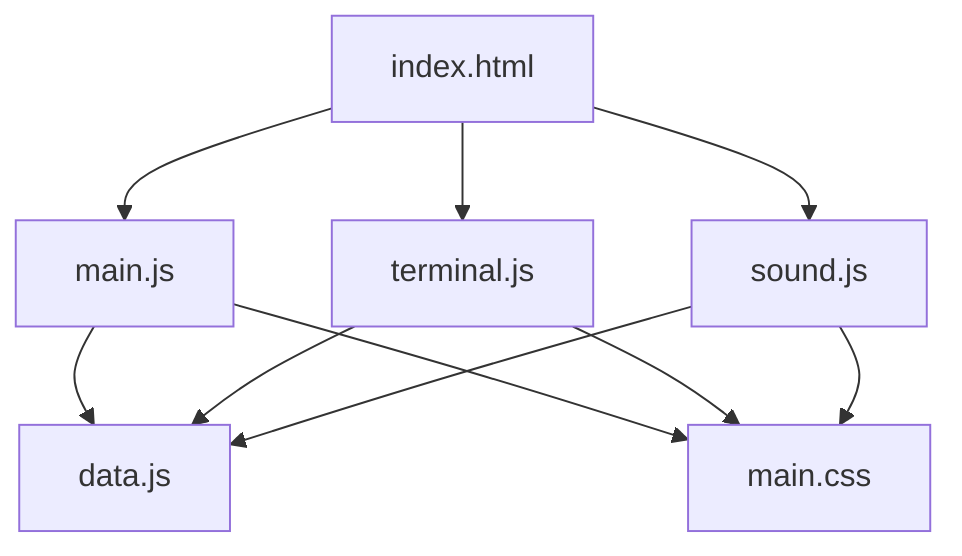
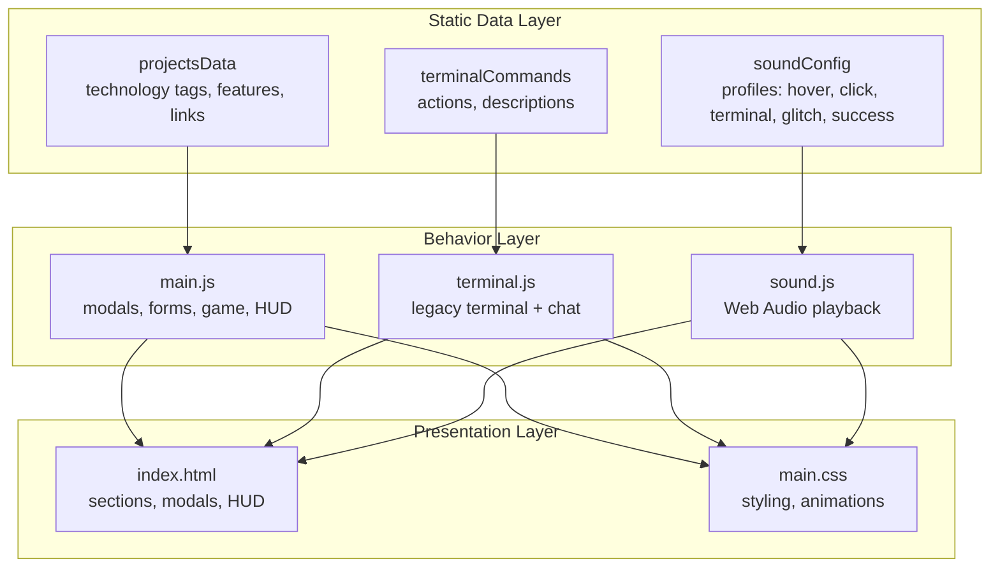
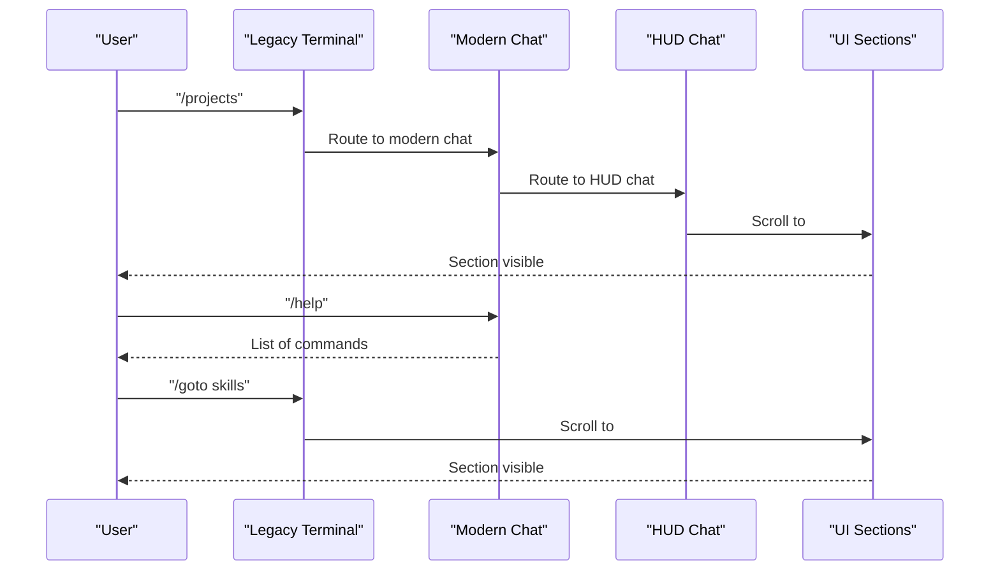
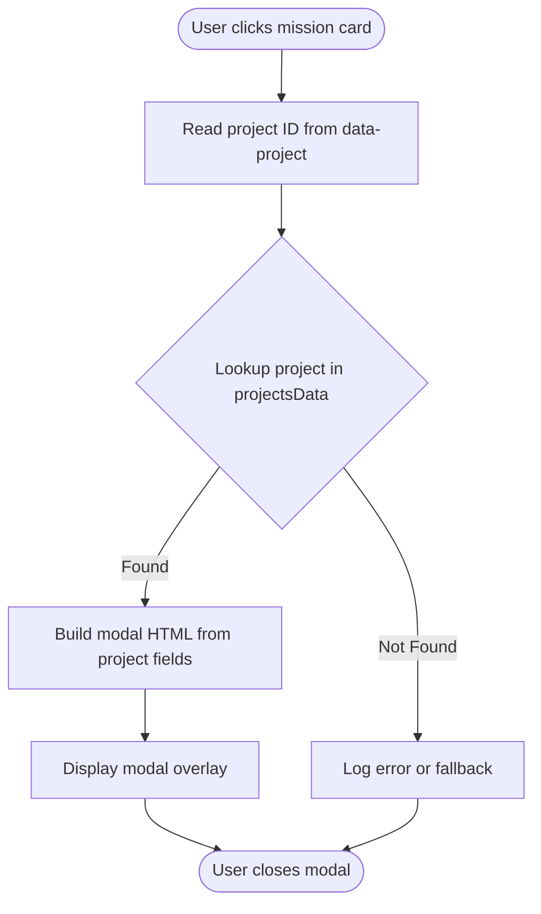
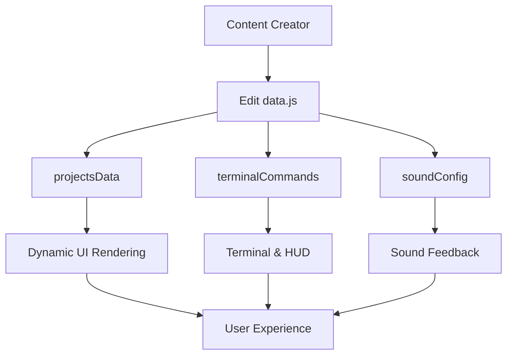
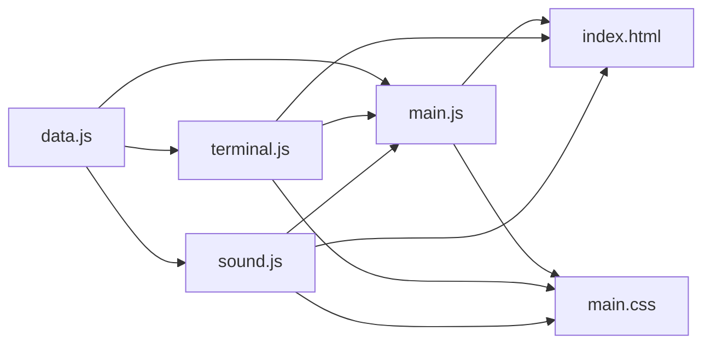

# Content Management

<cite>
**Referenced Files in This Document**
- [data.js](file://portfolio/js/data.js)
- [main.js](file://portfolio/js/main.js)
- [terminal.js](file://portfolio/js/terminal.js)
- [sound.js](file://portfolio/js/sound.js)
- [index.html](file://portfolio/index.html)
- [main.css](file://portfolio/css/main.css)
</cite>

## Table of Contents
1. [Introduction](#introduction)
2. [Project Structure](#project-structure)
3. [Core Components](#core-components)
4. [Architecture Overview](#architecture-overview)
5. [Detailed Component Analysis](#detailed-component-analysis)
6. [Dependency Analysis](#dependency-analysis)
7. [Performance Considerations](#performance-considerations)
8. [Troubleshooting Guide](#troubleshooting-guide)
9. [Conclusion](#conclusion)
10. [Appendices](#appendices)

## Introduction
This document explains the JAJA Portfolio content management system with a focus on the data.js module, terminal command architecture, and static data-driven UI generation. It covers:
- How project data is structured and extended
- How terminal commands are defined and executed
- How sound effects are configured and triggered
- How static content maps to dynamic UI rendering
- Practical examples for adding new projects, commands, and extending the content database
- Best practices for content creators to update the portfolio without touching core logic

## Project Structure
The portfolio is organized around a modular JavaScript architecture with a dedicated data module and several feature modules:
- Data module defines static content and command sets
- Terminal module handles legacy and modern chat/command terminals
- Sound module manages audio feedback
- Main module orchestrates UI interactions and game mechanics
- HTML and CSS define the presentation layer

**Diagram sources**
- [index.html](file://portfolio/index.html)
- [main.js](file://portfolio/js/main.js)
- [terminal.js](file://portfolio/js/terminal.js)
- [sound.js](file://portfolio/js/sound.js)
- [data.js](file://portfolio/js/data.js)
- [main.css](file://portfolio/css/main.css)

**Section sources**
- [index.html](file://portfolio/index.html)
- [main.js](file://portfolio/js/main.js)
- [terminal.js](file://portfolio/js/terminal.js)
- [sound.js](file://portfolio/js/sound.js)
- [data.js](file://portfolio/js/data.js)
- [main.css](file://portfolio/css/main.css)

## Core Components
- Static data module (data.js): Defines projects, terminal commands, and sound configurations
- Terminal system (terminal.js): Provides legacy terminal and modern chat with command parsing
- Sound system (sound.js): Generates Web Audio API tones for UI feedback
- Main orchestration (main.js): Initializes UI interactions, modals, forms, and the Aim Trainer game
- Presentation (index.html + main.css): Renders sections, HUD, and interactive elements

Key responsibilities:
- data.js: Centralized content and command definitions for easy maintenance
- terminal.js: Parses commands, navigates sections, and integrates with the HUD
- sound.js: Manages audio context, volume, and playback of predefined sound profiles
- main.js: Bridges static data to dynamic UI via modal generation, form animations, and game mechanics

**Section sources**
- [data.js](file://portfolio/js/data.js)
- [terminal.js](file://portfolio/js/terminal.js)
- [sound.js](file://portfolio/js/sound.js)
- [main.js](file://portfolio/js/main.js)
- [index.html](file://portfolio/index.html)
- [main.css](file://portfolio/css/main.css)

## Architecture Overview
The system follows a static-data-driven pattern:
- Static data (projects, commands, sound profiles) resides in data.js
- UI components read from data.js to render content dynamically
- Terminal and HUD systems interpret commands and trigger navigation
- Sound system responds to UI events using soundConfig profiles

**Diagram sources**
- [data.js](file://portfolio/js/data.js)
- [terminal.js](file://portfolio/js/terminal.js)
- [sound.js](file://portfolio/js/sound.js)
- [main.js](file://portfolio/js/main.js)
- [index.html](file://portfolio/index.html)
- [main.css](file://portfolio/css/main.css)

## Detailed Component Analysis

### Data Module (data.js)
The data module centralizes three categories:
- projectsData: A keyed collection of project entries with metadata, tech tags, features, and links
- terminalCommands: A keyed collection of command definitions with descriptions and actions
- soundConfig: A keyed collection of sound profiles with frequency, duration, and waveform type

Data schema highlights:
- Project entries include code, title, description, tech tags array, features array, and external links
- Command entries include description and an action function that returns either a message or a special directive
- Sound profiles define audio characteristics for UI feedback

Static data management benefits:
- Easy addition/removal of projects by editing the projectsData object
- Centralized command definitions for consistent behavior across terminals
- Unified sound configuration for cohesive audio feedback

Practical extension examples (conceptual):
- Adding a new project: Insert a new key under projectsData with the required fields
- Adding a new terminal command: Insert a new key under terminalCommands with description and action
- Extending sound effects: Add a new profile under soundConfig with appropriate attributes

**Section sources**
- [data.js](file://portfolio/js/data.js)

### Terminal Command System
Two terminal implementations coexist:
- Legacy terminal (CommandTerminal): Modal overlay with command suggestions, history, and typed output
- Modern chat (ValorantChat): In-app chat with channels and command routing
- HUD chat (MissionProgress): Minimal chat integrated into footer HUD with section navigation

Command architecture:
- Command parsing: Both legacy and modern systems parse command strings and route to handlers
- Navigation: Commands trigger smooth scrolling to target sections
- Help system: Commands list available commands and usage hints
- History: Both support up/down arrow navigation through command history
- Suggestions: Legacy terminal auto-completes command names

**Diagram sources**
- [terminal.js](file://portfolio/js/terminal.js)
- [main.js](file://portfolio/js/main.js)

**Section sources**
- [terminal.js](file://portfolio/js/terminal.js)
- [main.js](file://portfolio/js/main.js)

### Sound Effect Configuration and Playback
The sound system:
- Initializes an AudioContext on first user interaction
- Provides methods to toggle sound, adjust volume, and play predefined profiles
- Triggers sounds for UI interactions (hover, click, terminal, glitch, success)
- Adds typewriter-like typing sounds during terminal output

Sound profiles:
- hover, click, terminal, glitch, success map to frequency, duration, and waveform type
- Typewriter sound is generated dynamically for terminal typing feedback

Integration points:
- UI interactions trigger sound playback
- Terminal output plays typing sounds at intervals
- Game mechanics trigger success/glitch feedback

**Section sources**
- [sound.js](file://portfolio/js/sound.js)
- [data.js](file://portfolio/js/data.js)

### Dynamic UI Generation from Static Data
The main module reads static data to generate dynamic UI:
- Project modals: On clicking a mission card, the modal content is built from projectsData
- Technology tags and feature lists: Rendered dynamically from arrays in project entries
- Navigation: Smooth scroll to sections based on data keys
- HUD integration: Sections and progress are tracked and reflected in the footer HUD

**Diagram sources**
- [main.js](file://portfolio/js/main.js)
- [data.js](file://portfolio/js/data.js)

**Section sources**
- [main.js](file://portfolio/js/main.js)
- [data.js](file://portfolio/js/data.js)

### Conceptual Overview
The portfolio’s content management approach emphasizes separation of concerns:
- Content creators modify data.js to update projects, commands, and sound profiles
- UI remains unchanged, relying on data-driven rendering
- Terminal and HUD systems provide consistent navigation and interaction patterns
- Sound system ensures cohesive audio feedback across interactions

[No sources needed since this diagram shows conceptual workflow, not actual code structure]

[No sources needed since this section doesn't analyze specific source files]

## Dependency Analysis
The following diagram shows how modules depend on each other:

**Diagram sources**
- [data.js](file://portfolio/js/data.js)
- [main.js](file://portfolio/js/main.js)
- [terminal.js](file://portfolio/js/terminal.js)
- [sound.js](file://portfolio/js/sound.js)
- [index.html](file://portfolio/index.html)
- [main.css](file://portfolio/css/main.css)

**Section sources**
- [data.js](file://portfolio/js/data.js)
- [main.js](file://portfolio/js/main.js)
- [terminal.js](file://portfolio/js/terminal.js)
- [sound.js](file://portfolio/js/sound.js)
- [index.html](file://portfolio/index.html)
- [main.css](file://portfolio/css/main.css)

## Performance Considerations
- Static data loading: Keeping data in a single module avoids repeated network requests and simplifies caching
- Event delegation: Using event listeners on containers reduces memory overhead compared to attaching listeners to many individual elements
- Audio context lifecycle: Initializing AudioContext on first user interaction improves perceived performance and meets browser autoplay policies
- DOM updates: Building HTML strings for modals minimizes DOM manipulation overhead; ensure minimal reflows and repaints
- Terminal suggestions: Debouncing or limiting suggestion list length prevents excessive DOM updates

[No sources needed since this section provides general guidance]

## Troubleshooting Guide
Common issues and resolutions:
- Missing project modal content: Verify the mission card’s data-project attribute matches a key in projectsData
- Terminal command not recognized: Ensure the command key exists in terminalCommands and the action returns a message or directive
- Sound not playing: Confirm the sound toggle is enabled and the user has interacted with the page to initialize the AudioContext
- Navigation not working: Check that target section IDs exist in index.html and smooth scroll is supported by the browser
- HUD chat not responding: Ensure the HUD chat input exists and event listeners are attached after DOM ready

**Section sources**
- [main.js](file://portfolio/js/main.js)
- [terminal.js](file://portfolio/js/terminal.js)
- [sound.js](file://portfolio/js/sound.js)
- [index.html](file://portfolio/index.html)

## Conclusion
The JAJA Portfolio employs a clean, static-data-driven architecture that enables content creators to manage projects, commands, and sound effects without touching core UI logic. The terminal and HUD systems provide consistent navigation and interaction patterns, while the sound system delivers immersive feedback. By following the extension examples and best practices outlined here, content creators can efficiently update and customize the portfolio.

[No sources needed since this section summarizes without analyzing specific files]

## Appendices

### Practical Examples

- Adding a new project
  - Insert a new key under projectsData with fields: code, title, description, tech array, features array, github, demo
  - Reference: [data.js](file://portfolio/js/data.js)

- Creating a custom terminal command
  - Add a new key under terminalCommands with description and action function
  - Action can return a message or a special directive (e.g., navigation)
  - Reference: [data.js](file://portfolio/js/data.js), [terminal.js](file://portfolio/js/terminal.js)

- Extending the content database
  - Modify projectsData to include new entries
  - Update terminalCommands to expose navigation or game integration commands
  - Adjust soundConfig to add new audio profiles if needed
  - Reference: [data.js](file://portfolio/js/data.js), [sound.js](file://portfolio/js/sound.js)

- Relationship between static data and dynamic UI
  - projectsData drives modal content generation and technology tag rendering
  - terminalCommands drive navigation and help system behavior
  - soundConfig drives audio feedback across UI interactions
  - Reference: [main.js](file://portfolio/js/main.js), [terminal.js](file://portfolio/js/terminal.js), [sound.js](file://portfolio/js/sound.js), [data.js](file://portfolio/js/data.js)