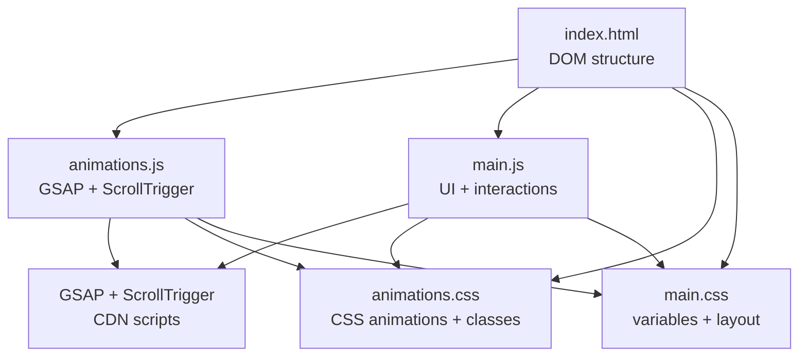
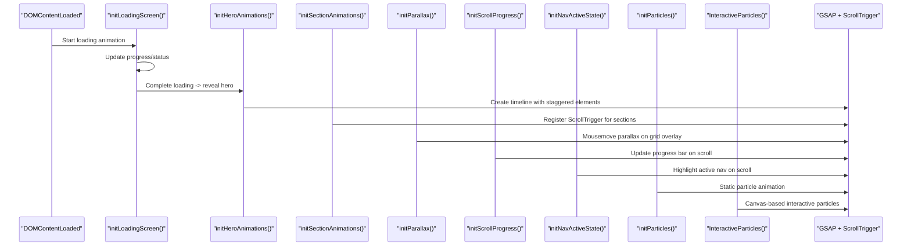
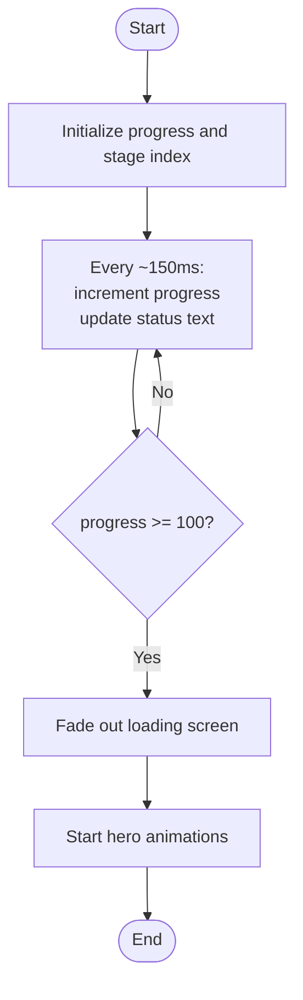
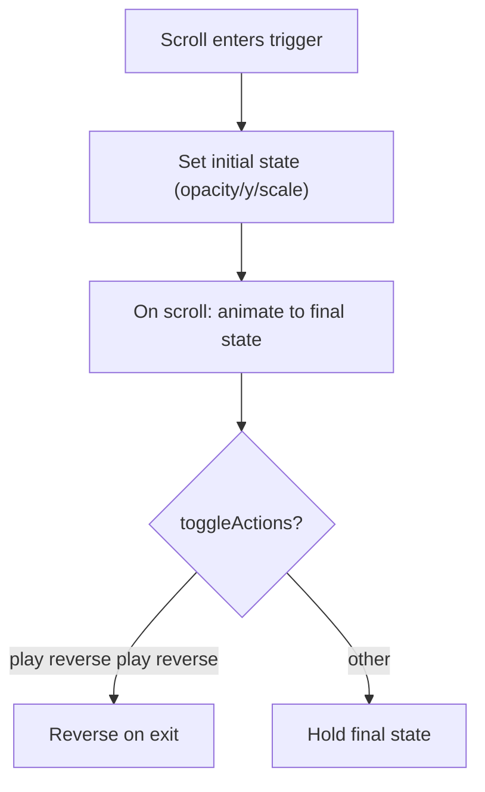
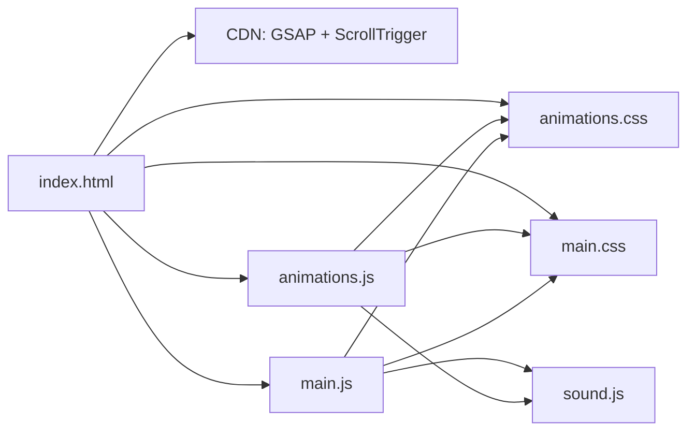

# Animation Controller

<cite>
**Referenced Files in This Document**
- [animations.js](file://portfolio/js/animations.js)
- [main.js](file://portfolio/js/main.js)
- [index.html](file://portfolio/index.html)
- [animations.css](file://portfolio/css/animations.css)
- [main.css](file://portfolio/css/main.css)
- [data.js](file://portfolio/js/data.js)
- [sound.js](file://portfolio/js/sound.js)
</cite>

## Table of Contents
1. [Introduction](#introduction)
2. [Project Structure](#project-structure)
3. [Core Components](#core-components)
4. [Architecture Overview](#architecture-overview)
5. [Detailed Component Analysis](#detailed-component-analysis)
6. [Dependency Analysis](#dependency-analysis)
7. [Performance Considerations](#performance-considerations)
8. [Troubleshooting Guide](#troubleshooting-guide)
9. [Conclusion](#conclusion)
10. [Appendices](#appendices)

## Introduction
This document explains the GSAP-based animation controller and ScrollTrigger integration used in the portfolio site. It covers initialization of GSAP instances, animation timelines, scroll-triggered reveals, and interactive effects. It also documents loading screen animations, section transitions, responsive scaling, browser compatibility, memory management, and debugging strategies.

## Project Structure
The animation system is primarily implemented in JavaScript with complementary CSS for motion primitives and visual effects. HTML provides the DOM structure that animations target.



**Diagram sources**
- [index.html:17-25](file://portfolio/index.html#L17-L25)
- [animations.js:5-6](file://portfolio/js/animations.js#L5-L6)
- [animations.css:1-540](file://portfolio/css/animations.css#L1-L540)
- [main.css:1-200](file://portfolio/css/main.css#L1-L200)

**Section sources**
- [index.html:17-25](file://portfolio/index.html#L17-L25)
- [animations.js:5-6](file://portfolio/js/animations.js#L5-L6)
- [animations.css:1-540](file://portfolio/css/animations.css#L1-L540)
- [main.css:1-200](file://portfolio/css/main.css#L1-L200)

## Core Components
- GSAP registration and ScrollTrigger plugin initialization
- Loading screen animation with animated progress and status text
- Hero section reveal with staggered timeline
- Scroll-triggered section reveals and interactive hover effects
- Parallax grid overlay controlled by mouse movement
- Scroll progress bar and navigation active state updates
- Back-to-top button with smooth scroll
- Particle systems (static and interactive)
- Sound effects synchronized with animations

**Section sources**
- [animations.js:5-6](file://portfolio/js/animations.js#L5-L6)
- [animations.js:8-54](file://portfolio/js/animations.js#L8-L54)
- [animations.js:56-123](file://portfolio/js/animations.js#L56-L123)
- [animations.js:125-501](file://portfolio/js/animations.js#L125-L501)
- [animations.js:503-524](file://portfolio/js/animations.js#L503-L524)
- [animations.js:526-536](file://portfolio/js/animations.js#L526-L536)
- [animations.js:538-556](file://portfolio/js/animations.js#L538-L556)
- [animations.js:582-621](file://portfolio/js/animations.js#L582-L621)
- [animations.js:624-759](file://portfolio/js/animations.js#L624-L759)
- [sound.js:5-101](file://portfolio/js/sound.js#L5-L101)

## Architecture Overview
The animation controller initializes on DOMContentLoaded and orchestrates:
- A loading sequence that unhides the hero after completion
- Scroll-triggered reveals for section headers, cards, grids, and lists
- Interactive hover effects with glow and scaling
- Mouse-follow parallax on the hero grid overlay
- Scroll progress and navigation highlighting
- Particle systems and HUD overlays
- Sound feedback synchronized with UI actions



**Diagram sources**
- [animations.js:762-773](file://portfolio/js/animations.js#L762-L773)
- [animations.js:8-54](file://portfolio/js/animations.js#L8-L54)
- [animations.js:56-123](file://portfolio/js/animations.js#L56-L123)
- [animations.js:125-501](file://portfolio/js/animations.js#L125-L501)
- [animations.js:503-524](file://portfolio/js/animations.js#L503-L524)
- [animations.js:526-536](file://portfolio/js/animations.js#L526-L536)
- [animations.js:558-580](file://portfolio/js/animations.js#L558-L580)
- [animations.js:582-621](file://portfolio/js/animations.js#L582-L621)
- [animations.js:624-759](file://portfolio/js/animations.js#L624-L759)

## Detailed Component Analysis

### GSAP Initialization and Plugin Registration
- Registers ScrollTrigger plugin globally so triggers can be attached to elements.
- Ensures GSAP core and ScrollTrigger are loaded via CDN in the HTML head.

**Section sources**
- [animations.js:5-6](file://portfolio/js/animations.js#L5-L6)
- [index.html:17-19](file://portfolio/index.html#L17-L19)

### Loading Screen Animation
- Progress bar fills with randomized increments until completion.
- Status text cycles through predefined stages.
- On completion, fades out the loading screen and starts hero animations.



**Diagram sources**
- [animations.js:8-54](file://portfolio/js/animations.js#L8-L54)

**Section sources**
- [animations.js:8-54](file://portfolio/js/animations.js#L8-L54)

### Hero Section Reveal Timeline
- Creates a timeline with staggered child animations for tag, name lines, title, tagline, buttons, stats, and scroll indicator.
- Uses easing and overlap timing to create a polished entrance.

```mermaid
sequenceDiagram
participant TL as "Timeline"
participant Tag as ".hero-tag"
participant Name as ".name-line"
participant Title as ".hero-title"
participant Tagline as ".hero-tagline"
participant Btns as ".hero-actions .btn"
participant Stats as ".stat-item"
participant Scroll as ".hero-scroll"
TL->>Tag : fade in from left
TL->>Name : staggered fade in from below
TL->>Title : fade in from below
TL->>Tagline : fade in from below
TL->>Btns : staggered fade in from below
TL->>Stats : staggered fade in from below
TL->>Scroll : fade in
```

**Diagram sources**
- [animations.js:56-123](file://portfolio/js/animations.js#L56-L123)

**Section sources**
- [animations.js:56-123](file://portfolio/js/animations.js#L56-L123)

### Scroll-Based Section Reveal Patterns
- Section headers: reveal children with opacity/y transforms and toggleActions for up/down scroll.
- About card: fade and scale reveal.
- Dossier grid: staggered reveal with subtle x/y offsets.
- Skill categories: staggered reveal with rotateX.
- Skill bars: animated width on enter with glow pulse on completion; percentage counters snap to integer values.
- Hover effects: glow, scale, and shadow enhancements for cards and items.



**Diagram sources**
- [animations.js:125-501](file://portfolio/js/animations.js#L125-L501)

**Section sources**
- [animations.js:125-501](file://portfolio/js/animations.js#L125-L501)

### Interactive Hover Effects
- Skill items: brightness enhancement on hover.
- Ability cards: glow, scale, border color, and icon rotation on hover.
- Mission cards: lift and image zoom on hover.
- Info cards: border and shadow changes.
- Form inputs: glow and border color on focus.

**Section sources**
- [animations.js:251-284](file://portfolio/js/animations.js#L251-L284)
- [animations.js:305-336](file://portfolio/js/animations.js#L305-L336)
- [animations.js:357-394](file://portfolio/js/animations.js#L357-L394)
- [animations.js:460-481](file://portfolio/js/animations.js#L460-L481)
- [animations.js:483-500](file://portfolio/js/animations.js#L483-L500)

### Parallax Grid Overlay
- Mousemove event computes normalized position and translates the grid overlay accordingly.
- Uses power2 easing for smooth follow behavior.

**Section sources**
- [animations.js:503-524](file://portfolio/js/animations.js#L503-L524)

### Scroll Progress and Navigation Highlights
- Scroll progress bar width updates based on scroll percentage.
- Navigation active state toggles based on current section viewport position.

**Section sources**
- [animations.js:526-536](file://portfolio/js/animations.js#L526-L536)
- [animations.js:558-580](file://portfolio/js/animations.js#L558-L580)

### Back-to-Top Button
- Appears when scrolled past threshold; smooth scrolls to top on click.

**Section sources**
- [animations.js:538-556](file://portfolio/js/animations.js#L538-L556)

### Particle Systems
- Static particles: randomly positioned dots with float animation.
- Interactive particles: canvas-based system with mouse proximity attraction and inter-particle connections.

**Section sources**
- [animations.js:582-621](file://portfolio/js/animations.js#L582-L621)
- [animations.js:624-759](file://portfolio/js/animations.js#L624-L759)

### Sound Synchronization
- SoundManager generates short synthetic tones via Web Audio API.
- Sounds triggered on hover, click, terminal actions, glitch, and success events.
- Enabled/disabled via UI toggle; volume configurable.

**Section sources**
- [sound.js:5-101](file://portfolio/js/sound.js#L5-L101)
- [sound.js:103-155](file://portfolio/js/sound.js#L103-L155)
- [main.js:68-109](file://portfolio/js/main.js#L68-L109)
- [main.js:1466-1509](file://portfolio/js/main.js#L1466-L1509)

### Additional UI Animations (non-GSAP)
- Custom cursor with smooth follow and click recoil.
- Mobile menu hamburger animation.
- Contact form transmit animation with status updates.
- Ability card activation with progress bar and particle burst.
- Bullet traces on click and hover effects.

**Section sources**
- [main.js:5-109](file://portfolio/js/main.js#L5-L109)
- [main.js:111-150](file://portfolio/js/main.js#L111-L150)
- [main.js:235-326](file://portfolio/js/main.js#L235-L326)
- [main.js:373-459](file://portfolio/js/main.js#L373-L459)
- [main.js:461-528](file://portfolio/js/main.js#L461-L528)

## Dependency Analysis
- HTML loads GSAP core and ScrollTrigger from CDN.
- animations.js depends on DOM-ready initialization and ScrollTrigger triggers.
- main.js integrates UI interactions with GSAP for cursor, menus, forms, and HUD.
- sound.js provides audio feedback synchronized with animations.
- animations.css defines reusable motion primitives and hover effects.



**Diagram sources**
- [index.html:17-25](file://portfolio/index.html#L17-L25)
- [animations.js:5-6](file://portfolio/js/animations.js#L5-L6)
- [animations.css:1-540](file://portfolio/css/animations.css#L1-L540)
- [main.css:1-200](file://portfolio/css/main.css#L1-L200)
- [sound.js:5-101](file://portfolio/js/sound.js#L5-L101)

**Section sources**
- [index.html:17-25](file://portfolio/index.html#L17-L25)
- [animations.js:5-6](file://portfolio/js/animations.js#L5-L6)
- [animations.css:1-540](file://portfolio/css/animations.css#L1-L540)
- [main.css:1-200](file://portfolio/css/main.css#L1-L200)
- [sound.js:5-101](file://portfolio/js/sound.js#L5-L101)

## Performance Considerations
- Use passive listeners for scroll events to avoid layout thrashing.
- Prefer transform/opacity for GPU-accelerated animations.
- Limit DOM queries inside tight loops; cache selectors.
- Use ScrollTrigger’s built-in throttling and efficient trigger regions.
- Avoid animating heavy elements frequently; prefer lighter proxies or CSS filters.
- Clean up intervals and timeouts when animations complete.
- Consider disabling animations on reduced-motion preferences.

[No sources needed since this section provides general guidance]

## Troubleshooting Guide
- If ScrollTrigger does not activate:
  - Verify plugin registration and that triggers are attached after DOMContentLoaded.
  - Confirm trigger elements exist and are visible in viewport.
- If animations stutter:
  - Reduce stagger count or duration.
  - Use transform/opacity only; avoid layout-affecting properties.
  - Ensure passive listeners for scroll.
- If sound does not play:
  - Ensure AudioContext is initialized on first user gesture.
  - Check browser autoplay policies and enable sound toggle.
- If particle systems lag:
  - Lower particle counts or simplify calculations.
  - Use requestAnimationFrame efficiently and cancel on resize.

**Section sources**
- [animations.js:5-6](file://portfolio/js/animations.js#L5-L6)
- [animations.js:526-536](file://portfolio/js/animations.js#L526-L536)
- [sound.js:13-26](file://portfolio/js/sound.js#L13-L26)

## Conclusion
The animation controller leverages GSAP and ScrollTrigger to deliver a polished, scroll-driven experience with interactive elements, parallax effects, and responsive feedback. By structuring animations as timelines and triggers, and integrating sound and particle systems, the site achieves a cohesive, immersive presentation suitable for a modern portfolio.

[No sources needed since this section summarizes without analyzing specific files]

## Appendices

### Implementation Details and Best Practices
- Responsive animation scaling:
  - Use rem/em units and clamp for fluid sizing.
  - Avoid fixed pixel values for transforms; prefer percentages or viewport-relative units where applicable.
- Browser compatibility:
  - Ensure ES5-compatible syntax for older browsers.
  - Provide fallbacks for unsupported features (e.g., Web Audio API).
- Memory management:
  - Remove event listeners and cancel timers on unmount or page change.
  - Avoid accumulating DOM nodes; reuse or remove transient elements.
- Debugging performance:
  - Use browser DevTools Performance panel to profile animation frames.
  - Monitor ScrollTrigger callbacks and throttle heavy computations.
  - Validate that animations are not running unnecessarily during off-screen states.

[No sources needed since this section provides general guidance]

### Customizing Animation Timing
- Adjust durations and easings in timeline and ScrollTrigger configurations.
- Use stagger values to create wave-like effects across groups.
- Fine-tune trigger start/end positions to control reveal timing.

**Section sources**
- [animations.js:56-123](file://portfolio/js/animations.js#L56-L123)
- [animations.js:125-501](file://portfolio/js/animations.js#L125-L501)

### Creating New Scroll-Triggered Effects
- Wrap initial state in fromTo with ScrollTrigger configuration.
- Use toggleActions to control play/reverse behavior on scroll direction changes.
- For progress-based fills, use onEnter/onLeaveBack to animate numeric properties.

**Section sources**
- [animations.js:205-249](file://portfolio/js/animations.js#L205-L249)
- [animations.js:125-501](file://portfolio/js/animations.js#L125-L501)

### Examples of Customization
- Change easing curves for smoother or punchier motion.
- Modify stagger delays to adjust perceived rhythm.
- Swap ScrollTrigger toggleActions to keep elements visible after scroll.
- Integrate sound effects for hover/click states using SoundManager.

**Section sources**
- [animations.js:125-501](file://portfolio/js/animations.js#L125-L501)
- [sound.js:37-79](file://portfolio/js/sound.js#L37-L79)