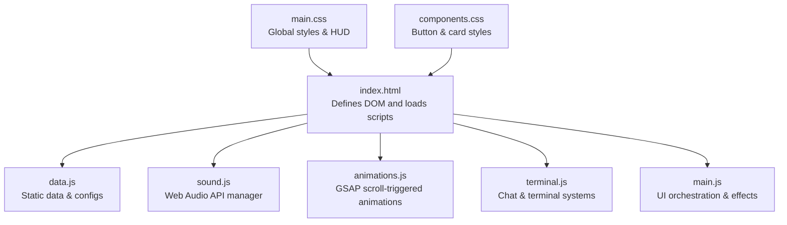
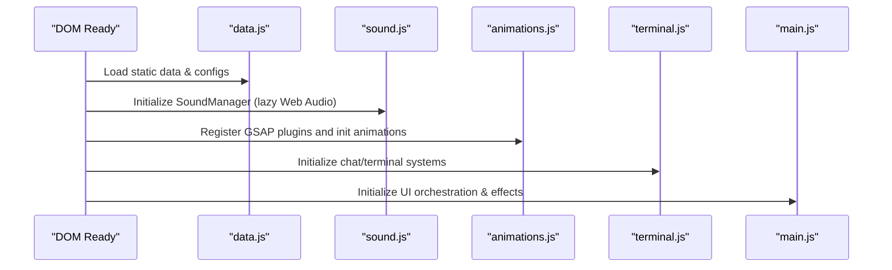
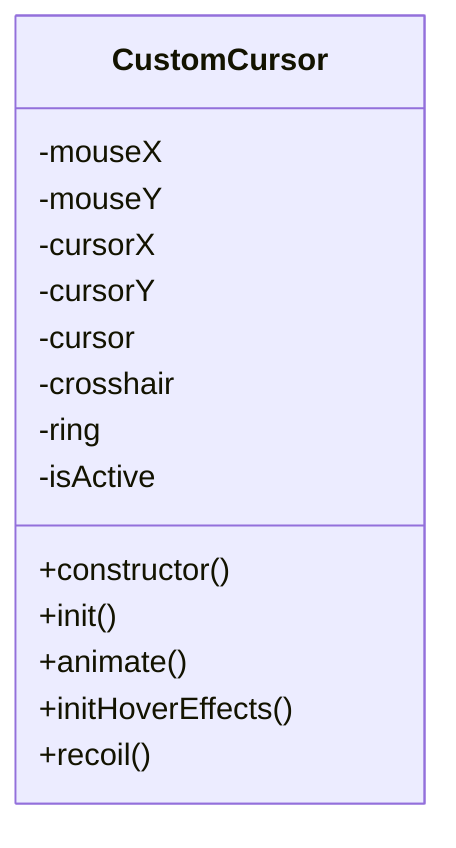
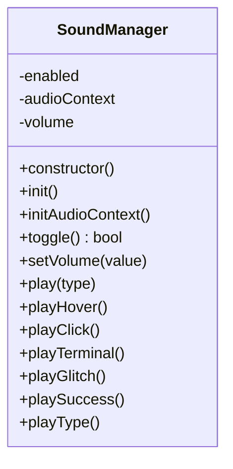
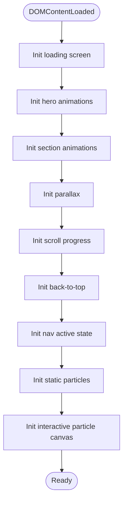
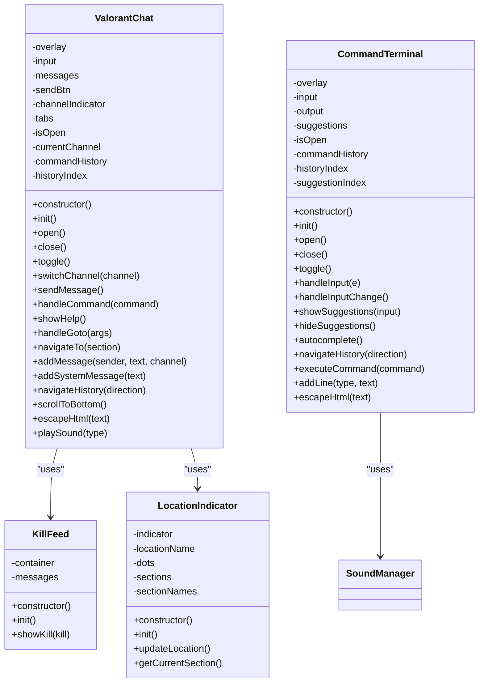
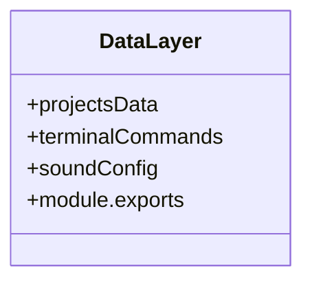
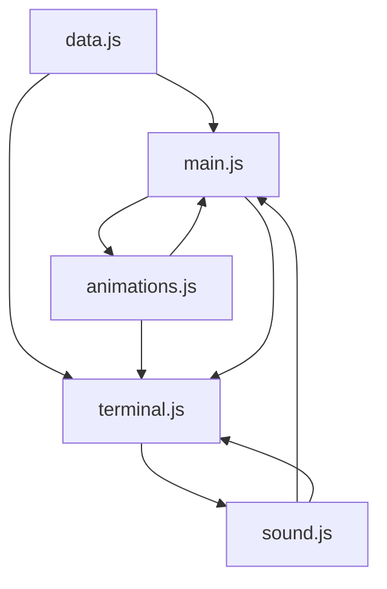

# Core Components

<cite>
**Referenced Files in This Document**
- [index.html](file://portfolio/index.html)
- [main.js](file://portfolio/js/main.js)
- [animations.js](file://portfolio/js/animations.js)
- [sound.js](file://portfolio/js/sound.js)
- [terminal.js](file://portfolio/js/terminal.js)
- [data.js](file://portfolio/js/data.js)
- [main.css](file://portfolio/css/main.css)
- [components.css](file://portfolio/css/components.css)
</cite>

## Table of Contents
1. [Introduction](#introduction)
2. [Project Structure](#project-structure)
3. [Core Components](#core-components)
4. [Architecture Overview](#architecture-overview)
5. [Detailed Component Analysis](#detailed-component-analysis)
6. [Dependency Analysis](#dependency-analysis)
7. [Performance Considerations](#performance-considerations)
8. [Troubleshooting Guide](#troubleshooting-guide)
9. [Conclusion](#conclusion)

## Introduction
This document explains the core components that power the JAJA Portfolio’s immersive, gaming-inspired experience. It focuses on five primary JavaScript modules:
- CustomCursor: Tactical crosshair and mouse interaction system
- SoundManager: Web Audio API integration for precise sound synthesis
- AnimationController (via animations.js): GSAP-based scroll-triggered animations
- ValorantChat terminal system: Command processing and HUD integration
- Data management layer: Static data and configuration for commands and sound

Each component is modular, independently initialized, and integrates through shared DOM hooks and global variables. The document outlines responsibilities, initialization, integration points, configuration options, and usage patterns, with practical interaction examples.

## Project Structure
The portfolio is structured around a single-page application with modular JavaScript modules and a cohesive CSS framework. The HTML defines the DOM structure and loads modules in a specific order to ensure dependencies resolve correctly.

**Diagram sources**
- [index.html:894-899](file://portfolio/index.html#L894-L899)
- [data.js:1-165](file://portfolio/js/data.js#L1-L165)
- [sound.js:1-155](file://portfolio/js/sound.js#L1-L155)
- [animations.js:1-774](file://portfolio/js/animations.js#L1-L774)
- [terminal.js:1-683](file://portfolio/js/terminal.js#L1-L683)
- [main.js:1-1510](file://portfolio/js/main.js#L1-L1510)
- [main.css:1-1173](file://portfolio/css/main.css#L1-L1173)
- [components.css:1-1196](file://portfolio/css/components.css#L1-L1196)

**Section sources**
- [index.html:1-902](file://portfolio/index.html#L1-L902)
- [main.js:1-1510](file://portfolio/js/main.js#L1-L1510)
- [animations.js:1-774](file://portfolio/js/animations.js#L1-L774)
- [sound.js:1-155](file://portfolio/js/sound.js#L1-L155)
- [terminal.js:1-683](file://portfolio/js/terminal.js#L1-L683)
- [data.js:1-165](file://portfolio/js/data.js#L1-L165)
- [main.css:1-1173](file://portfolio/css/main.css#L1-L1173)
- [components.css:1-1196](file://portfolio/css/components.css#L1-L1196)

## Core Components
This section summarizes each component’s role and how it contributes to the overall experience.

- CustomCursor: Provides a smooth, tactical crosshair with hover/click feedback and recoil animations. Integrates with SoundManager for audio cues and GSAP for ring expansion.
- SoundManager: Initializes Web Audio API on first user interaction, exposes volume control, toggles, and multiple sound effect types (hover, click, terminal, glitch, success).
- AnimationController (animations.js): Orchestrates loading screen, hero reveal, scroll-triggered reveals, parallax, scroll progress, back-to-top, navigation active state, particle systems, and interactive particle canvas.
- ValorantChat: Implements a chat overlay with channels, command processing (/help, /goto, /skills, /projects, /contact, /about, /cv, /clear, /aim), kill feed, and location indicator HUD.
- Data management layer: Provides static data for projects, command definitions, and sound configurations. Also exports soundConfig for SoundManager.

**Section sources**
- [main.js:5-109](file://portfolio/js/main.js#L5-L109)
- [sound.js:5-101](file://portfolio/js/sound.js#L5-L101)
- [animations.js:5-774](file://portfolio/js/animations.js#L5-L774)
- [terminal.js:5-267](file://portfolio/js/terminal.js#L5-L267)
- [data.js:5-165](file://portfolio/js/data.js#L5-L165)

## Architecture Overview
The system follows a modular, event-driven architecture:
- Modules initialize on DOMContentLoaded and register event listeners.
- Global variables (e.g., soundManager) enable cross-module communication.
- Shared DOM elements (e.g., HUD overlays, modals) are referenced by multiple components.
- GSAP is used for animations and scroll-triggered effects; Web Audio API powers sound synthesis.

**Diagram sources**
- [index.html:894-899](file://portfolio/index.html#L894-L899)
- [data.js:161-165](file://portfolio/js/data.js#L161-L165)
- [sound.js:103-155](file://portfolio/js/sound.js#L103-L155)
- [animations.js:761-774](file://portfolio/js/animations.js#L761-L774)
- [terminal.js:679-683](file://portfolio/js/terminal.js#L679-L683)
- [main.js:1-1510](file://portfolio/js/main.js#L1-L1510)

## Detailed Component Analysis

### CustomCursor
Responsibilities:
- Track mouse position and render a smooth-following crosshair
- Apply hover and click states with visual feedback
- Trigger recoil animations and ring expansion on click
- Integrate with SoundManager for click and hover sounds
- Deactivate on coarse-pointer devices (touch)

Initialization and lifecycle:
- Constructor selects cursor elements and initializes state
- On init, checks device type and binds mousemove listener
- Starts animation loop using requestAnimationFrame
- Adds hover effects to interactive elements
- Registers mousedown/mouseup to toggle click state and trigger recoil

Integration points:
- Uses GSAP for recoil and ring animations
- Calls soundManager.playClick() on click
- Applies body classes for hover/click states

Configuration options:
- Interpolation factor for smoothness
- Crosshair and ring elements are selected via CSS selectors
- Deactivation on touch devices via media query

Usage patterns:
- Instantiated globally; no explicit export/import required
- Integrates with UI events (buttons, links, ability cards)

**Diagram sources**
- [main.js:6-109](file://portfolio/js/main.js#L6-L109)

**Section sources**
- [main.js:6-109](file://portfolio/js/main.js#L6-L109)
- [main.css:218-301](file://portfolio/css/main.css#L218-L301)

### SoundManager
Responsibilities:
- Initialize Web Audio API on first user interaction
- Provide volume control and toggle
- Play synthesized sound effects with configurable waveforms and durations
- Expose convenience methods for hover, click, terminal, glitch, and success sounds
- Provide a typewriter effect for terminal-like typing

Initialization and lifecycle:
- Constructor sets enabled flag, volume, and registers lazy init on first user interaction
- Audio context is resumed if suspended
- Provides toggle() and setVolume() for runtime control

Integration points:
- Called by CustomCursor, UI interactions, and terminal components
- Updates UI toggle button visuals

Configuration options:
- soundConfig defines waveform type, frequency, and duration per effect
- Volume clamped between 0 and 1

Usage patterns:
- Singleton instance exported as soundManager
- Used throughout main.js for UI feedback and terminal typing

**Diagram sources**
- [sound.js:5-101](file://portfolio/js/sound.js#L5-L101)
- [data.js:133-159](file://portfolio/js/data.js#L133-L159)

**Section sources**
- [sound.js:5-101](file://portfolio/js/sound.js#L5-L101)
- [sound.js:103-155](file://portfolio/js/sound.js#L103-L155)
- [data.js:133-159](file://portfolio/js/data.js#L133-L159)

### AnimationController (animations.js)
Responsibilities:
- Manage loading screen with animated progress and status text
- Animate hero section with staggered entrance and glitch effect
- Implement scroll-triggered animations for sections, cards, and skill bars
- Provide parallax effect on hero section
- Implement scroll progress bar, back-to-top button, navigation active state
- Create particle systems (static and interactive canvas-based)
- Initialize GSAP ScrollTrigger plugin

Initialization and lifecycle:
- Registers GSAP ScrollTrigger plugin
- Initializes loading screen, hero animations, section animations, parallax, scroll progress, back-to-top, navigation active state, and particle systems
- Uses requestAnimationFrame loops for interactive particle animation

Integration points:
- Uses GSAP timeline and ScrollTrigger for animations
- Calls soundManager for UI feedback (e.g., back-to-top)
- Manages HUD overlays and progress bars

Configuration options:
- ScrollTrigger triggers and toggleActions for reveal-on-scroll
- Staggered animations for section headers and skill bars
- Interactive particle count scales with viewport area

Usage patterns:
- Loaded on DOMContentLoaded; orchestrates all visual transitions
- Extensive use of GSAP for timing and easing

**Diagram sources**
- [animations.js:761-774](file://portfolio/js/animations.js#L761-L774)

**Section sources**
- [animations.js:5-774](file://portfolio/js/animations.js#L5-L774)
- [main.css:343-358](file://portfolio/css/main.css#L343-L358)
- [main.css:417-616](file://portfolio/css/main.css#L417-L616)

### ValorantChat Terminal System
Responsibilities:
- Provide a chat overlay with tabs (team, all, party) and message history
- Process commands: /help, /goto [section], /skills, /projects, /contact, /about, /cv, /clear, /aim
- Navigate to sections by ID on scroll
- Maintain command history and support arrow keys for navigation
- Provide a kill feed with randomized entries
- Provide a location indicator HUD showing current section and clickable dots
- Legacy CommandTerminal for backward compatibility with a separate terminal overlay

Initialization and lifecycle:
- ValorantChat: Initializes keyboard shortcuts, send button, tabs, and adds welcome message
- KillFeed: Periodically displays randomized kill messages
- LocationIndicator: Tracks scroll position and updates HUD dots and location text
- CommandTerminal: Handles Ctrl+K toggle, input processing, suggestions, and command execution

Integration points:
- Calls soundManager for UI feedback and typing effects
- Navigates to sections by scrolling to element IDs
- Uses DOM elements for overlay, input, messages, and HUD components

Configuration options:
- Command definitions and descriptions in terminalCommands
- Channel switching and current channel indicator
- Kill feed messages and intervals

Usage patterns:
- Open/close via Enter/Escape or buttons
- Use /goto to jump to sections
- Use /aim to start the Aim Trainer mini-game

**Diagram sources**
- [terminal.js:5-267](file://portfolio/js/terminal.js#L5-L267)
- [terminal.js:269-313](file://portfolio/js/terminal.js#L269-L313)
- [terminal.js:315-385](file://portfolio/js/terminal.js#L315-L385)
- [terminal.js:387-677](file://portfolio/js/terminal.js#L387-L677)

**Section sources**
- [terminal.js:5-267](file://portfolio/js/terminal.js#L5-L267)
- [terminal.js:269-313](file://portfolio/js/terminal.js#L269-L313)
- [terminal.js:315-385](file://portfolio/js/terminal.js#L315-L385)
- [terminal.js:387-677](file://portfolio/js/terminal.js#L387-L677)
- [data.js:54-130](file://portfolio/js/data.js#L54-L130)

### Data Management Layer
Responsibilities:
- Provide static project data for mission cards
- Define terminal command registry with descriptions and actions
- Define sound effect configurations for SoundManager
- Export data for use in other modules

Initialization and lifecycle:
- Declares projectsData, terminalCommands, and soundConfig
- Exports module for Node-like environments

Integration points:
- Used by main.js for modal content and by terminal.js for navigation commands
- Consumed by sound.js for audio effect parameters

Usage patterns:
- Import projectsData for modal rendering
- Reference terminalCommands for command processing
- Access soundConfig for audio synthesis parameters

**Diagram sources**
- [data.js:5-165](file://portfolio/js/data.js#L5-L165)

**Section sources**
- [data.js:5-165](file://portfolio/js/data.js#L5-L165)

## Dependency Analysis
The modules depend on each other through shared DOM elements and global variables. The dependency graph below reflects how components interact during runtime.

**Diagram sources**
- [index.html:894-899](file://portfolio/index.html#L894-L899)
- [data.js:161-165](file://portfolio/js/data.js#L161-L165)
- [main.js:1-1510](file://portfolio/js/main.js#L1-L1510)
- [terminal.js:1-683](file://portfolio/js/terminal.js#L1-L683)
- [animations.js:1-774](file://portfolio/js/animations.js#L1-L774)
- [sound.js:1-155](file://portfolio/js/sound.js#L1-L155)

**Section sources**
- [index.html:894-899](file://portfolio/index.html#L894-L899)
- [data.js:161-165](file://portfolio/js/data.js#L161-L165)
- [main.js:1-1510](file://portfolio/js/main.js#L1-L1510)
- [terminal.js:1-683](file://portfolio/js/terminal.js#L1-L683)
- [animations.js:1-774](file://portfolio/js/animations.js#L1-L774)
- [sound.js:1-155](file://portfolio/js/sound.js#L1-L155)

## Performance Considerations
- CustomCursor uses requestAnimationFrame for smooth interpolation; consider throttling mousemove events on low-power devices.
- SoundManager defers Web Audio context creation until first interaction to satisfy browser autoplay policies.
- animations.js uses GSAP ScrollTrigger for efficient scroll-based animations; ensure ScrollTrigger instances are cleaned up on route changes if applicable.
- Interactive particle canvas dynamically adjusts particle count based on viewport area; consider reducing count on smaller screens.
- ValorantChat maintains command history arrays; cap history length to prevent memory bloat.
- Modal and terminal overlays use z-index stacking; keep DOM depth minimal to reduce paint costs.

[No sources needed since this section provides general guidance]

## Troubleshooting Guide
Common issues and resolutions:
- Web Audio context not playing: Ensure a user gesture occurs before initializing SoundManager. The manager resumes the context on first click or keydown.
- Cursor not visible on mobile: CustomCursor disables itself on coarse-pointer devices; this is expected behavior.
- Scroll animations not triggering: Verify ScrollTrigger is registered and that trigger elements exist in the DOM.
- Terminal commands not recognized: Confirm command strings match terminalCommands keys and that the terminal overlay is present.
- Modal content missing: Ensure projectsData contains the referenced project ID and that the modal overlay exists.

**Section sources**
- [sound.js:13-26](file://portfolio/js/sound.js#L13-L26)
- [main.js:20-30](file://portfolio/js/main.js#L20-L30)
- [animations.js:5-7](file://portfolio/js/animations.js#L5-L7)
- [terminal.js:580-624](file://portfolio/js/terminal.js#L580-L624)
- [data.js:5-52](file://portfolio/js/data.js#L5-L52)

## Conclusion
The JAJA Portfolio’s core components combine precise Web Audio synthesis, smooth cursor mechanics, immersive scroll-triggered animations, and a command-driven terminal to deliver a cohesive, gaming-inspired experience. Their modular design enables independent development and testing while maintaining seamless integration through shared DOM hooks and global variables. By following the documented initialization, configuration, and usage patterns, developers can extend or modify individual components without disrupting the broader system.