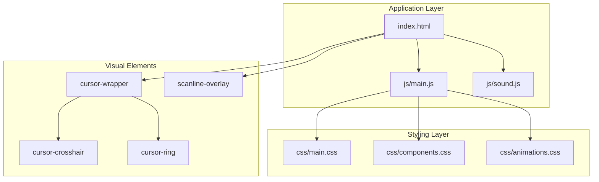
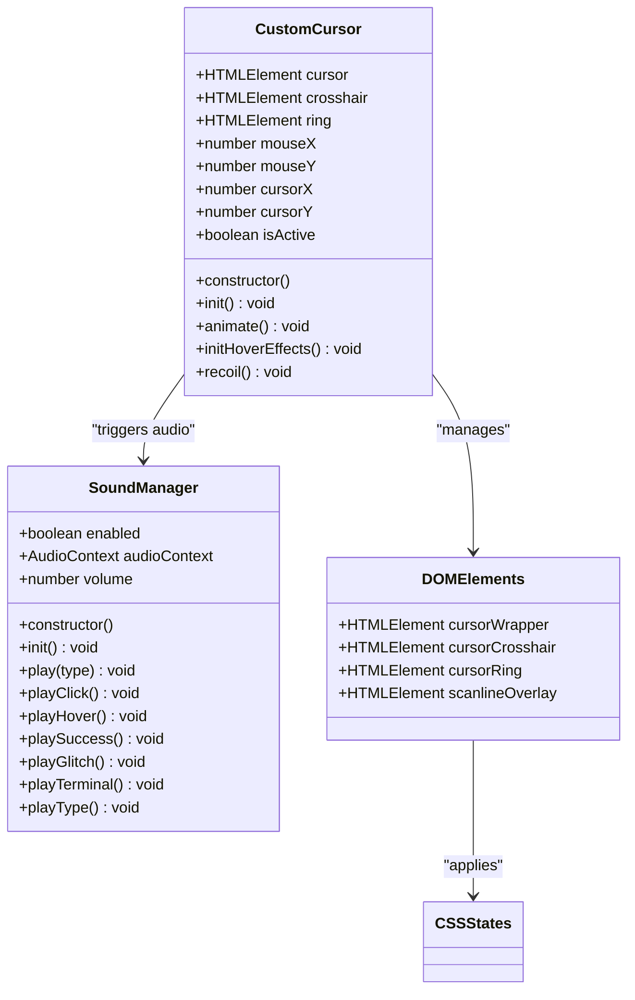
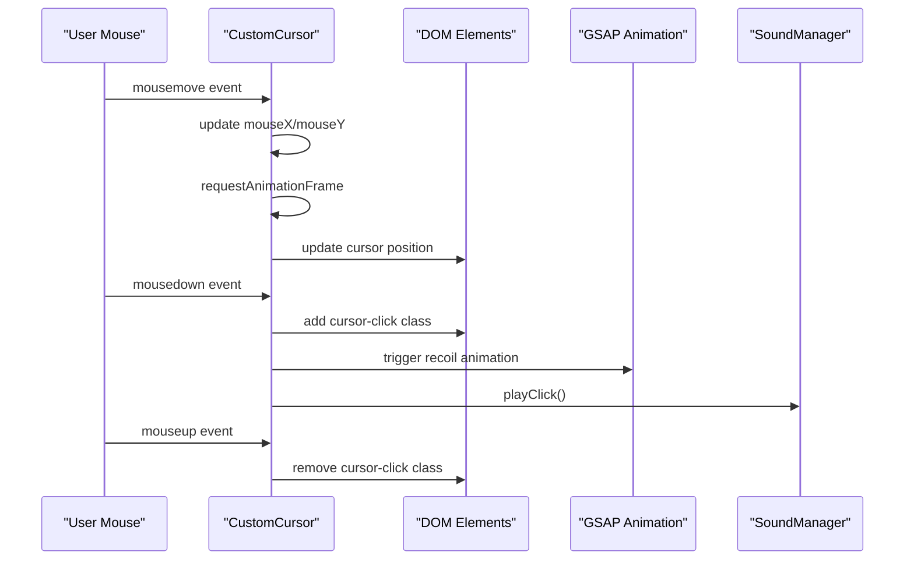
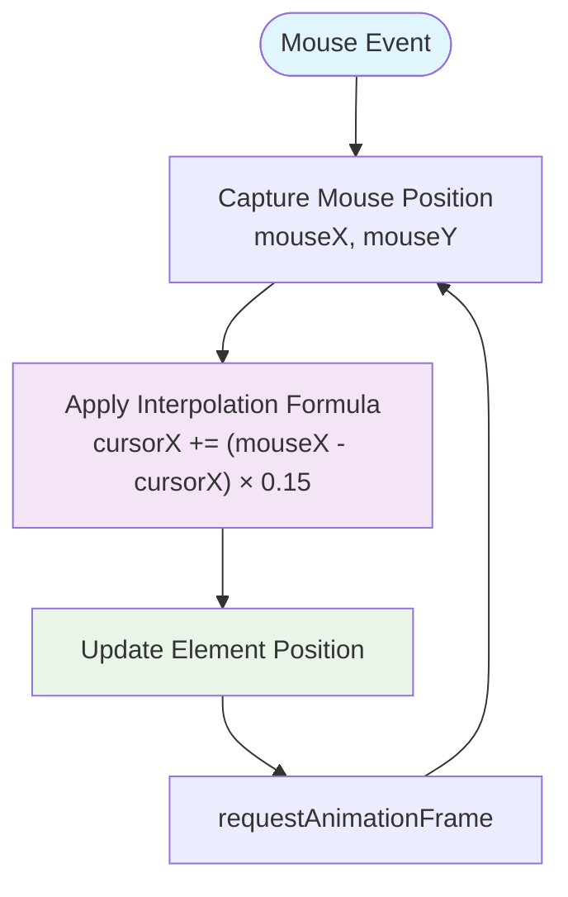
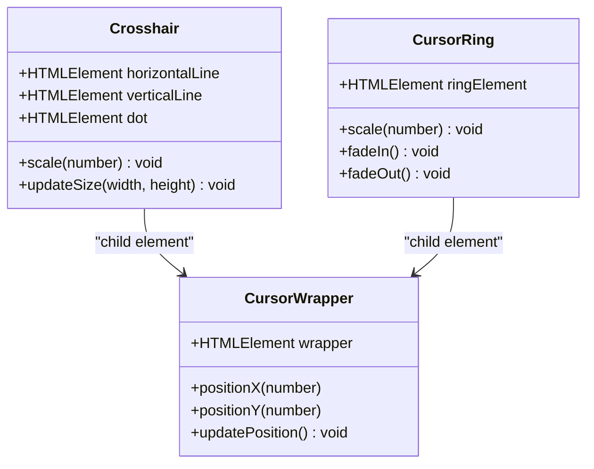
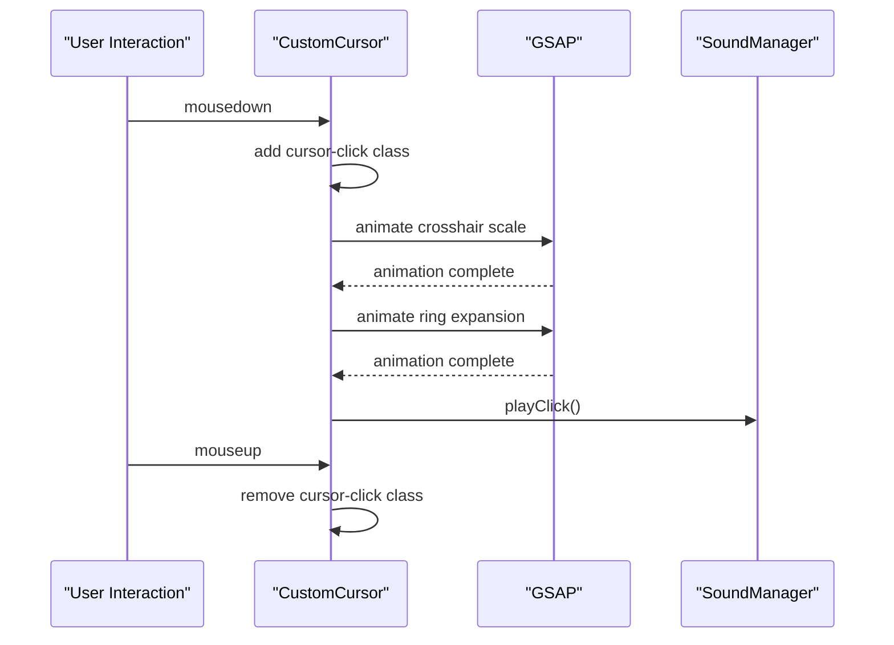
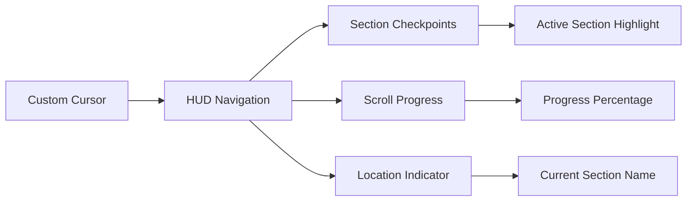
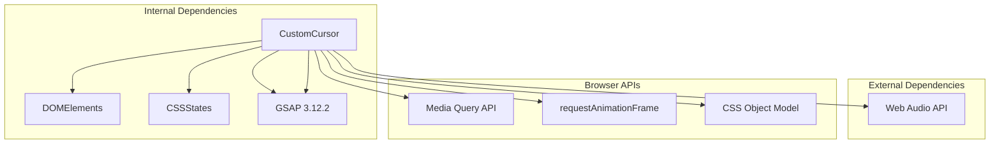

# Custom Cursor System

<cite>
**Referenced Files in This Document**
- [index.html](file://index.html)
- [main.js](file://js/main.js)
- [main.css](file://css/main.css)
- [components.css](file://css/components.css)
- [animations.css](file://css/animations.css)
- [sound.js](file://js/sound.js)
</cite>

## Table of Contents
1. [Introduction](#introduction)
2. [Project Structure](#project-structure)
3. [Core Components](#core-components)
4. [Architecture Overview](#architecture-overview)
5. [Detailed Component Analysis](#detailed-component-analysis)
6. [Dependency Analysis](#dependency-analysis)
7. [Performance Considerations](#performance-considerations)
8. [Troubleshooting Guide](#troubleshooting-guide)
9. [Conclusion](#conclusion)

## Introduction
This document provides comprehensive technical documentation for the Custom Cursor system implemented in the VALORANT-themed portfolio website. The cursor system features a tactical crosshair design with smooth following mechanics, recoil animation effects, and contextual feedback through CSS visual states and Web Audio API integration. The implementation includes touch device compatibility, mobile responsiveness considerations, and seamless integration with section navigation indicators.

## Project Structure
The cursor system is integrated into the main portfolio application with the following key architectural components:

**Diagram sources**
- [index.html:46-54](file://index.html#L46-L54)
- [main.js:6-18](file://js/main.js#L6-L18)
- [main.css:240-306](file://css/main.css#L240-L306)

**Section sources**
- [index.html:27-54](file://index.html#L27-L54)
- [main.js:6-109](file://js/main.js#L6-L109)

## Core Components
The Custom Cursor system consists of several interconnected components that work together to create the tactical cursor experience:

### CustomCursor Class
The primary cursor controller manages mouse tracking, smooth following mechanics, and visual feedback through CSS state classes.

### Tactical Crosshair Design
The crosshair implementation uses a modular design with horizontal and vertical lines combined with a central dot, creating a precise targeting interface reminiscent of tactical gaming aesthetics.

### Smooth Following Mechanics
Advanced interpolation algorithms provide fluid cursor movement with configurable damping factors for optimal responsiveness and visual appeal.

### Recoil Animation Effects
Contextual feedback mechanisms trigger visual animations and audio cues during user interactions, enhancing the immersive experience.

**Section sources**
- [main.js:6-109](file://js/main.js#L6-L109)
- [main.css:240-306](file://css/main.css#L240-L306)

## Architecture Overview
The cursor system follows a layered architecture pattern with clear separation of concerns:

**Diagram sources**
- [main.js:6-109](file://js/main.js#L6-L109)
- [sound.js:5-101](file://js/sound.js#L5-L101)
- [index.html:46-54](file://index.html#L46-L54)

## Detailed Component Analysis

### CustomCursor Class Implementation
The CustomCursor class serves as the central controller for all cursor-related functionality:

**Diagram sources**
- [main.js:31-50](file://js/main.js#L31-L50)
- [main.js:82-108](file://js/main.js#L82-L108)

#### Initialization Process
The cursor initialization process includes device detection, event listener setup, and state management:

1. **Device Compatibility Check**: Uses media queries to detect touch devices and disable cursor functionality
2. **Event Listener Registration**: Sets up mousemove tracking for position updates
3. **Animation Loop**: Establishes smooth interpolation loop using requestAnimationFrame
4. **Hover State Management**: Configures interactive element detection and visual feedback

#### Position Tracking Algorithm
The cursor employs a sophisticated interpolation algorithm for smooth following:

**Diagram sources**
- [main.js:53-66](file://js/main.js#L53-L66)

**Section sources**
- [main.js:6-109](file://js/main.js#L6-L109)

### Tactical Crosshair Design
The crosshair implementation provides a modular, scalable targeting interface:

**Diagram sources**
- [index.html:47-54](file://index.html#L47-L54)
- [main.css:240-278](file://css/main.css#L240-L278)

#### Visual State Management
CSS-based state classes provide dynamic visual feedback:

- **cursor-hover**: Activated when hovering over interactive elements
- **cursor-click**: Triggered during mouse press events
- **Transition Effects**: Smooth animations for state changes

**Section sources**
- [main.css:280-301](file://css/main.css#L280-L301)
- [components.css:280-301](file://css/components.css#L280-L301)

### Smooth Following Mechanics
The cursor movement algorithm implements exponential smoothing for natural feel:

#### Interpolation Parameters
- **Damping Factor**: 0.15 provides smooth yet responsive tracking
- **Frame Rate**: Utilizes requestAnimationFrame for optimal performance
- **Position Updates**: Continuous position calculation without excessive DOM manipulation

#### Performance Optimization
The animation loop minimizes computational overhead through:
- Single requestAnimationFrame per frame
- Efficient property updates
- Conditional rendering based on device capability

**Section sources**
- [main.js:53-66](file://js/main.js#L53-L66)

### Recoil Animation Effects
The recoil system provides immediate visual feedback for user interactions:

**Diagram sources**
- [main.js:43-50](file://js/main.js#L43-L50)
- [main.js:82-108](file://js/main.js#L82-L108)

#### Animation Configuration
The recoil animation uses GSAP for precise control:
- **Crosshair Scale**: Quick 0.7 scale reduction with power2 easing
- **Ring Expansion**: 1.5 scale increase with fade out
- **Timing**: Subtle 0.05-second duration for immediate feedback

**Section sources**
- [main.js:82-108](file://js/main.js#L82-L108)

### Touch Device Compatibility
The system includes comprehensive touch device support:

#### Device Detection
Uses CSS media queries to detect coarse pointer devices:
- **Pointer Detection**: `(pointer: coarse)` media query
- **Automatic Disable**: Cursor functionality disabled on touch devices
- **Fallback Behavior**: Native cursor restoration for mobile devices

#### Mobile Responsiveness
- **Touch Events**: Automatic fallback to native browser cursor
- **Performance**: Prevents unnecessary computation on mobile devices
- **User Experience**: Maintains intuitive navigation on touch interfaces

**Section sources**
- [main.js:20-29](file://js/main.js#L20-L29)

### Integration with Section Navigation Indicators
The cursor system integrates seamlessly with the HUD navigation system:

**Diagram sources**
- [main.js:1090-1172](file://js/main.js#L1090-L1172)

#### Section Navigation Features
The HUD system provides:
- **Real-time Location Tracking**: Current section identification
- **Interactive Checkpoints**: Clickable navigation dots
- **Progress Visualization**: Scroll progress indicator
- **Dynamic Updates**: Live section status changes

**Section sources**
- [main.js:1090-1409](file://js/main.js#L1090-L1409)

## Dependency Analysis
The cursor system maintains loose coupling with minimal external dependencies:

**Diagram sources**
- [main.js:6-109](file://js/main.js#L6-L109)
- [index.html:17-19](file://index.html#L17-L19)

### External Dependencies
- **GSAP**: Advanced animation library for smooth transitions
- **Web Audio API**: Contextual audio feedback system
- **Media Queries**: Device capability detection

### Internal Dependencies
- **DOM Manipulation**: Minimal, efficient element updates
- **CSS Classes**: State management through class toggling
- **Event Listeners**: Clean event handling with proper cleanup

**Section sources**
- [main.js:6-109](file://js/main.js#L6-L109)
- [index.html:17-25](file://index.html#L17-L25)

## Performance Considerations
The cursor system implements several optimization strategies:

### Frame Rate Optimization
- **requestAnimationFrame**: Uses browser-native animation loop
- **Efficient Updates**: Minimizes DOM manipulation frequency
- **Conditional Rendering**: Disables on touch devices to save resources

### Memory Management
- **Event Listener Cleanup**: Proper removal of event handlers
- **Animation Cancellation**: GSAP animation cleanup on component disposal
- **DOM Reference Management**: Efficient element selection and caching

### Computational Efficiency
- **Single Interpolation Pass**: Optimized mathematical calculations
- **CSS Transforms**: Leverages GPU acceleration for positioning
- **Minimal State Changes**: Reduced reflow and repaint cycles

### Battery Life Considerations
- **Intelligent Device Detection**: Prevents unnecessary computation on mobile
- **Efficient Animation**: Optimized GSAP usage for smooth performance
- **Resource Conscious Design**: Minimal impact on system resources

## Troubleshooting Guide

### Common Issues and Solutions

#### Cursor Not Appearing on Mobile Devices
**Symptoms**: Cursor remains hidden on touch devices
**Cause**: Automatic device detection disabling cursor functionality
**Solution**: This is expected behavior for mobile devices

#### Crosshair Animation Not Working
**Symptoms**: Crosshair scale changes but ring expansion fails
**Cause**: GSAP library not loaded or audio context issues
**Solution**: Verify GSAP script inclusion and audio context initialization

#### Performance Issues on Low-End Devices
**Symptoms**: Choppy cursor movement or dropped frames
**Cause**: Excessive DOM manipulation or animation conflicts
**Solution**: Adjust interpolation factor or disable animations

#### Audio Feedback Not Playing
**Symptoms**: No sound during cursor interactions
**Cause**: Browser autoplay restrictions or audio context issues
**Solution**: Trigger audio context on user interaction

**Section sources**
- [main.js:20-29](file://js/main.js#L20-L29)
- [sound.js:13-26](file://js/sound.js#L13-L26)

### Debugging Techniques
1. **Console Logging**: Monitor cursor position updates and state changes
2. **Performance Profiling**: Use browser dev tools to analyze frame rates
3. **Event Listener Inspection**: Verify proper event registration and cleanup
4. **Memory Monitoring**: Check for memory leaks in animation sequences

## Conclusion
The Custom Cursor system represents a sophisticated implementation of interactive UI elements with tactical gaming aesthetics. The system successfully balances visual appeal with performance optimization while maintaining compatibility across different device types. Through careful consideration of smooth following mechanics, contextual feedback systems, and integration with broader UI components, the cursor enhances the overall user experience without compromising performance or accessibility.

The modular architecture ensures maintainability and extensibility, allowing for future enhancements such as customizable cursor themes, advanced animation effects, or additional haptic feedback capabilities. The implementation demonstrates best practices in modern web development, particularly in areas of performance optimization, device compatibility, and user experience design.