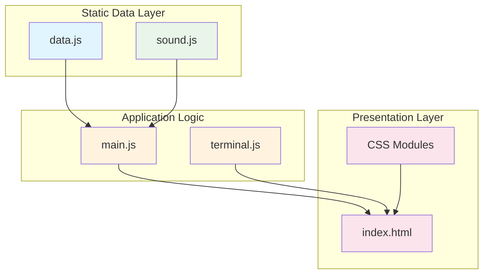
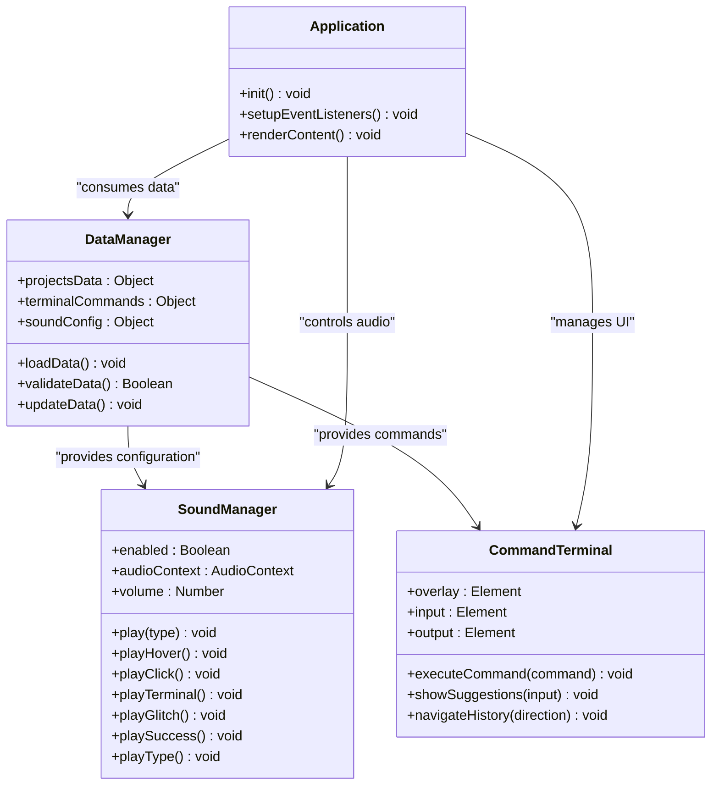
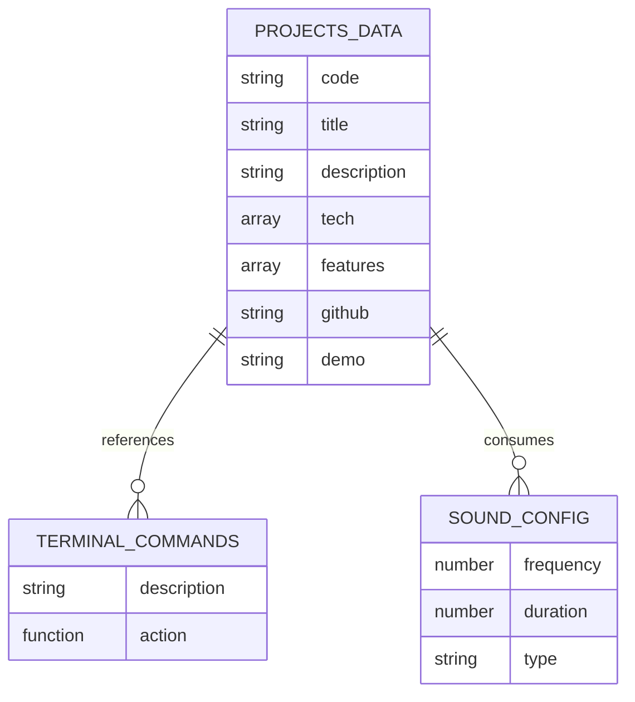
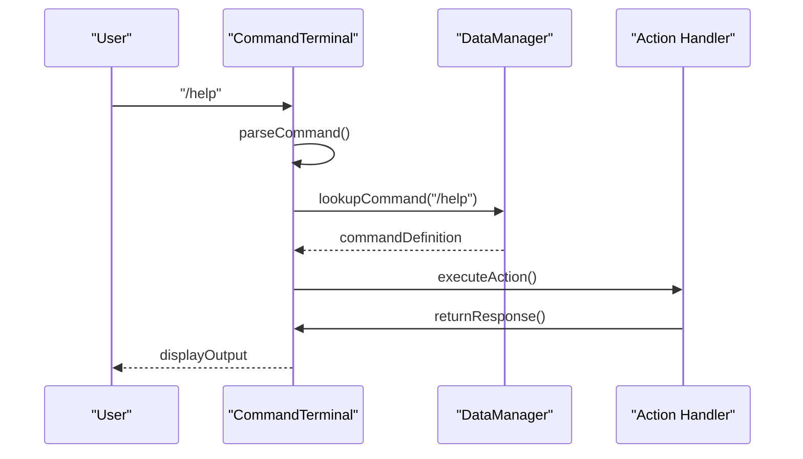
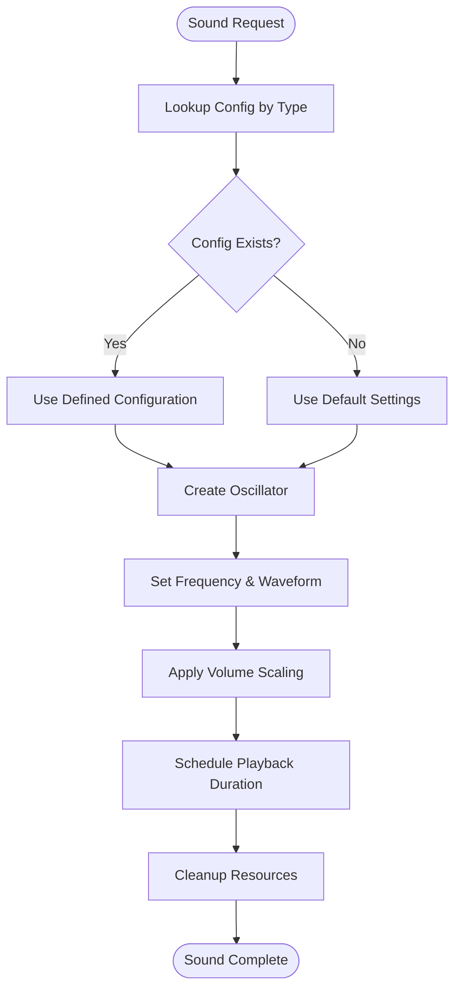
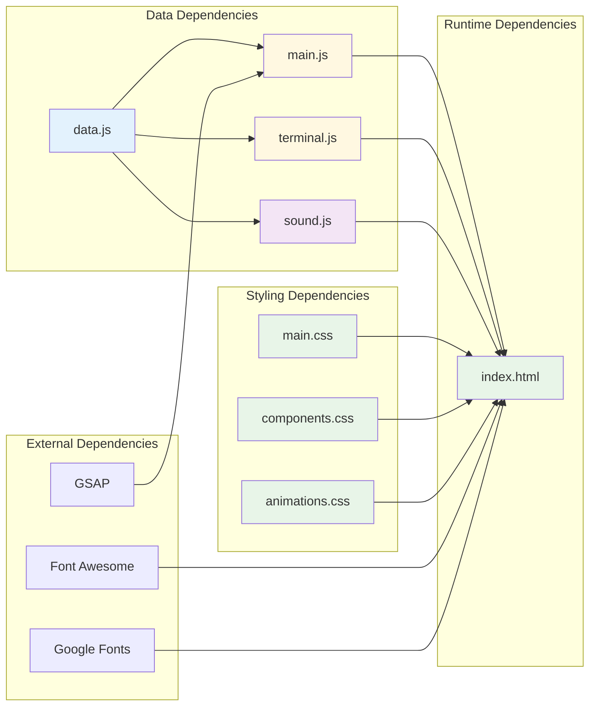

# Data Management Layer

<cite>
**Referenced Files in This Document**
- [data.js](file://portfolio/js/data.js)
- [terminal.js](file://portfolio/js/terminal.js)
- [sound.js](file://portfolio/js/sound.js)
- [main.js](file://portfolio/js/main.js)
- [index.html](file://portfolio/index.html)
- [main.css](file://portfolio/css/main.css)
- [components.css](file://portfolio/css/components.css)
- [animations.css](file://portfolio/css/animations.css)
</cite>

## Table of Contents
1. [Introduction](#introduction)
2. [Project Structure](#project-structure)
3. [Core Components](#core-components)
4. [Architecture Overview](#architecture-overview)
5. [Detailed Component Analysis](#detailed-component-analysis)
6. [Dependency Analysis](#dependency-analysis)
7. [Performance Considerations](#performance-considerations)
8. [Troubleshooting Guide](#troubleshooting-guide)
9. [Conclusion](#conclusion)
10. [Appendices](#appendices)

## Introduction
This document provides comprehensive documentation for the static data management system and configuration layer of the VALORANT-themed portfolio website. The system manages three primary categories of static data: project portfolio information, terminal command definitions, and audio effect configurations. These data structures are organized to support dynamic application functionality while maintaining clear separation between static configuration and runtime behavior.

The data management layer follows a modular architecture where static data is defined in dedicated configuration objects, validated through controlled access patterns, and consumed by various application components. This approach enables easy maintenance, extension, and consistency across the entire application ecosystem.

## Project Structure
The portfolio project is organized around a clear separation of concerns with dedicated modules for data management, user interface interactions, and media playback:

**Diagram sources**
- [data.js:1-165](file://portfolio/js/data.js#L1-L165)
- [sound.js:1-155](file://portfolio/js/sound.js#L1-L155)
- [main.js:1-1510](file://portfolio/js/main.js#L1-L1510)
- [index.html:1-902](file://portfolio/index.html#L1-L902)

**Section sources**
- [data.js:1-165](file://portfolio/js/data.js#L1-L165)
- [index.html:1-902](file://portfolio/index.html#L1-L902)

## Core Components

### Static Data Configuration
The static data layer consists of three primary configuration objects that define the application's content and behavior:

#### Project Portfolio Data
The `projectsData` object serves as the central repository for all project information, containing structured entries for each portfolio piece with standardized properties for consistent rendering across the application.

#### Terminal Command System
The `terminalCommands` object defines the complete command vocabulary available to users, including navigation commands, system utilities, and specialized features. Each command includes both descriptive metadata and executable actions.

#### Audio Configuration System
The `soundConfig` object establishes the complete audio palette for the application, defining frequency characteristics, durations, and waveform types for different sound effects.

**Section sources**
- [data.js:5-52](file://portfolio/js/data.js#L5-L52)
- [data.js:54-130](file://portfolio/js/data.js#L54-L130)
- [data.js:132-159](file://portfolio/js/data.js#L132-L159)

### Data Loading Mechanisms
The application employs a straightforward module-based loading approach where static data is made available globally through module exports. This pattern ensures immediate accessibility across all application components while maintaining encapsulation within the data module.

**Section sources**
- [data.js:161-165](file://portfolio/js/data.js#L161-L165)

### Validation Processes
Data validation occurs through controlled access patterns and type checking within consuming components. The system validates:
- Command existence before execution
- Section availability before navigation
- Project existence before modal rendering
- Audio context initialization before playback

**Section sources**
- [terminal.js:600-615](file://portfolio/js/terminal.js#L600-L615)
- [main.js:164-165](file://portfolio/js/main.js#L164-L165)

## Architecture Overview

**Diagram sources**
- [data.js:1-165](file://portfolio/js/data.js#L1-L165)
- [sound.js:5-101](file://portfolio/js/sound.js#L5-L101)
- [terminal.js:388-677](file://portfolio/js/terminal.js#L388-L677)

The architecture demonstrates clear separation of concerns with the DataManager serving as the central hub for all static configuration, while specialized managers handle specific functionality domains.

## Detailed Component Analysis

### Static Data Organization Patterns

#### Data Structure Organization
The static data follows a hierarchical organization pattern with consistent property definitions across all categories:

**Diagram sources**
- [data.js:6-51](file://portfolio/js/data.js#L6-L51)
- [data.js:55-129](file://portfolio/js/data.js#L55-L129)
- [data.js:133-159](file://portfolio/js/data.js#L133-L159)

#### Property Definitions and Relationships
Each data category maintains consistent property definitions that enable predictable consumption patterns:

**Project Properties:**
- `code`: Unique identifier for project categorization
- `title`: Display name for project presentation
- `description`: Comprehensive project overview
- `tech`: Technology stack representation
- `features`: Key capabilities and functionalities
- `github/demo`: External resource links

**Command Properties:**
- `description`: User-facing command explanation
- `action`: Executable function with side effects

**Audio Properties:**
- `frequency`: Pitch characteristic in Hz
- `duration`: Playback length in milliseconds
- `type`: Waveform type (sine, square, sawtooth)

**Section sources**
- [data.js:6-51](file://portfolio/js/data.js#L6-L51)
- [data.js:55-129](file://portfolio/js/data.js#L55-L129)
- [data.js:133-159](file://portfolio/js/data.js#L133-L159)

### Terminal Command System

#### Command Definition Pattern
The terminal command system implements a consistent definition pattern that separates concerns between command metadata and executable logic:

**Diagram sources**
- [terminal.js:580-624](file://portfolio/js/terminal.js#L580-L624)
- [data.js:105-112](file://portfolio/js/data.js#L105-L112)

#### Command Execution Flow
The command execution process follows a structured flow that ensures consistent behavior across all command types:

1. **Input Processing**: Command parsing and argument extraction
2. **Validation**: Command existence verification
3. **Execution**: Action function invocation
4. **Response Generation**: Output formatting and display
5. **State Management**: History tracking and UI updates

**Section sources**
- [terminal.js:118-162](file://portfolio/js/terminal.js#L118-L162)
- [terminal.js:580-624](file://portfolio/js/terminal.js#L580-L624)

### Audio Configuration System

#### Sound Effect Architecture
The audio configuration system provides a comprehensive framework for sound effect management with consistent parameter definitions:

**Diagram sources**
- [sound.js:37-59](file://portfolio/js/sound.js#L37-L59)
- [sound.js:19-26](file://portfolio/js/sound.js#L19-L26)

#### Audio Context Management
The system implements sophisticated audio context management that handles browser autoplay policies and user interaction requirements:

**Section sources**
- [sound.js:5-17](file://portfolio/js/sound.js#L5-L17)
- [sound.js:19-26](file://portfolio/js/sound.js#L19-L26)

## Dependency Analysis

**Diagram sources**
- [data.js:1-165](file://portfolio/js/data.js#L1-L165)
- [main.js:1-1510](file://portfolio/js/main.js#L1-L1510)
- [terminal.js:1-683](file://portfolio/js/terminal.js#L1-L683)
- [sound.js:1-155](file://portfolio/js/sound.js#L1-L155)
- [index.html:1-902](file://portfolio/index.html#L1-L902)

### Component Coupling Analysis
The data management layer demonstrates minimal coupling with application logic, enabling easy modification and extension:

- **Low Coupling**: Data objects are consumed but not modified by consumers
- **High Cohesion**: Related functionality is grouped within cohesive modules
- **Clear Interfaces**: Well-defined boundaries between data provision and consumption

**Section sources**
- [data.js:161-165](file://portfolio/js/data.js#L161-L165)
- [main.js:1466-1510](file://portfolio/js/main.js#L1466-L1510)

## Performance Considerations

### Data Access Optimization
The static data architecture minimizes performance overhead through:

- **Immediate Availability**: Data loaded at module level for instant access
- **Memory Efficiency**: Lightweight object structures with minimal footprint
- **Lazy Evaluation**: Command actions executed only when invoked

### Audio Performance Management
The sound system implements several optimization strategies:

- **Resource Pooling**: Single audio context shared across all sound requests
- **Efficient Scheduling**: Precise timing control for sound effects
- **Automatic Cleanup**: Proper resource deallocation after playback

**Section sources**
- [sound.js:37-59](file://portfolio/js/sound.js#L37-L59)
- [terminal.js:616-618](file://portfolio/js/terminal.js#L616-L618)

## Troubleshooting Guide

### Common Data Issues
**Missing Project Data**: Verify project keys match between data definitions and UI references
**Command Not Found**: Check command registration in terminalCommands object
**Audio Not Playing**: Confirm audio context initialization and user interaction requirements

### Validation Strategies
The system implements multiple validation layers:

1. **Type Checking**: Verify data types before processing
2. **Existence Validation**: Confirm object properties exist
3. **Range Validation**: Ensure numeric values fall within acceptable ranges
4. **Format Validation**: Validate string formats and patterns

**Section sources**
- [terminal.js:600-615](file://portfolio/js/terminal.js#L600-L615)
- [main.js:164-165](file://portfolio/js/main.js#L164-L165)

### Extension Guidelines
When extending the data management system:

1. **Maintain Consistency**: Follow established property patterns
2. **Preserve Compatibility**: Ensure backward compatibility with existing consumers
3. **Validate Changes**: Test data modifications across all dependent components
4. **Document Updates**: Update documentation for new data structures

## Conclusion
The static data management system provides a robust foundation for the VALORANT-themed portfolio website through its clear separation of concerns, consistent data organization patterns, and efficient consumption mechanisms. The modular architecture enables easy maintenance and extension while maintaining performance and reliability across all application components.

The system successfully balances flexibility with structure, allowing for future enhancements while preserving the established patterns that ensure consistent behavior across the entire application ecosystem.

## Appendices

### Implementation Guidelines for Extensions

#### Adding New Projects
1. Define project entry in `projectsData` with required properties
2. Update project modal rendering logic
3. Add navigation references in terminal commands
4. Test project display and modal functionality

#### Adding New Terminal Commands
1. Define command in `terminalCommands` object
2. Implement action function with appropriate side effects
3. Add command to autocomplete suggestions
4. Test command execution and output formatting

#### Configuring Audio Effects
1. Define sound configuration in `soundConfig`
2. Implement corresponding sound methods
3. Integrate sound triggers in relevant UI components
4. Test audio playback and volume controls

### Data Consistency Maintenance
- Regular validation of data structures
- Consistent property naming conventions
- Backward compatibility testing
- Performance monitoring of data access patterns