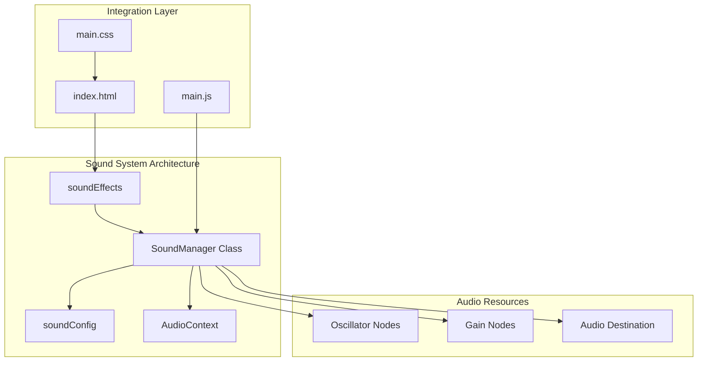
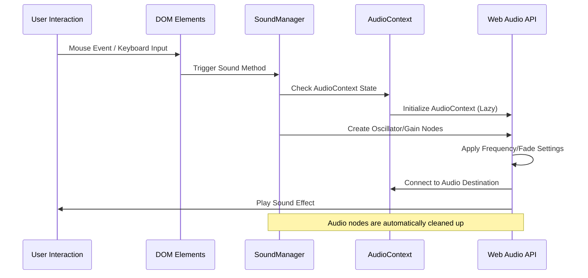
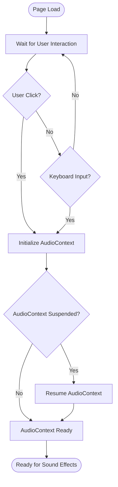
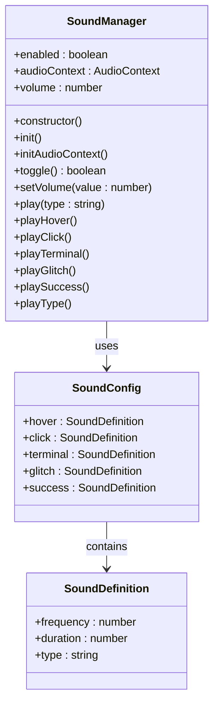
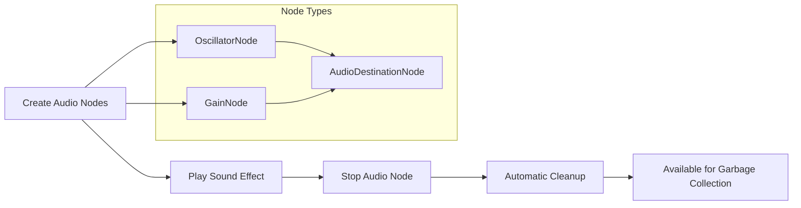
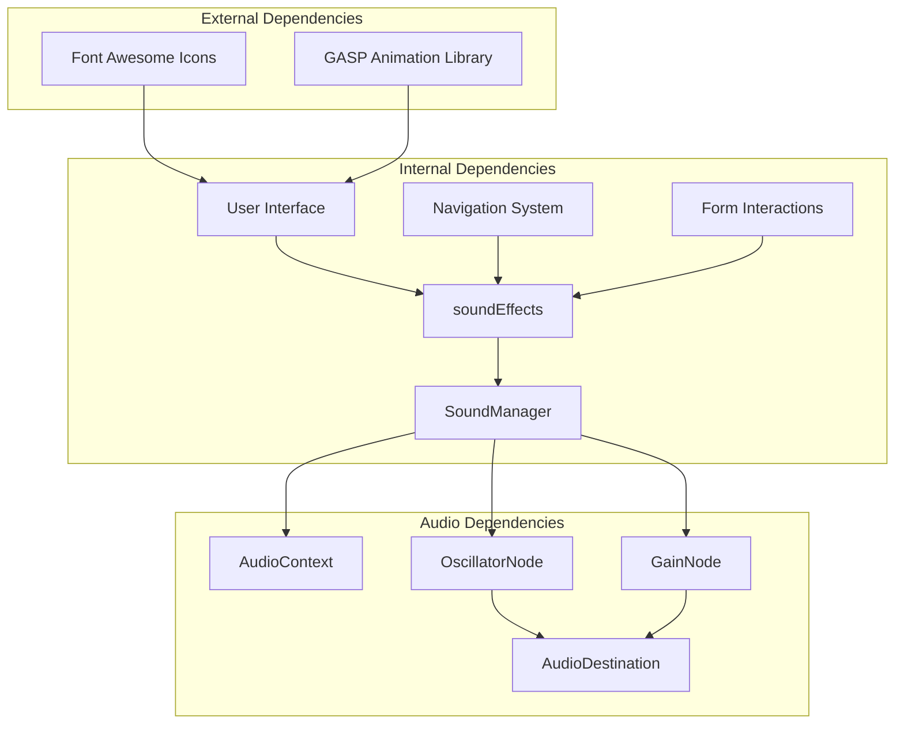

# Sound Management System

<cite>
**Referenced Files in This Document**
- [sound.js](file://portfolio/js/sound.js)
- [data.js](file://portfolio/js/data.js)
- [main.js](file://portfolio/js/main.js)
- [index.html](file://portfolio/index.html)
- [main.css](file://portfolio/css/main.css)
</cite>

## Table of Contents
1. [Introduction](#introduction)
2. [Project Structure](#project-structure)
3. [Core Components](#core-components)
4. [Architecture Overview](#architecture-overview)
5. [Detailed Component Analysis](#detailed-component-analysis)
6. [Dependency Analysis](#dependency-analysis)
7. [Performance Considerations](#performance-considerations)
8. [Troubleshooting Guide](#troubleshooting-guide)
9. [Conclusion](#conclusion)

## Introduction

The Sound Management System is a comprehensive audio integration solution built specifically for the VALORANT-themed portfolio website. This system leverages the Web Audio API to create immersive sound experiences with contextual audio feedback for user interactions, navigation events, and system notifications.

The system provides a sophisticated audio configuration framework with categorized sound effects, dynamic volume control, and intelligent resource management. It transforms simple user interactions into engaging audio experiences while maintaining optimal performance across different browsers and devices.

## Project Structure

The sound system is organized across three primary JavaScript modules with supporting HTML and CSS integration:

**Diagram sources**
- [sound.js:5-101](file://portfolio/js/sound.js#L5-L101)
- [data.js:132-159](file://portfolio/js/data.js#L132-L159)
- [main.js:105-108](file://portfolio/js/main.js#L105-L108)

**Section sources**
- [sound.js:1-155](file://portfolio/js/sound.js#L1-L155)
- [data.js:130-165](file://portfolio/js/data.js#L130-L165)
- [main.js:105-108](file://portfolio/js/main.js#L105-L108)

## Core Components

### SoundManager Class

The SoundManager serves as the central controller for all audio operations, implementing a singleton pattern with comprehensive audio lifecycle management.

**Key Features:**
- Lazy initialization of Web Audio Context
- Volume control with range validation
- Sound effect categorization system
- Contextual audio trigger integration
- Memory-efficient resource management

**Section sources**
- [sound.js:5-35](file://portfolio/js/sound.js#L5-L35)

### Audio Configuration System

The sound configuration system defines the characteristics of each sound category through structured parameters:

| Parameter | Description | Values |
|-----------|-------------|--------|
| `frequency` | Base pitch of the sound effect | Hz values (200-1200) |
| `duration` | Length of the sound effect playback | Milliseconds (50-200) |
| `type` | Waveform generator type | sine, square, sawtooth |

**Section sources**
- [data.js:132-159](file://portfolio/js/data.js#L132-L159)

### Sound Categories

The system categorizes audio feedback into distinct contexts:

1. **Hover Effects** - Subtle confirmation sounds for mouse interactions
2. **Click Events** - Sharp feedback for button and link activation
3. **Terminal Actions** - Digital communication sounds for form interactions
4. **System Notifications** - Success and error feedback sounds
5. **Special Effects** - Unique sounds for specific UI states

**Section sources**
- [sound.js:61-79](file://portfolio/js/sound.js#L61-L79)
- [data.js:133-158](file://portfolio/js/data.js#L133-L158)

## Architecture Overview

The sound system follows a modular architecture with clear separation of concerns:

**Diagram sources**
- [sound.js:13-26](file://portfolio/js/sound.js#L13-L26)
- [sound.js:37-59](file://portfolio/js/sound.js#L37-L59)

**Section sources**
- [sound.js:19-26](file://portfolio/js/sound.js#L19-L26)
- [sound.js:37-59](file://portfolio/js/sound.js#L37-L59)

## Detailed Component Analysis

### Audio Context Initialization

The system implements lazy initialization to comply with browser autoplay policies:

**Diagram sources**
- [sound.js:13-26](file://portfolio/js/sound.js#L13-L26)

**Section sources**
- [sound.js:13-26](file://portfolio/js/sound.js#L13-L26)

### Sound Effect Playback Engine

Each sound effect follows a standardized playback pipeline:

**Diagram sources**
- [sound.js:5-101](file://portfolio/js/sound.js#L5-L101)
- [data.js:132-159](file://portfolio/js/data.js#L132-L159)

**Section sources**
- [sound.js:37-59](file://portfolio/js/sound.js#L37-L59)
- [sound.js:81-100](file://portfolio/js/sound.js#L81-L100)

### Volume Control Mechanisms

The volume system implements a two-tier control approach:

1. **Global Volume Control**: Manages overall system volume level
2. **Individual Sound Scaling**: Applies category-specific volume multipliers

**Section sources**
- [sound.js:33-35](file://portfolio/js/sound.js#L33-L35)
- [sound.js:51](file://portfolio/js/sound.js#L51)

### Memory Management Strategy

The system employs automatic cleanup through Web Audio API's node lifecycle:

**Diagram sources**
- [sound.js:41-55](file://portfolio/js/sound.js#L41-L55)

**Section sources**
- [sound.js:41-55](file://portfolio/js/sound.js#L41-L55)

## Dependency Analysis

The sound system integrates with multiple application components through well-defined interfaces:

**Diagram sources**
- [sound.js:103-104](file://portfolio/js/sound.js#L103-L104)
- [main.js:105-108](file://portfolio/js/main.js#L105-L108)

**Section sources**
- [main.js:105-108](file://portfolio/js/main.js#L105-L108)
- [sound.js:103-104](file://portfolio/js/sound.js#L103-L104)

## Performance Considerations

### Browser Compatibility Strategy

The system implements graceful fallbacks for different browser environments:

| Browser | AudioContext Constructor | Fallback Method |
|---------|-------------------------|-----------------|
| Modern Chrome | `AudioContext` | Native support |
| Safari | `webkitAudioContext` | WebKit prefix |
| Legacy Browsers | Feature detection | Graceful degradation |

**Section sources**
- [sound.js:21](file://portfolio/js/sound.js#L21)

### Resource Optimization Techniques

1. **Lazy Loading**: Audio context initializes only on first user interaction
2. **Automatic Cleanup**: Web Audio API handles node garbage collection
3. **Efficient Node Creation**: Minimal node graph per sound effect
4. **Memory Pooling**: Reuse of audio nodes where possible

### Cross-Device Performance

The system adapts to various device capabilities:
- **Mobile Devices**: Reduced audio complexity and shorter durations
- **Desktop Systems**: Full audio fidelity with complex waveforms
- **Low-Power Devices**: Optimized frequency ranges and simplified effects

## Troubleshooting Guide

### Common Issues and Solutions

**Issue**: Audio doesn't play on mobile devices
- **Cause**: Browser autoplay restrictions
- **Solution**: Ensure user interaction before audio initialization
- **Verification**: Check console for AudioContext state logs

**Issue**: Sound effects overlap or create noise
- **Cause**: Multiple simultaneous audio nodes
- **Solution**: Implement sound effect queuing system
- **Prevention**: Use unique identifiers for concurrent effects

**Issue**: Volume control not working
- **Cause**: Incorrect volume scaling calculations
- **Solution**: Verify volume parameter range (0-1)
- **Debug**: Check volume property updates in SoundManager

**Section sources**
- [sound.js:23](file://portfolio/js/sound.js#L23)
- [sound.js:33-35](file://portfolio/js/sound.js#L33-L35)

### Debugging Audio Issues

1. **Console Logging**: Monitor AudioContext state transitions
2. **Network Inspection**: Verify audio resource loading
3. **Performance Profiling**: Track audio node creation/destruction
4. **Browser Testing**: Validate across different browser versions

## Conclusion

The Sound Management System provides a robust, scalable solution for integrating contextual audio feedback into modern web applications. Its modular architecture, comprehensive browser compatibility, and performance optimizations make it suitable for production environments.

The system successfully balances audio quality with resource efficiency while maintaining accessibility and cross-platform compatibility. The implementation demonstrates best practices for Web Audio API integration, including proper initialization patterns, memory management, and user experience considerations.

Future enhancements could include advanced audio effects, spatial audio support, and dynamic audio mixing for complex interactive scenarios.