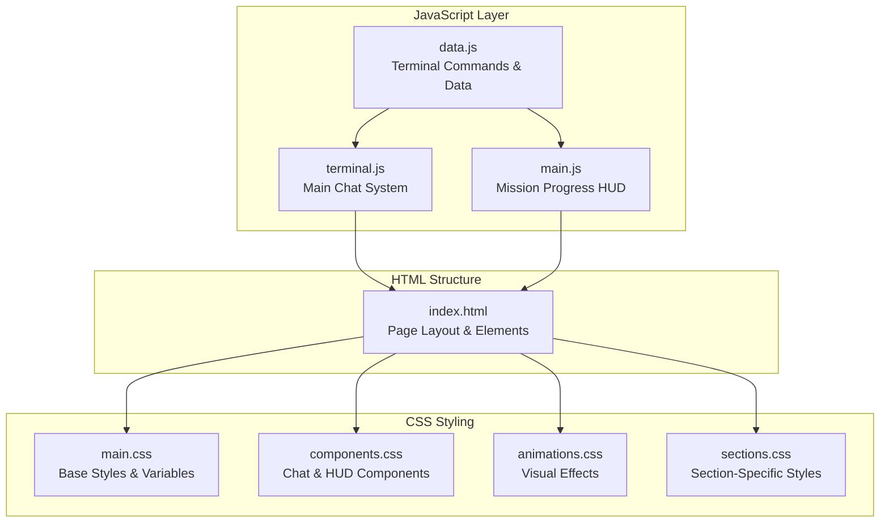
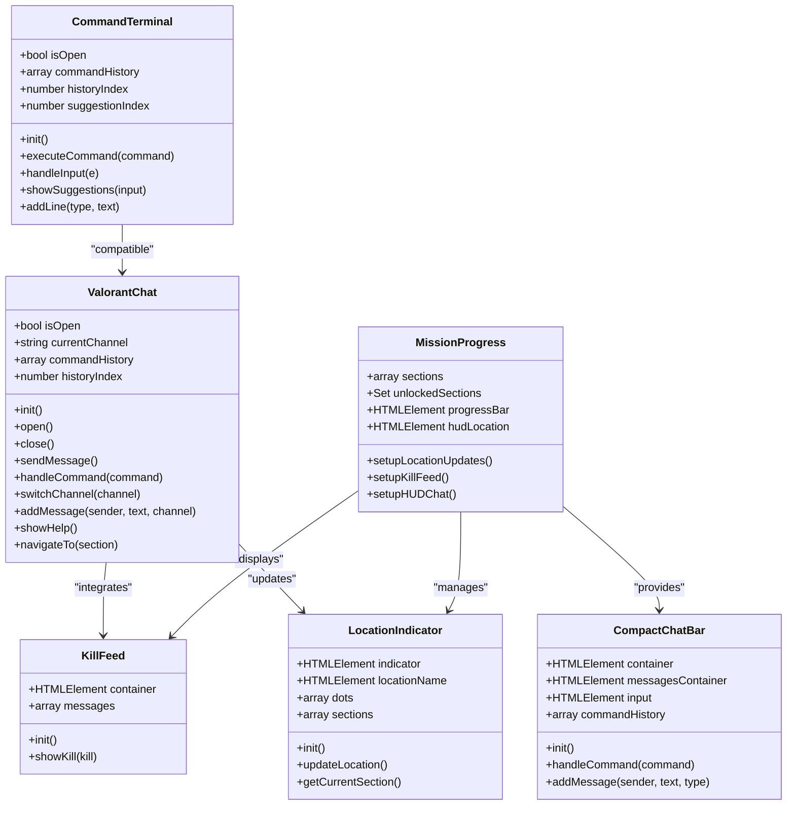
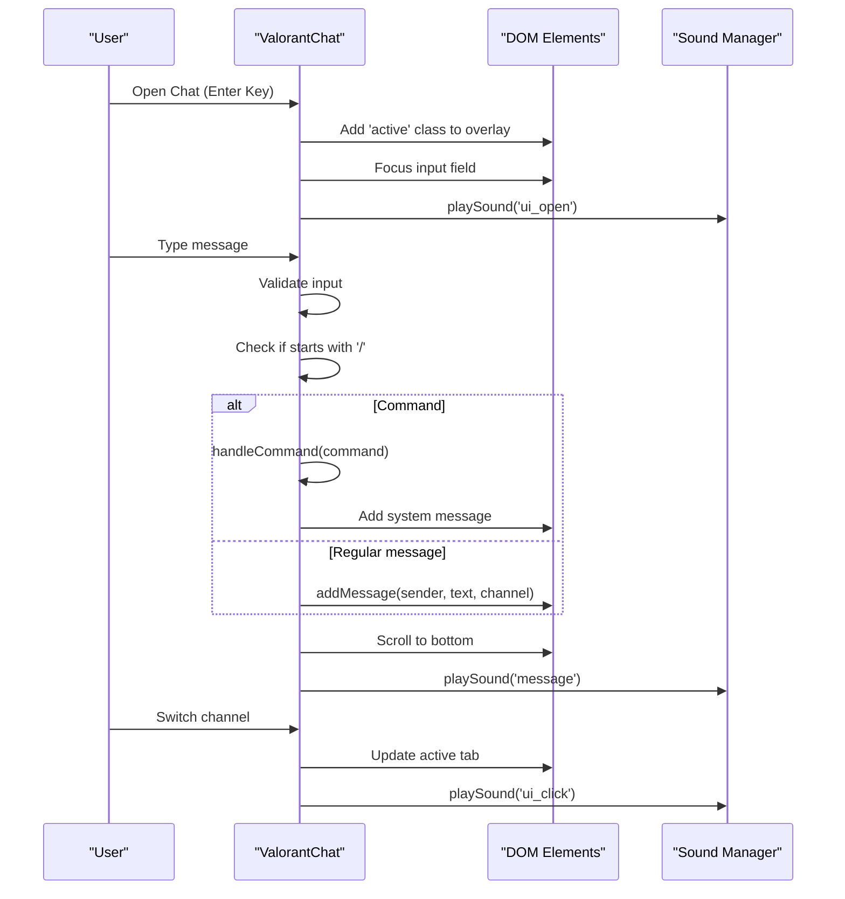
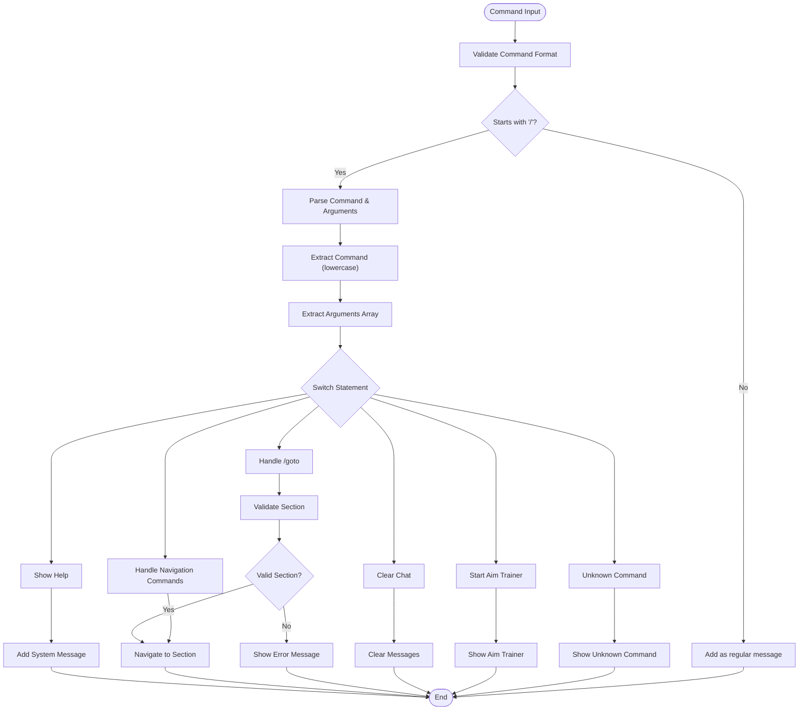
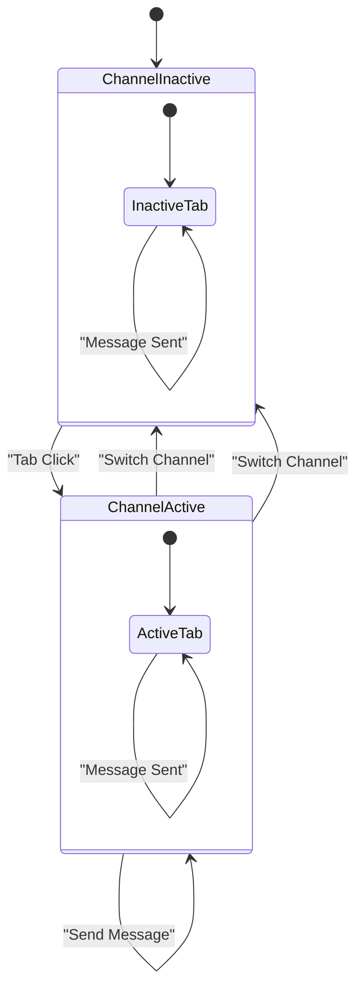
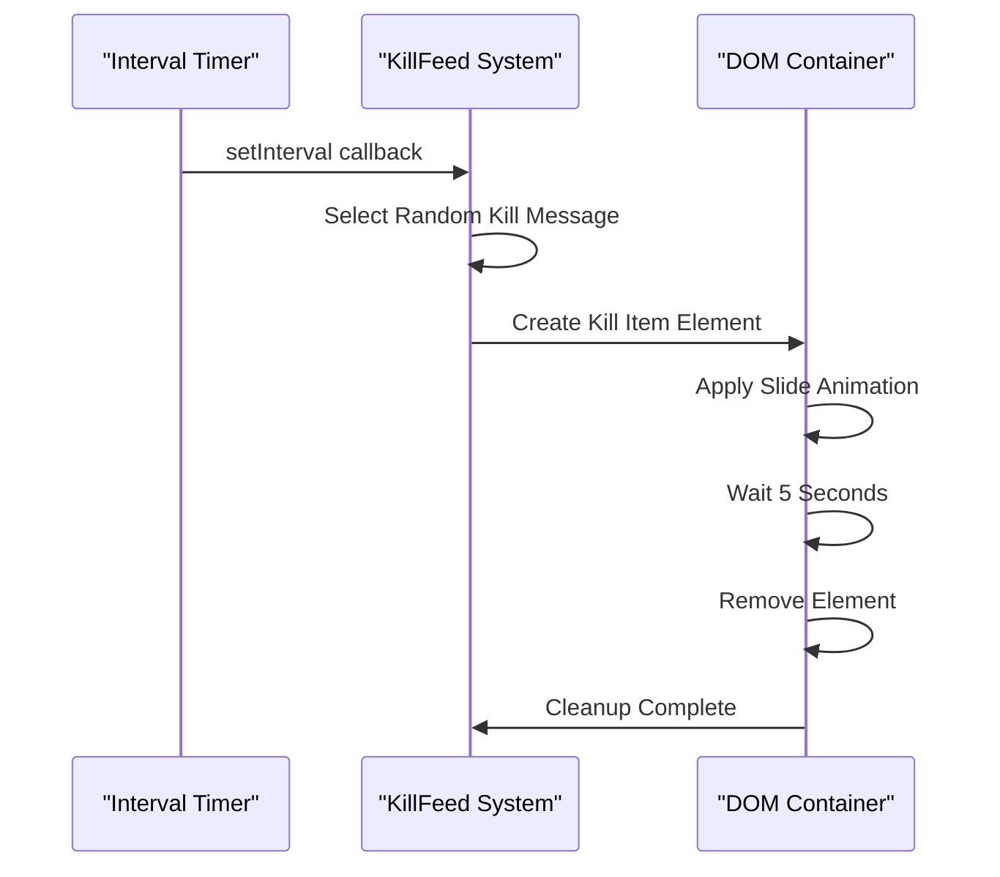
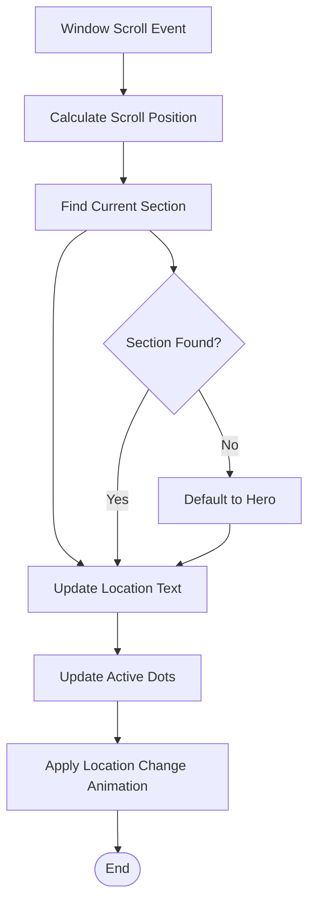
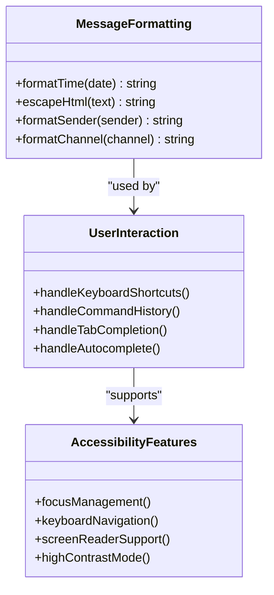
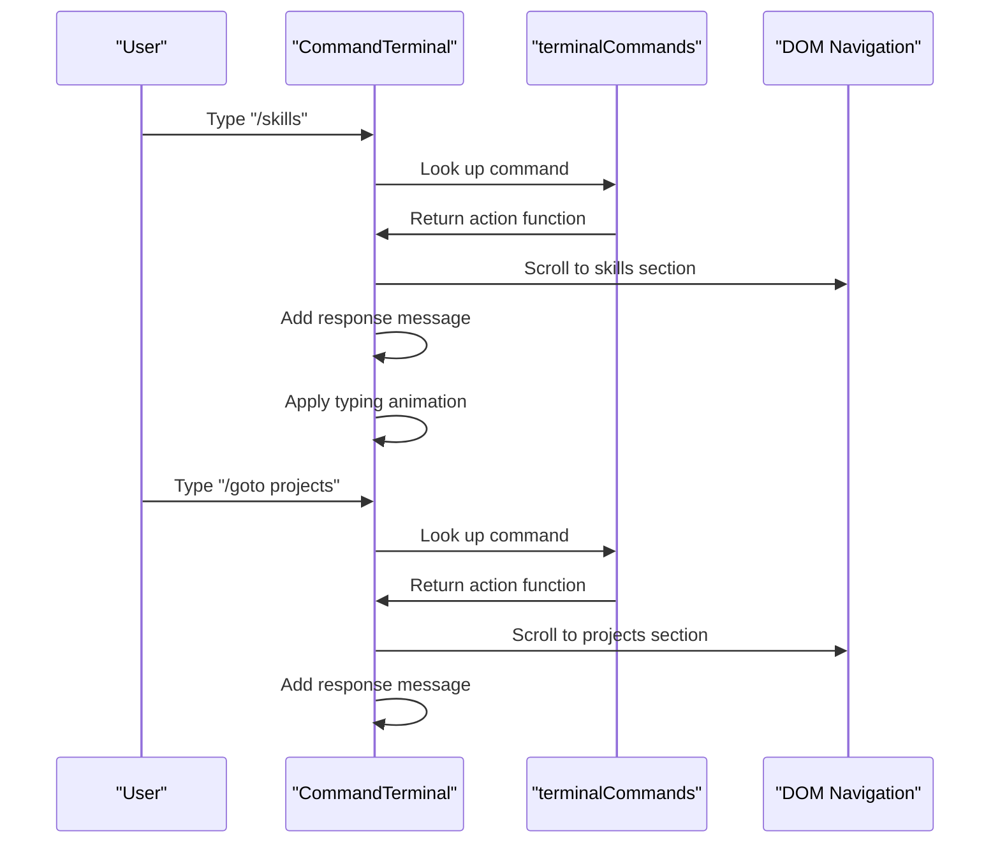
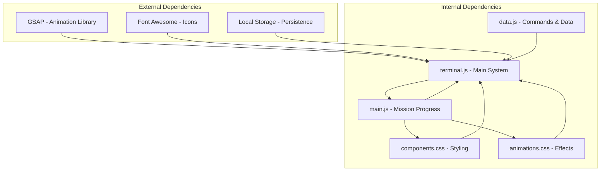

# Terminal Chat System

<cite>
**Referenced Files in This Document**
- [terminal.js](file://portfolio/js/terminal.js)
- [main.js](file://portfolio/js/main.js)
- [data.js](file://portfolio/js/data.js)
- [index.html](file://portfolio/index.html)
- [main.css](file://portfolio/css/main.css)
- [components.css](file://portfolio/css/components.css)
- [animations.css](file://portfolio/css/animations.css)
- [sections.css](file://portfolio/css/sections.css)
</cite>

## Table of Contents
1. [Introduction](#introduction)
2. [Project Structure](#project-structure)
3. [Core Components](#core-components)
4. [Architecture Overview](#architecture-overview)
5. [Detailed Component Analysis](#detailed-component-analysis)
6. [Dependency Analysis](#dependency-analysis)
7. [Performance Considerations](#performance-considerations)
8. [Troubleshooting Guide](#troubleshooting-guide)
9. [Conclusion](#conclusion)
10. [Appendices](#appendices)

## Introduction
This document provides comprehensive documentation for the ValorantChat terminal system and command processing engine implemented in the portfolio website. The system consists of multiple interconnected components: a chat interface with channel management, a kill feed display mechanism, a location indicator system, and a legacy command terminal. The documentation covers the chat interface implementation, command parsing algorithms, channel management, message formatting, user interaction patterns, and the relationship between terminal commands and section navigation.

## Project Structure
The terminal chat system is organized across JavaScript, HTML, and CSS modules:



**Diagram sources**
- [terminal.js:1-683](file://portfolio/js/terminal.js#L1-L683)
- [main.js:1465-1510](file://portfolio/js/main.js#L1465-L1510)
- [data.js:1-165](file://portfolio/js/data.js#L1-L165)

**Section sources**
- [terminal.js:1-683](file://portfolio/js/terminal.js#L1-L683)
- [main.js:1465-1510](file://portfolio/js/main.js#L1465-L1510)
- [data.js:1-165](file://portfolio/js/data.js#L1-L165)

## Core Components
The system comprises several key components that work together to provide the terminal chat experience:

### ValorantChat Class
The primary chat system that manages:
- Chat overlay lifecycle (open/close/toggle)
- Message sending and formatting
- Channel switching and management
- Command processing and routing
- Kill feed integration
- Location indicator updates

### CommandTerminal Class
A legacy terminal system with:
- Command suggestion system
- History navigation
- Response formatting with typing effects
- Compatibility with the main chat system

### MissionProgress HUD
Integrated system providing:
- Location indicator with section names
- Kill feed display
- Mission progress tracking
- Compact chat interface
- Section navigation controls

### KillFeed System
Automated kill feed display with:
- Random kill message generation
- Animated display transitions
- Weapon icon integration
- Automatic cleanup

**Section sources**
- [terminal.js:5-267](file://portfolio/js/terminal.js#L5-L267)
- [terminal.js:269-313](file://portfolio/js/terminal.js#L269-L313)
- [terminal.js:315-385](file://portfolio/js/terminal.js#L315-L385)
- [terminal.js:387-677](file://portfolio/js/terminal.js#L387-L677)

## Architecture Overview
The terminal chat system follows a modular architecture with clear separation of concerns:



**Diagram sources**
- [terminal.js:5-267](file://portfolio/js/terminal.js#L5-L267)
- [terminal.js:269-313](file://portfolio/js/terminal.js#L269-L313)
- [terminal.js:315-385](file://portfolio/js/terminal.js#L315-L385)
- [terminal.js:387-677](file://portfolio/js/terminal.js#L387-L677)
- [main.js:904-1056](file://portfolio/js/main.js#L904-L1056)
- [main.js:1058-1463](file://portfolio/js/main.js#L1058-L1463)

## Detailed Component Analysis

### Chat Interface Implementation
The chat interface provides a comprehensive messaging system with multiple channels and formatting:



**Diagram sources**
- [terminal.js:21-88](file://portfolio/js/terminal.js#L21-L88)
- [terminal.js:101-116](file://portfolio/js/terminal.js#L101-L116)
- [terminal.js:118-162](file://portfolio/js/terminal.js#L118-L162)
- [terminal.js:90-99](file://portfolio/js/terminal.js#L90-L99)

The chat interface supports multiple channels with distinct styling:
- Team channel: Standard white text
- System channel: Green text for system messages
- All channel: Gold/yellow text for global messages

**Section sources**
- [terminal.js:207-236](file://portfolio/js/terminal.js#L207-L236)
- [terminal.js:530-581](file://portfolio/js/terminal.js#L530-L581)
- [components.css:551-561](file://portfolio/css/components.css#L551-L561)

### Command Parsing Algorithms
The command processing system implements sophisticated parsing and routing:



**Diagram sources**
- [terminal.js:118-162](file://portfolio/js/terminal.js#L118-L162)
- [terminal.js:182-197](file://portfolio/js/terminal.js#L182-L197)
- [terminal.js:199-205](file://portfolio/js/terminal.js#L199-L205)

The command system supports:
- `/help`: Comprehensive help with available commands
- `/goto [section]`: Direct navigation to specific sections
- `/skills`, `/projects`, `/contact`, `/about`, `/cv`: Quick navigation shortcuts
- `/clear`: Clear chat history
- `/aim`: Launch aim trainer game

**Section sources**
- [terminal.js:122-161](file://portfolio/js/terminal.js#L122-L161)
- [terminal.js:164-180](file://portfolio/js/terminal.js#L164-L180)
- [terminal.js:182-197](file://portfolio/js/terminal.js#L182-L197)

### Channel Management System
The channel management system provides tabbed interface with visual feedback:



**Diagram sources**
- [terminal.js:90-99](file://portfolio/js/terminal.js#L90-L99)
- [terminal.js:471-501](file://portfolio/js/terminal.js#L471-L501)

Channel features include:
- Visual tab highlighting for active channel
- Channel indicator showing current channel
- Sound feedback on channel switching
- Persistent command history per channel

**Section sources**
- [terminal.js:90-99](file://portfolio/js/terminal.js#L90-L99)
- [terminal.js:591-600](file://portfolio/js/terminal.js#L591-L600)

### Kill Feed Display Mechanism
The kill feed system provides automated combat notifications:



**Diagram sources**
- [terminal.js:286-295](file://portfolio/js/terminal.js#L286-L295)
- [terminal.js:297-312](file://portfolio/js/terminal.js#L297-L312)

Kill feed features:
- Random kill message selection from predefined list
- Smooth slide-in animation with fade-out
- Weapon icon integration using Font Awesome
- Automatic cleanup after display period
- HUD integration in mission progress system

**Section sources**
- [terminal.js:270-313](file://portfolio/js/terminal.js#L270-L313)
- [main.js:1174-1202](file://portfolio/js/main.js#L1174-L1202)

### Location Indicator System
The location indicator tracks user position and provides navigation context:



**Diagram sources**
- [main.js:1133-1172](file://portfolio/js/main.js#L1133-L1172)
- [main.js:351-384](file://portfolio/js/main.js#L351-L384)

Location indicator features:
- Real-time section detection during scrolling
- Animated location name changes
- Active dot highlighting for current section
- Section name mapping (SPAWN, DOSSIER, LOADOUT, etc.)
- Click-to-navigate functionality

**Section sources**
- [main.js:1133-1172](file://portfolio/js/main.js#L1133-L1172)
- [main.js:351-384](file://portfolio/js/main.js#L351-L384)

### Message Formatting and User Interaction
The system implements comprehensive message formatting and interaction patterns:



**Diagram sources**
- [terminal.js:207-262](file://portfolio/js/terminal.js#L207-L262)
- [terminal.js:238-252](file://portfolio/js/terminal.js#L238-L252)
- [terminal.js:44-57](file://portfolio/js/terminal.js#L44-L57)

Key formatting features:
- Timestamp formatting with 24-hour format
- HTML escaping for XSS protection
- Channel-specific styling
- System message differentiation
- Responsive message layout

**Section sources**
- [terminal.js:207-262](file://portfolio/js/terminal.js#L207-L262)
- [terminal.js:44-57](file://portfolio/js/terminal.js#L44-L57)

### Terminal Commands and Section Navigation
The system integrates terminal commands with section navigation:



**Diagram sources**
- [data.js:54-130](file://portfolio/js/data.js#L54-L130)
- [terminal.js:580-624](file://portfolio/js/terminal.js#L580-L624)

Command integration features:
- Seamless navigation between sections
- Consistent response formatting
- Command history preservation
- Suggestion system for command discovery
- Typing animation effects for responses

**Section sources**
- [data.js:54-130](file://portfolio/js/data.js#L54-L130)
- [terminal.js:580-624](file://portfolio/js/terminal.js#L580-L624)

## Dependency Analysis
The terminal chat system exhibits clear dependency relationships:



**Diagram sources**
- [terminal.js:18-31](file://portfolio/js/terminal.js#L18-L31)
- [main.js:1467-1468](file://portfolio/js/main.js#L1467-L1468)

**Section sources**
- [terminal.js:18-31](file://portfolio/js/terminal.js#L18-L31)
- [main.js:1467-1468](file://portfolio/js/main.js#L1467-L1468)

## Performance Considerations
The system implements several performance optimizations:

### Memory Management
- Automatic cleanup of DOM elements after animations
- Limited message history in compact chat (5 messages max)
- Efficient event listener management
- Debounced scroll listeners for location updates

### Rendering Optimizations
- CSS transforms for animations (hardware accelerated)
- RequestAnimationFrame for smooth animations
- Efficient DOM manipulation batching
- Visibility-based rendering (only active overlays)

### Network Considerations
- Local storage persistence for command history
- Minimal external dependencies
- Optimized CSS animations
- Efficient icon usage via Font Awesome CDN

## Troubleshooting Guide
Common issues and their resolutions:

### Chat Not Opening
**Symptoms**: Pressing Enter does nothing
**Causes**: 
- Focus conflicts with other inputs
- Event listener issues
- CSS overlay blocking

**Solutions**:
- Ensure no other input is focused when pressing Enter
- Check browser console for JavaScript errors
- Verify overlay CSS classes are properly applied

### Command Not Working
**Symptoms**: Commands return "Unknown command"
**Causes**:
- Incorrect command syntax
- Case sensitivity issues
- Missing command definitions

**Solutions**:
- Use `/help` to verify available commands
- Check command spelling and capitalization
- Verify command exists in terminalCommands object

### Kill Feed Not Displaying
**Symptoms**: No kill notifications appear
**Causes**:
- Interval timer issues
- DOM element not found
- CSS animation conflicts

**Solutions**:
- Check browser console for timer errors
- Verify kill feed container exists
- Inspect CSS animation properties

**Section sources**
- [terminal.js:286-295](file://portfolio/js/terminal.js#L286-L295)
- [terminal.js:580-624](file://portfolio/js/terminal.js#L580-L624)

## Conclusion
The ValorantChat terminal system provides a comprehensive, integrated solution for interactive communication within the portfolio website. The system successfully combines multiple chat interfaces, automated kill feeds, location tracking, and seamless section navigation. Its modular architecture allows for easy extension and customization while maintaining performance and accessibility standards.

The implementation demonstrates advanced JavaScript patterns including class-based architecture, event-driven programming, and DOM manipulation. The styling system leverages CSS variables and animations to create a cohesive visual experience that aligns with the portfolio's tactical theme.

## Appendices

### Creating Custom Commands
To add new commands to the terminal system:

1. **Extend terminalCommands object** in data.js:
```javascript
'/newcommand': {
    description: 'Description of new command',
    action: () => {
        // Command implementation
        return 'Response text';
    }
}
```

2. **Update command processing** in terminal.js:
```javascript
case '/newcommand':
    // Handle new command logic
    break;
```

3. **Add styling** in components.css for any new message types

### Extending Chat Functionality
To extend the chat system:

1. **Modify message formatting** in addMessage methods
2. **Add new channel types** with distinct styling
3. **Implement new command handlers** in handleCommand
4. **Update HTML templates** for new features

### Integration Examples
The system provides multiple integration points:

- **Section Navigation**: Commands automatically integrate with existing section IDs
- **Sound Effects**: Audio feedback can be enabled by implementing soundManager
- **Animation Libraries**: GSAP integration for advanced animations
- **Accessibility**: Keyboard navigation and screen reader support built-in

**Section sources**
- [data.js:54-130](file://portfolio/js/data.js#L54-L130)
- [terminal.js:118-162](file://portfolio/js/terminal.js#L118-L162)
- [components.css:434-792](file://portfolio/css/components.css#L434-L792)