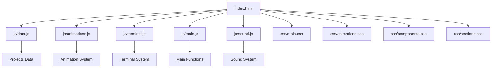
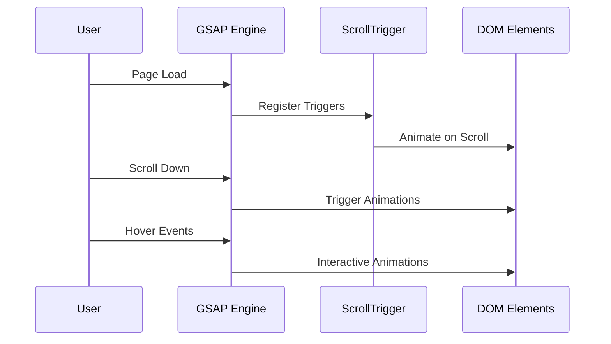
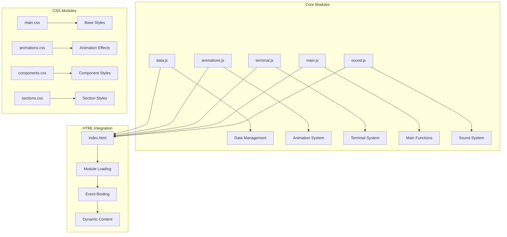

# Customization Guide

<cite>
**Referenced Files in This Document**
- [index.html](file://portfolio/index.html)
- [data.js](file://portfolio/js/data.js)
- [animations.js](file://portfolio/js/animations.js)
- [terminal.js](file://portfolio/js/terminal.js)
- [main.js](file://portfolio/js/main.js)
- [sound.js](file://portfolio/js/sound.js)
- [main.css](file://portfolio/css/main.css)
- [animations.css](file://portfolio/css/animations.css)
- [components.css](file://portfolio/css/components.css)
- [sections.css](file://portfolio/css/sections.css)
</cite>

## Table of Contents
1. [Introduction](#introduction)
2. [Getting Started](#getting-started)
3. [Adding New Projects](#adding-new-projects)
4. [Creating Custom Terminal Commands](#creating-custom-terminal-commands)
5. [Modifying Animations](#modifying-animations)
6. [Theming System](#theming-system)
7. [Advanced Customizations](#advanced-customizations)
8. [Modular Architecture](#modular-architecture)
9. [Best Practices](#best-practices)
10. [Troubleshooting](#troubleshooting)

## Introduction

The JAJA Portfolio is a modular, animated portfolio website built with modern web technologies. This guide provides comprehensive instructions for customizing and extending the portfolio while maintaining compatibility with the existing codebase.

## Getting Started

### Project Structure Overview

The portfolio follows a modular architecture with clear separation of concerns:



**Diagram sources**
- [index.html:1-26](file://portfolio/index.html#L1-L26)
- [data.js:1-165](file://portfolio/js/data.js#L1-L165)

**Section sources**
- [index.html:1-26](file://portfolio/index.html#L1-L26)

## Adding New Projects

### Step 1: Extend the projectsData Array

The projects are defined in the `projectsData` object. To add a new project, follow this pattern:

```javascript
// Add to the projectsData object in data.js
const newProject = {
    unique_key: {
        code: 'MISSION XX',
        title: 'PROJECT TITLE',
        description: 'Brief project description',
        tech: ['Technology 1', 'Technology 2', 'Technology 3'],
        features: [
            'Feature 1',
            'Feature 2',
            'Feature 3'
        ],
        github: 'https://github.com/yourusername/project',
        demo: 'https://demo.com/project'
    }
};
```

### Step 2: Update HTML Structure

Add the project card to your HTML:

```html
<div class="mission-card" data-project="unique_key">
    <div class="mission-image">
        <div class="mission-placeholder">
            <i class="fas fa-project-icon"></i>
        </div>
        <div class="mission-overlay">
            <span class="mission-status">COMPLETED</span>
        </div>
    </div>
    <div class="mission-info">
        <span class="mission-code">MISSION XX</span>
        <h3 class="mission-name">PROJECT TITLE</h3>
        <p class="mission-brief">Brief description</p>
        <div class="mission-tech">
            <span class="tech-tag">Tech 1</span>
            <span class="tech-tag">Tech 2</span>
            <span class="tech-tag">Tech 3</span>
        </div>
        <button class="mission-btn" data-modal="modal-id">VIEW DETAILS</button>
    </div>
</div>
```

### Step 3: Update Modal Content

The modal content is generated dynamically. Ensure your project data matches the template structure.

**Section sources**
- [data.js:6-52](file://portfolio/js/data.js#L6-L52)
- [index.html:544-610](file://portfolio/index.html#L544-L610)

## Creating Custom Terminal Commands

### Method 1: Adding Commands to terminalCommands

Extend the `terminalCommands` object in data.js:

```javascript
const terminalCommands = {
    // ... existing commands ...
    
    '/custom': {
        description: 'Description of your custom command',
        action: () => {
            // Your custom logic here
            return 'Response message';
        }
    },
    
    '/another-command': {
        description: 'Another custom command',
        action: () => {
            // Navigate to section
            document.getElementById('section-id').scrollIntoView({ behavior: 'smooth' });
            return 'Navigating to section...';
        }
    }
};
```

### Method 2: Extending the CommandTerminal Class

For more complex commands, modify the CommandTerminal class:

```javascript
// In terminal.js, extend the executeCommand method
executeCommand(command) {
    // ... existing code ...
    
    // Add your custom command handling
    if (command === '/your-custom-command') {
        // Custom logic
        this.addLine('response', 'Custom command executed');
        return;
    }
    
    // ... rest of existing code ...
}
```

### Method 3: Creating New Terminal Systems

For completely new terminal-like functionality:

```javascript
class CustomTerminal {
    constructor() {
        this.overlay = document.getElementById('customOverlay');
        this.commands = {};
        this.init();
    }
    
    init() {
        // Initialize your terminal
    }
    
    registerCommand(name, description, handler) {
        this.commands[name] = { description, handler };
    }
    
    executeCommand(command) {
        const cmd = this.commands[command];
        if (cmd) {
            cmd.handler();
        }
    }
}

// Initialize in DOMContentLoaded event
document.addEventListener('DOMContentLoaded', () => {
    window.customTerminal = new CustomTerminal();
});
```

**Section sources**
- [data.js:55-130](file://portfolio/js/data.js#L55-L130)
- [terminal.js:580-624](file://portfolio/js/terminal.js#L580-L624)

## Modifying Animations

### Understanding the Animation Architecture

The animation system uses GSAP with ScrollTrigger for scroll-based animations:



**Diagram sources**
- [animations.js:56-501](file://portfolio/js/animations.js#L56-L501)

### Modifying Existing Animations

#### Hero Section Animation

To modify hero animations, edit the `initHeroAnimations` function:

```javascript
function initHeroAnimations() {
    const tl = gsap.timeline();
    
    // Modify timing and easing
    tl.from('.hero-tag', {
        opacity: 0,
        x: -30,
        duration: 0.6, // Change duration
        ease: 'power2.out' // Change easing
    })
    // ... rest of animation
}
```

#### Section Reveal Animations

Edit the `initSectionAnimations` function to customize scroll-triggered animations:

```javascript
function initSectionAnimations() {
    // Skill bars animation
    const skillBars = document.querySelectorAll('.skill-fill');
    skillBars.forEach(bar => {
        const fillPercent = bar.dataset.fill;
        
        ScrollTrigger.create({
            trigger: bar,
            start: 'top 90%', // Adjust trigger position
            end: 'bottom 10%',
            onEnter: () => {
                gsap.to(bar, {
                    width: `${fillPercent}%`,
                    duration: 1.2,
                    ease: 'power2.out',
                    onComplete: () => {
                        // Add custom effects
                    }
                });
            }
        });
    });
}
```

#### Creating New Animation Timelines

```javascript
// Create a new animation timeline
function createCustomTimeline() {
    const tl = gsap.timeline({
        scrollTrigger: {
            trigger: '.custom-element',
            start: 'top 80%',
            toggleActions: 'play reverse play reverse'
        }
    });
    
    tl.from('.custom-element', {
        opacity: 0,
        y: 50,
        duration: 0.8,
        ease: 'back.out(1.7)'
    });
    
    return tl;
}
```

### Animation Performance Optimization

```javascript
// Use transform instead of layout-affecting properties
gsap.to(element, {
    x: 100, // Preferred
    left: 100, // Less preferred
    duration: 1
});

// Use will-change for complex animations
.element {
    will-change: transform;
}
```

**Section sources**
- [animations.js:56-501](file://portfolio/js/animations.js#L56-L501)

## Theming System

### CSS Variables Architecture

The theme system is built around CSS custom properties:

```css
:root {
    /* VALORANT Color Palette */
    --val-red: #ff4655;
    --val-red-dark: #c93642;
    --val-red-glow: rgba(255, 70, 85, 0.5);
    --val-black: #0f1419;
    --val-dark: #1a1d24;
    --val-dark-light: #2d3139;
    --val-grey: #4a4e57;
    --val-light-grey: #8b929d;
    --val-white: #ffffff;
    --val-off-white: #ece8e1;
    
    /* HUD Colors */
    --hud-green: #00ff88;
    --hud-blue: #00d4ff;
    --hud-yellow: #ffcc00;
    --hud-orange: #ff6b35;
    --hud-green-glow: rgba(0, 255, 136, 0.5);
    --hud-blue-glow: rgba(0, 212, 255, 0.5);
    --hud-yellow-glow: rgba(255, 204, 0, 0.5);
    
    /* Typography */
    --font-display: 'Oswald', sans-serif;
    --font-body: 'Rajdhani', sans-serif;
    --font-mono: 'Share Tech Mono', monospace;
}
```

### Creating a New Theme

#### Method 1: Override CSS Variables

```css
/* Create a dark theme */
.dark-theme {
    --val-red: #ff6b6b;
    --val-black: #0a0a0a;
    --val-dark: #121212;
    --val-dark-light: #2a2a2a;
    --val-white: #f0f0f0;
}

/* Apply theme */
[data-theme="dark"] {
    --val-red: #ff6b6b;
    --val-black: #0a0a0a;
    --val-dark: #121212;
    --val-dark-light: #2a2a2a;
    --val-white: #f0f0f0;
}
```

#### Method 2: Dynamic Theme Switching

```javascript
// Add theme switching functionality
function switchTheme(themeName) {
    const root = document.documentElement;
    
    switch(themeName) {
        case 'dark':
            root.style.setProperty('--val-red', '#ff6b6b');
            root.style.setProperty('--val-black', '#0a0a0a');
            break;
        case 'blue':
            root.style.setProperty('--val-red', '#4dabf7');
            root.style.setProperty('--val-black', '#0c1427');
            break;
        case 'green':
            root.style.setProperty('--val-red', '#51cf66');
            root.style.setProperty('--val-black', '#0b1a12');
            break;
    }
}

// Toggle between themes
function toggleTheme() {
    const currentTheme = document.body.getAttribute('data-theme');
    const newTheme = currentTheme === 'dark' ? 'default' : 'dark';
    document.body.setAttribute('data-theme', newTheme);
}
```

### Typography Modifications

#### Custom Font Families

```css
/* Define custom fonts */
:root {
    --font-display: 'CustomDisplay', system-ui;
    --font-body: 'CustomBody', system-ui;
    --font-mono: 'CustomMono', monospace;
}

/* Apply to specific sections */
.hero-name {
    font-family: var(--font-display);
}

.skill-name {
    font-family: var(--font-mono);
}
```

#### Font Size Adjustments

```css
/* Responsive font sizing */
.hero-name {
    font-size: clamp(3rem, 8vw, 8rem);
}

.skill-category {
    font-size: clamp(1.2rem, 4vw, 1.5rem);
}
```

### Layout Adjustments

#### Grid System Modifications

```css
/* Modify section layouts */
.skills-section {
    background: var(--val-dark);
    position: relative;
}

.skills-content {
    display: flex;
    flex-direction: column;
    gap: 48px;
}

/* Responsive grid changes */
@media (max-width: 1200px) {
    .skills-content {
        grid-template-columns: repeat(1, 1fr); /* Single column on mobile */
    }
}
```

**Section sources**
- [main.css:5-50](file://portfolio/css/main.css#L5-L50)
- [main.css:128-214](file://portfolio/css/main.css#L128-L214)

## Advanced Customizations

### Creating Custom Ability Cards

#### Step 1: Define Ability Data

```javascript
// Add to data.js projectsData
const abilityData = {
    custom_ability: {
        icon: 'fas fa-rocket',
        key: 'Z',
        name: 'CUSTOM ABILITY',
        description: 'Description of your custom ability',
        stats: [
            { label: 'DAMAGE', value: 'HIGH' },
            { label: 'COOLDOWN', value: 'FAST' }
        ]
    }
};
```

#### Step 2: Add HTML Structure

```html
<div class="ability-card" data-ability="custom_ability">
    <div class="ability-icon">
        <i class="fas fa-rocket"></i>
    </div>
    <div class="ability-key">Z</div>
    <h3 class="ability-name">CUSTOM ABILITY</h3>
    <p class="ability-description">Description of your custom ability</p>
    <div class="ability-stats">
        <span class="ability-stat">DAMAGE: HIGH</span>
        <span class="ability-stat">COOLDOWN: FAST</span>
    </div>
    <div class="ability-activate">
        <div class="activate-bar">
            <div class="activate-progress"></div>
        </div>
        <button class="btn btn-ability" data-ability="custom_ability">
            <span class="btn-text">ACTIVATE</span>
            <span class="btn-icon"><i class="fas fa-crosshairs"></i></span>
        </button>
    </div>
</div>
```

#### Step 3: Style Custom Abilities

```css
/* Add custom ability styles */
.ability-card[data-ability="custom_ability"] {
    border: 1px solid var(--hud-blue);
}

.ability-card[data-ability="custom_ability"] .ability-key {
    background: var(--hud-blue);
    color: var(--val-black);
}

.ability-card[data-ability="custom_ability"] .ability-icon {
    color: var(--hud-blue);
    border-color: var(--hud-blue);
}
```

### Integrating Additional Gaming Elements

#### Custom Game System

```javascript
class CustomGame {
    constructor() {
        this.gameArea = document.getElementById('gameArea');
        this.score = 0;
        this.level = 1;
        this.init();
    }
    
    init() {
        this.setupEventListeners();
        this.render();
    }
    
    setupEventListeners() {
        // Add game-specific event listeners
        this.gameArea.addEventListener('click', (e) => this.handleInteraction(e));
    }
    
    handleInteraction(event) {
        // Game logic
        this.updateScore(10);
        this.createParticleEffect(event.clientX, event.clientY);
    }
    
    updateScore(points) {
        this.score += points;
        this.updateUI();
    }
    
    render() {
        // Render game elements
    }
}

// Initialize game
document.addEventListener('DOMContentLoaded', () => {
    window.customGame = new CustomGame();
});
```

#### Enhanced Particle System

```javascript
// Extend the existing particle system
function createEnhancedParticle(x, y, type = 'default') {
    const particle = document.createElement('div');
    particle.className = 'enhanced-particle';
    
    // Different particle types
    switch(type) {
        case 'explosion':
            particle.style.cssText = `
                position: absolute;
                width: 10px;
                height: 10px;
                background: var(--val-red);
                border-radius: 50%;
                pointer-events: none;
                left: ${x}px;
                top: ${y}px;
                box-shadow: 0 0 20px var(--val-red-glow);
            `;
            break;
        case 'sparkle':
            particle.style.cssText = `
                position: absolute;
                width: 4px;
                height: 4px;
                background: var(--hud-yellow);
                border-radius: 50%;
                pointer-events: none;
                left: ${x}px;
                top: ${y}px;
            `;
            break;
    }
    
    document.body.appendChild(particle);
    
    // Animate particle
    gsap.to(particle, {
        x: Math.random() * 100 - 50,
        y: Math.random() * 100 - 50,
        opacity: 0,
        scale: 0,
        duration: 0.8,
        ease: 'power2.out',
        onComplete: () => particle.remove()
    });
}
```

**Section sources**
- [data.js:6-52](file://portfolio/js/data.js#L6-L52)
- [index.html:404-531](file://portfolio/index.html#L404-L531)

## Modular Architecture

### Understanding the Module System

The portfolio uses a clear modular architecture:



**Diagram sources**
- [index.html:1-26](file://portfolio/index.html#L1-L26)
- [data.js:161-165](file://portfolio/js/data.js#L161-L165)

### Safe Modification Guidelines

#### 1. Preserve Module Interfaces

Always maintain the existing function signatures and exported objects:

```javascript
// Good: Maintains interface
export function initHeroAnimations() {
    // Implementation
}

// Good: Maintains export
if (typeof module !== 'undefined' && module.exports) {
    module.exports = { projectsData, terminalCommands, soundConfig };
}
```

#### 2. Use Configuration Objects

Structure customizations as configuration objects:

```javascript
// Configuration object pattern
const customizationConfig = {
    animations: {
        heroDuration: 0.8,
        sectionDelay: 0.1,
        easing: 'power3.out'
    },
    theming: {
        primaryColor: '#ff4655',
        secondaryColor: '#00d4ff',
        fontFamily: 'Oswald'
    },
    terminal: {
        commands: {
            '/custom': 'Custom command description'
        }
    }
};
```

#### 3. Event-Driven Architecture

Use event listeners instead of direct function calls:

```javascript
// Good: Event-driven
document.addEventListener('DOMContentLoaded', initializePortfolio);

// Better: Custom events
document.dispatchEvent(new CustomEvent('portfolio:ready'));

// Listen for custom events
document.addEventListener('portfolio:ready', handlePortfolioReady);
```

**Section sources**
- [data.js:161-165](file://portfolio/js/data.js#L161-L165)
- [main.js:761-774](file://portfolio/js/main.js#L761-L774)

## Best Practices

### 1. Performance Optimization

#### Animation Performance
- Use transform and opacity for GPU acceleration
- Avoid layout thrashing by batching DOM reads/writes
- Use `will-change` property for elements with frequent animations

```css
/* Optimize animations */
.animated-element {
    will-change: transform, opacity;
    transform: translateZ(0); /* Force GPU acceleration */
}
```

#### Memory Management
- Remove event listeners when components are destroyed
- Clear intervals and timeouts properly
- Use weak references where appropriate

### 2. Compatibility Maintenance

#### Version Control Strategy
- Keep a changelog of modifications
- Test against different browser versions
- Maintain backward compatibility for public APIs

#### Upgrade Safety
```javascript
// Safe way to extend functionality
function safeExtend(target, extension) {
    const originalMethods = {};
    
    // Backup original methods
    Object.keys(extension).forEach(key => {
        if (typeof target[key] === 'function') {
            originalMethods[key] = target[key];
        }
    });
    
    // Apply extensions
    Object.assign(target, extension);
    
    // Return restore function
    return () => Object.assign(target, originalMethods);
}
```

### 3. Code Organization

#### Modular Pattern
```javascript
// Create reusable modules
const PortfolioModule = (() => {
    let instance;
    
    function createInstance() {
        return {
            init: function() {
                // Initialization logic
            },
            destroy: function() {
                // Cleanup logic
            }
        };
    }
    
    return {
        getInstance: function() {
            if (!instance) {
                instance = createInstance();
            }
            return instance;
        }
    };
})();
```

### 4. Error Handling

#### Graceful Degradation
```javascript
function safeExecute(fn, fallback = () => {}) {
    try {
        return fn();
    } catch (error) {
        console.warn('Operation failed:', error);
        fallback();
        return null;
    }
}

// Usage
safeExecute(() => {
    // Potentially failing operation
}, () => {
    // Fallback behavior
});
```

## Troubleshooting

### Common Issues and Solutions

#### Animation Not Working
1. **GSAP not loaded**: Ensure GSAP libraries are included in HTML
2. **ScrollTrigger missing**: Verify ScrollTrigger plugin is registered
3. **Element selectors wrong**: Check CSS selectors match HTML structure

#### Terminal Commands Not Responding
1. **Command not found**: Verify command exists in terminalCommands object
2. **Action function error**: Check console for JavaScript errors
3. **Event listener conflicts**: Ensure proper event delegation

#### Theme Changes Not Applied
1. **CSS variable override**: Check if variables are being overridden elsewhere
2. **Specificity issues**: Verify CSS specificity is sufficient
3. **Timing issues**: Ensure theme changes occur after CSS loads

### Debugging Tools

#### Animation Debugging
```javascript
// Enable GSAP debug mode
gsap.config({ force3D: true });

// Add animation logging
gsap.utils.toArray('.animated-element').forEach(el => {
    const observer = new IntersectionObserver((entries) => {
        entries.forEach(entry => {
            console.log('Element in viewport:', entry.target, entry.isIntersecting);
        });
    });
    observer.observe(el);
});
```

#### Performance Monitoring
```javascript
// Monitor animation performance
const perfObserver = new PerformanceObserver((list) => {
    for (const entry of list.getEntries()) {
        if (entry.duration > 100) {
            console.warn('Long animation frame:', entry);
        }
    }
});
perfObserver.observe({ entryTypes: ['measure'] });
```

### Testing Checklist

- [ ] All animations work on different screen sizes
- [ ] Terminal commands respond correctly
- [ ] Theme changes apply consistently
- [ ] Custom projects appear correctly
- [ ] Sound effects work properly
- [ ] Accessibility features remain intact
- [ ] Browser compatibility maintained

**Section sources**
- [animations.js:56-501](file://portfolio/js/animations.js#L56-L501)
- [terminal.js:580-624](file://portfolio/js/terminal.js#L580-L624)