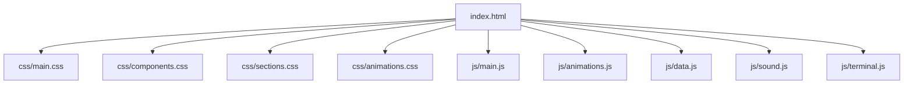
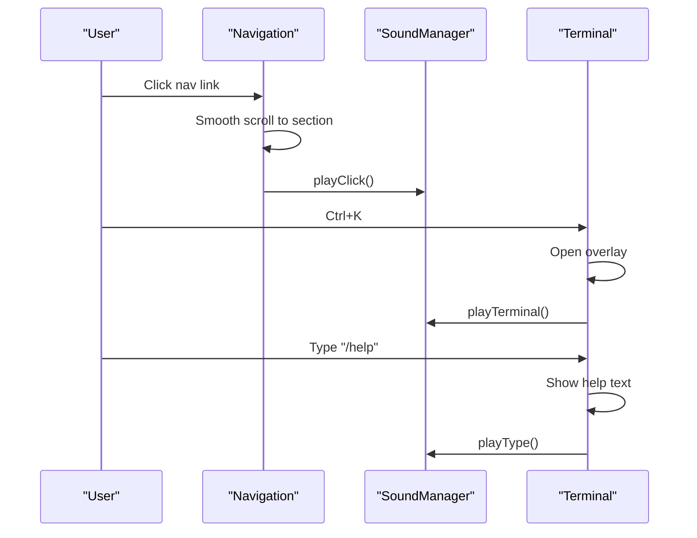

# Getting Started

<cite>
**Referenced Files in This Document**
- [index.html](file://portfolio/index.html)
- [main.js](file://portfolio/js/main.js)
- [animations.js](file://portfolio/js/animations.js)
- [data.js](file://portfolio/js/data.js)
- [sound.js](file://portfolio/js/sound.js)
- [terminal.js](file://portfolio/js/terminal.js)
- [main.css](file://portfolio/css/main.css)
- [animations.css](file://portfolio/css/animations.css)
- [components.css](file://portfolio/css/components.css)
- [sections.css](file://portfolio/css/sections.css)
</cite>

## Table of Contents
1. [Introduction](#introduction)
2. [Prerequisites](#prerequisites)
3. [Installation](#installation)
4. [Development Environment Setup](#development-environment-setup)
5. [Running Locally](#running-locally)
6. [Project Structure](#project-structure)
7. [External Dependencies](#external-dependencies)
8. [Using the Gaming-Inspired Interface](#using-the-gaming-inspired-interface)
9. [Troubleshooting](#troubleshooting)
10. [Conclusion](#conclusion)

## Introduction
Welcome to the JAJA Portfolio project. This is a modern, gaming-inspired single-page portfolio showcasing a developer’s profile, skills, projects, and interactive elements. It uses HTML, CSS, and JavaScript with advanced animations powered by GSAP and a retro-futuristic aesthetic inspired by games like Valorant. The site includes a custom cursor, animated HUD elements, a terminal-style command system, and a mini-game (Aim Trainer).

## Prerequisites
Before you begin, ensure your environment meets the following requirements:

- Modern browser support
  - Latest Chrome, Firefox, Safari, or Edge
  - JavaScript ES6+ enabled (required for modern features)
- Basic web development knowledge
  - Understanding of HTML, CSS, and JavaScript fundamentals
  - Familiarity with the DOM and event handling
- Optional: Local server for live reload during development (e.g., Live Server extension in VS Code)

## Installation
Follow these steps to install and run the project locally:

1. Clone or download the repository to your machine.
2. Open the project folder in your preferred code editor.
3. Launch the project by opening the index.html file in your browser.
   - Alternatively, serve the project via a local HTTP server for live updates.

Notes:
- There is no build step or package manager required. All assets are included in the repository.
- The project relies on CDN-hosted libraries for GSAP and Font Awesome (see External Dependencies).

**Section sources**
- [index.html:1-26](file://portfolio/index.html#L1-L26)

## Development Environment Setup
Configure your environment for optimal development and testing:

- Use a modern code editor (VS Code recommended) with:
  - Syntax highlighting for HTML, CSS, and JavaScript
  - Live Server extension for automatic browser refresh
- Keep your browser updated to support the latest JavaScript features and CSS animations.
- Optionally, enable developer tools to inspect animations, network requests, and console logs.

## Running Locally
To run the project locally:

1. Open the index.html file directly in your browser.
2. Interact with the interface:
   - Use navigation links to jump between sections.
   - Toggle sound using the volume icon in the top-right.
   - Open the terminal using Ctrl+K or the terminal icon.
3. Access the Aim Trainer section to play the mini-game.

Tips:
- If animations feel choppy, disable hardware acceleration in your browser settings temporarily.
- On mobile devices, the custom cursor is disabled automatically to improve usability.

**Section sources**
- [index.html:64-110](file://portfolio/index.html#L64-L110)
- [main.js:112-150](file://portfolio/js/main.js#L112-L150)
- [sound.js:104-155](file://portfolio/js/sound.js#L104-L155)

## Project Structure
The project follows a straightforward, feature-based layout:

- Root index.html serves as the application shell and loads all styles and scripts.
- CSS files are split into modular concerns:
  - main.css: global variables, resets, and base styles
  - components.css: reusable UI components (buttons, cards, forms)
  - sections.css: layout and styling for each page section
  - animations.css: motion effects and keyframe animations
- JavaScript modules encapsulate distinct functionality:
  - main.js: UI interactions, modals, forms, and game logic
  - animations.js: GSAP-powered scroll-triggered animations
  - data.js: static data for projects and terminal commands
  - sound.js: Web Audio API-based sound effects
  - terminal.js: Command terminal, chat HUD, and HUD systems

**Diagram sources**
- [index.html:21-25](file://portfolio/index.html#L21-L25)
- [main.css:1-50](file://portfolio/css/main.css#L1-L50)
- [components.css:1-50](file://portfolio/css/components.css#L1-L50)
- [sections.css:1-50](file://portfolio/css/sections.css#L1-L50)
- [animations.css:1-50](file://portfolio/css/animations.css#L1-L50)
- [main.js:1-20](file://portfolio/js/main.js#L1-L20)
- [animations.js:1-10](file://portfolio/js/animations.js#L1-L10)
- [data.js:1-10](file://portfolio/js/data.js#L1-L10)
- [sound.js:1-10](file://portfolio/js/sound.js#L1-L10)
- [terminal.js:1-10](file://portfolio/js/terminal.js#L1-L10)

**Section sources**
- [index.html:1-90](file://portfolio/index.html#L1-L90)
- [main.css:1-120](file://portfolio/css/main.css#L1-L120)
- [components.css:1-120](file://portfolio/css/components.css#L1-L120)
- [sections.css:1-120](file://portfolio/css/sections.css#L1-L120)
- [animations.css:1-120](file://portfolio/css/animations.css#L1-L120)
- [main.js:1-120](file://portfolio/js/main.js#L1-L120)
- [animations.js:1-120](file://portfolio/js/animations.js#L1-L120)
- [data.js:1-60](file://portfolio/js/data.js#L1-L60)
- [sound.js:1-60](file://portfolio/js/sound.js#L1-L60)
- [terminal.js:1-120](file://portfolio/js/terminal.js#L1-L120)

## External Dependencies
The project uses CDN-hosted libraries loaded in index.html:

- GSAP 3.12.2
  - Purpose: Scroll-triggered animations and UI effects
  - Includes ScrollTrigger plugin
- Font Awesome 6.4.0
  - Purpose: Icons for UI elements (navigation, buttons, social links)
- Google Fonts
  - Oswald, Rajdhani, Share Tech Mono for typography

How they are integrated:
- Scripts and styles are included in the <head> of index.html
- The animations module registers and uses ScrollTrigger
- Icons are referenced via Font Awesome classes in HTML

**Section sources**
- [index.html:10-25](file://portfolio/index.html#L10-L25)
- [animations.js:5-10](file://portfolio/js/animations.js#L5-L10)

## Using the Gaming-Inspired Interface
Explore the interactive features of the portfolio:

- Custom cursor
  - A stylized crosshair appears on desktop; disabled on touch devices
  - Hover states and click animations provide tactile feedback
- HUD elements
  - Scanline overlays, progress bars, and “tactical” borders
  - Section navigation dots and a kill feed for dynamic storytelling
- Terminal and chat
  - Press Ctrl+K to open the terminal
  - Type /help for available commands; use /goto to navigate sections
  - Chat HUD supports channels and animated messages
- Sound system
  - Toggle sound using the volume icon
  - Clicks, hover, typing, and success sounds are generated via Web Audio API
- Aim Trainer
  - Start a timed challenge in the RANGE section
  - Click targets to score points; watch animations and sound cues

**Diagram sources**
- [main.js:328-349](file://portfolio/js/main.js#L328-L349)
- [sound.js:104-155](file://portfolio/js/sound.js#L104-L155)
- [terminal.js:404-479](file://portfolio/js/terminal.js#L404-L479)

**Section sources**
- [main.js:6-109](file://portfolio/js/main.js#L6-L109)
- [terminal.js:1-120](file://portfolio/js/terminal.js#L1-L120)
- [sound.js:1-100](file://portfolio/js/sound.js#L1-L100)

## Troubleshooting
Common setup and runtime issues:

- Blank screen or missing styles
  - Ensure index.html is opened from a local server or directly in a supported browser
  - Verify that CSS files are present in the css/ directory
- Animations not playing
  - Confirm that GSAP is loading from the CDN (check browser network tab)
  - Ensure ScrollTrigger is registered in animations.js
- Terminal not responding
  - Press Ctrl+K to open; ensure the terminal overlay exists in the DOM
  - Check for console errors related to missing modules
- Sound does not play
  - Some browsers require user interaction before audio can play
  - Click anywhere on the page to initialize the audio context
  - Toggle the sound icon to enable/disable audio
- Mobile cursor issues
  - On touch devices, the custom cursor is intentionally disabled for usability

**Section sources**
- [index.html:1-26](file://portfolio/index.html#L1-L26)
- [animations.js:5-10](file://portfolio/js/animations.js#L5-L10)
- [sound.js:13-26](file://portfolio/js/sound.js#L13-L26)
- [terminal.js:404-479](file://portfolio/js/terminal.js#L404-L479)

## Conclusion
You are now ready to explore the JAJA Portfolio project. Use the terminal for quick navigation, enjoy the animated HUD and sound effects, and test the Aim Trainer. For contributors, the modular structure makes it easy to extend animations, add new sections, or integrate additional interactive features. If you encounter issues, refer to the troubleshooting section or verify your browser and network connectivity.