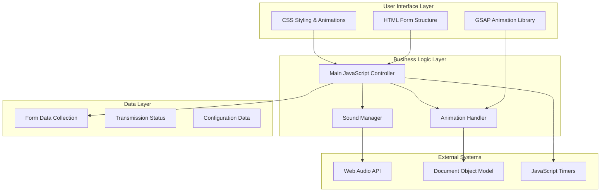

# Contact Transmission System

<cite>
**Referenced Files in This Document**
- [index.html](file://portfolio/index.html)
- [main.js](file://portfolio/js/main.js)
- [animations.js](file://portfolio/js/animations.js)
- [sound.js](file://portfolio/js/sound.js)
- [terminal.js](file://portfolio/js/terminal.js)
- [data.js](file://portfolio/js/data.js)
- [main.css](file://portfolio/css/main.css)
- [components.css](file://portfolio/css/components.css)
- [animations.css](file://portfolio/css/animations.css)
- [sections.css](file://portfolio/css/sections.css)
</cite>

## Table of Contents
1. [Introduction](#introduction)
2. [System Architecture](#system-architecture)
3. [Form Validation Process](#form-validation-process)
4. [Transmission Initiation Sequence](#transmission-initiation-sequence)
5. [Progress Animation System](#progress-animation-system)
6. [Step-by-Step Transmission Phases](#step-by-step-transmission-phases)
7. [Visual Feedback System](#visual-feedback-system)
8. [Satellite Dish Icon Animations](#satellite-dish-icon-animations)
9. [Button State Changes](#button-state-changes)
10. [Form Reset Functionality](#form-reset-functionality)
11. [Error Handling](#error-handling)
12. [User Experience Enhancements](#user-experience-enhancements)
13. [Sound System Integration](#sound-system-integration)
14. [VALORANT Aesthetic Implementation](#valorant-aesthetic-implementation)
15. [Conclusion](#conclusion)

## Introduction

The Contact Transmission System is a sophisticated VALORANT-inspired communication interface that simulates secure data transmission through a multi-phase process. Built with modern web technologies, this system provides an immersive experience that combines visual effects, audio feedback, and realistic transmission simulation to create an authentic tactical communication interface.

The system transforms a simple contact form into an interactive transmission sequence that progresses through distinct phases: data encryption simulation, packet uploading, integrity verification, and finalization. Each phase is accompanied by visual feedback, status updates, and appropriate sound effects to enhance the user experience.

## System Architecture

The contact transmission system follows a modular architecture with clear separation of concerns:

**Diagram sources**
- [main.js:235-326](file://portfolio/js/main.js#L235-L326)
- [sound.js:5-104](file://portfolio/js/sound.js#L5-L104)
- [animations.js:5-774](file://portfolio/js/animations.js#L5-L774)

The architecture ensures that each component has a specific responsibility:
- **HTML Structure**: Provides the foundation for the transmission interface
- **CSS Styling**: Handles visual presentation and animations
- **JavaScript Controllers**: Manage business logic and user interactions
- **Sound System**: Provides audio feedback synchronized with visual effects
- **Animation Engine**: Coordinates complex visual sequences

**Section sources**
- [main.js:235-326](file://portfolio/js/main.js#L235-L326)
- [index.html:733-785](file://portfolio/index.html#L733-L785)

## Form Validation Process

The form validation process is integrated seamlessly into the transmission initiation sequence. The system validates form data through multiple stages:

### Pre-Transmission Validation
The form validation occurs automatically when the user attempts to submit the form. The system checks for required fields and ensures data integrity before proceeding with transmission.

### Real-Time Input Validation
Individual form fields implement real-time validation feedback:
- **Input Focus Effects**: Fields glow with red borders when focused
- **Scan Line Animation**: Horizontal scan lines appear below focused inputs
- **Validation State Indicators**: Visual cues indicate field validity

### Field-Specific Validation Rules
- **Name Field**: Required, minimum length validation
- **Email Field**: Required, email format validation  
- **Subject Field**: Required, character limit enforcement
- **Message Field**: Required, minimum length requirement

### Validation Feedback Mechanisms
The system provides immediate visual feedback through:
- **Border Color Changes**: Red glow for invalid fields, green for valid
- **Shadow Effects**: Glowing borders with configurable intensity
- **Error State Classes**: Dynamic class application for validation states

**Section sources**
- [main.js:235-326](file://portfolio/js/main.js#L235-L326)
- [components.css:232-246](file://portfolio/css/components.css#L232-L246)

## Transmission Initiation Sequence

The transmission initiation sequence begins when the user submits the contact form. This triggers a carefully orchestrated series of events that transform the static form into an animated transmission interface.

### Initial State Transformation
Upon form submission, the system immediately transforms the interface:
- **Form Container**: Adds `.transmitting` class to enable transmission mode
- **Progress Bar**: Activates the transmission progress bar with fade-in animation
- **Button State**: Disables the submit button and changes text to "TRANSMITTING..."
- **Icon Animation**: Replaces static satellite dish icon with spinning animation

### Visual State Management
The system manages multiple visual states simultaneously:
- **Transmit Container**: Applies transmission-specific styling
- **Status Panel**: Updates to transmitting state with yellow border
- **Progress Indicator**: Begins progress animation sequence
- **Button Styling**: Changes background to red with glow effect

### Audio Cue Integration
The transmission initiation triggers appropriate sound effects:
- **Terminal Sound**: Initializes transmission sequence
- **Button Click**: Provides tactile feedback for submission
- **System Alert**: Indicates successful transition to transmission mode

**Section sources**
- [main.js:247-293](file://portfolio/js/main.js#L247-L293)
- [components.css:248-330](file://portfolio/css/components.css#L248-L330)

## Progress Animation System

The progress animation system provides real-time visual feedback throughout the transmission process. The system implements a sophisticated animation framework that coordinates multiple visual elements.

### Progress Bar Implementation
The transmission progress bar consists of several key components:
- **Container Element**: Manages overall layout and state
- **Progress Fill**: Animated gradient bar representing transmission progress
- **State Classes**: Dynamically applied based on transmission phase

### Animation Timing and Control
The progress animation uses precise timing controls:
- **Interval-Based Updates**: Progress increments occur at 200ms intervals
- **Randomized Progress**: Variable increment rates simulate realistic processing
- **Phase-Based Updates**: Different progress rates for different transmission phases

### Visual Progress Indicators
The system provides multiple visual indicators:
- **Percentage Counter**: Numeric progress display
- **Gradient Color Transition**: Red-to-green color change
- **Pulsing Animation**: Subtle pulsing effect during active transmission
- **Wave Effect**: Animated wave pattern along the progress bar

### State-Specific Visual Effects
Different transmission phases trigger distinct visual effects:
- **Encryption Phase**: Rapid progress with blue accent color
- **Upload Phase**: Steady progress with yellow warning indicators
- **Verification Phase**: Slow, careful progress with caution indicators
- **Finalization Phase**: Rapid completion with green success indicators

**Section sources**
- [main.js:270-293](file://portfolio/js/main.js#L270-L293)
- [components.css:269-274](file://portfolio/css/components.css#L269-L274)

## Step-by-Step Transmission Phases

The transmission process is divided into four distinct phases, each with specific visual and auditory characteristics.

### Phase 1: Data Encryption Simulation (0-30%)
During this initial phase, the system simulates data encryption processes.

#### Encryption Process Simulation
The encryption phase employs sophisticated visual metaphors:
- **Binary Code Rain**: Digital rain effect representing encrypted data streams
- **Lock Icon Animation**: Satellite dish icon transforms into lock icon
- **Color Transition**: Gradual shift from blue to purple tones
- **Pulsing Effect**: Synchronized pulsing of encryption indicators

#### Visual Elements
- **Background Particles**: Floating particles with encryption-themed patterns
- **Grid Overlay**: Subtle grid pattern representing encrypted data structure
- **Status Text**: "ENCRYPTING DATA..." with blinking cursor effect
- **Progress Rate**: Fastest progress rate to simulate rapid encryption

### Phase 2: Packet Uploading (30-60%)
The packet upload phase simulates data transmission through network channels.

#### Upload Process Simulation
This phase focuses on network transmission metaphors:
- **Network Grid Animation**: Animated grid representing network topology
- **Data Stream Visualization**: Flowing data streams moving upward
- **Connection Indicators**: Visual indicators showing established connections
- **Upload Speed**: Moderate progress rate with steady upward movement

#### Network Visualization
The system creates an immersive network visualization:
- **Connection Lines**: Animated lines connecting to remote servers
- **Data Packets**: Small animated packets traveling through network
- **Server Icons**: Animated server icons receiving data packets
- **Bandwidth Indicators**: Visual representation of upload bandwidth

### Phase 3: Integrity Verification (60-90%)
The integrity verification phase simulates data validation and quality assurance.

#### Verification Process Simulation
This phase emphasizes data validation and quality checks:
- **Checksum Calculation**: Animated checksum calculation process
- **Data Validation**: Visual validation of transmitted data
- **Quality Metrics**: Display of data quality and integrity metrics
- **Error Detection**: Simulated error detection and correction processes

#### Quality Assurance Visualization
The system provides comprehensive quality assurance feedback:
- **Integrity Check**: Animated integrity check process
- **Error Correction**: Visual representation of error correction
- **Quality Scores**: Numerical quality scores displayed
- **Validation Results**: Final validation result indicators

### Phase 4: Finalization (90-100%)
The finalization phase completes the transmission process with success indicators.

#### Completion Process
The finalization phase provides closure and success feedback:
- **Success Animation**: Confetti-like particles celebrating successful transmission
- **Completion Message**: "TRANSMISSION COMPLETE" with success styling
- **Green Success State**: Complete transition to green success indicators
- **Auto-Restart**: Automatic reset after completion sequence

#### Success Celebration
The system provides celebratory visual effects:
- **Particle Explosion**: Confetti-like particle explosion effect
- **Glow Effect**: Extended glow around successful transmission elements
- **Sound Cues**: Success sound effects synchronized with visual celebration
- **Automatic Reset**: System automatically resets after completion

**Section sources**
- [main.js:277-291](file://portfolio/js/main.js#L277-L291)
- [components.css:288-330](file://portfolio/css/components.css#L288-L330)

## Visual Feedback System

The visual feedback system provides comprehensive real-time feedback throughout the transmission process, ensuring users always understand the current state of the transmission.

### Status Indicator System
The status indicator system provides clear visual communication of transmission state:

#### Status Light System
- **Primary Status Light**: Central indicator showing overall transmission health
- **Color Coding**: Red for errors, Yellow for warnings, Green for success
- **Pulsing Animation**: Different pulse patterns for different states
- **Glow Effects**: Enhanced glow effects during active transmission

#### Status Text System
- **Dynamic Text Updates**: Real-time status text changes based on transmission phase
- **Phase-Specific Messages**: Contextually appropriate messages for each phase
- **Progress Percentage**: Current progress displayed alongside status text
- **Estimated Time**: Remaining time estimates for transmission completion

### Progress Visualization
The progress visualization system provides multiple layers of progress information:

#### Multi-Level Progress Tracking
- **Overall Progress**: Main progress bar showing total transmission progress
- **Phase Progress**: Separate indicators for individual transmission phases
- **Speed Indicators**: Visual representation of current transmission speed
- **Data Volume**: Estimated data volume being transmitted

#### Progress Bar Design
The progress bar features sophisticated design elements:
- **Gradient Background**: Multi-colored gradient representing different phases
- **Animated Fill**: Smoothly animated fill with wave effect
- **Progress Markers**: Visual markers indicating key milestones
- **Completion Animation**: Special animation for completion state

### Visual State Management
The system manages multiple visual states simultaneously:

#### State Transitions
- **Smooth Transitions**: All state changes use smooth CSS transitions
- **Animation Coordination**: All visual elements coordinate during state changes
- **Timing Consistency**: Consistent timing across all state transitions
- **Visual Continuity**: Maintains visual continuity during transitions

#### Responsive Visual Feedback
The system adapts visual feedback to different screen sizes:
- **Mobile Optimization**: Simplified visual elements for mobile devices
- **Touch-Friendly Elements**: Larger interactive elements for touch interfaces
- **Adaptive Layouts**: Layouts that adapt to different screen orientations
- **Performance Optimization**: Optimized animations for lower-powered devices

**Section sources**
- [main.js:262-322](file://portfolio/js/main.js#L262-L322)
- [components.css:276-330](file://portfolio/css/components.css#L276-L330)

## Satellite Dish Icon Animations

The satellite dish icon serves as the central visual metaphor for the transmission system, undergoing dramatic transformations throughout the transmission process.

### Icon Transformation Sequence
The satellite dish icon undergoes a complete visual transformation:

#### Initial State
- **Static Icon**: Standard satellite dish icon with subtle glow
- **Neutral Color**: Gray/white color scheme indicating readiness
- **Stable Position**: Centered and stable positioning
- **Minimal Animation**: Subtle pulsing to indicate system readiness

#### Transmission State
- **Spinning Animation**: Continuous clockwise rotation animation
- **Color Transition**: Shift from neutral to red/orange during active transmission
- **Size Changes**: Subtle scaling effects during high-activity phases
- **Glow Intensification**: Increased glow intensity during critical phases

#### Success State
- **Static Success**: Non-animated checkmark icon
- **Green Color**: Bright green color indicating successful completion
- **Enhanced Glow**: Strong green glow effect
- **Stable Position**: Centered and stable final position

### Animation Timing and Coordination
The icon animations are precisely timed to match transmission phases:

#### Phase-Specific Animations
- **Encryption Phase**: Gentle pulsing animation
- **Upload Phase**: Steady rotation with acceleration
- **Verification Phase**: Brief pause with intense pulsing
- **Finalization Phase**: Smooth transition to checkmark

#### Synchronization Effects
The icon animations synchronize with other visual elements:
- **Progress Bar Sync**: Rotation speed synchronized with progress
- **Color Transitions**: Color changes coordinated with phase transitions
- **Timing Patterns**: Animation timing coordinated with audio cues
- **Visual Harmony**: All animations work together for cohesive experience

### Icon Design Elements
The satellite dish icon incorporates sophisticated design elements:

#### Visual Metaphors
- **Signal Strength**: Icon size variations represent signal strength
- **Connection Quality**: Visual distortions represent connection quality
- **Data Flow**: Animated elements represent data flow through the system
- **System Health**: Icon stability represents overall system health

#### Technical Symbolism
The icon design incorporates technical symbolism:
- **Antenna Elements**: Representing signal reception/transmission
- **Digital Patterns**: Representing digital data processing
- **Network Connections**: Representing network connectivity
- **Security Elements**: Representing data security measures

**Section sources**
- [main.js:260-301](file://portfolio/js/main.js#L260-L301)
- [animations.css:132-152](file://portfolio/css/animations.css#L132-L152)

## Button State Changes

The transmission button undergoes comprehensive state changes throughout the transmission process, providing clear visual feedback about the current system state.

### Button State Management
The button system manages multiple distinct states:

#### Ready State
- **Default Appearance**: Red button with white text
- **Static Icon**: Satellite dish icon with subtle glow
- **Hover Effects**: Smooth hover transitions to black background
- **Click Feedback**: Subtle press animation on click

#### Transmitting State
- **Disabled State**: Button becomes disabled during transmission
- **Text Change**: Text changes to "TRANSMITTING..."
- **Icon Animation**: Satellite dish icon begins spinning
- **Color Transition**: Button color intensifies with red glow

#### Success State
- **Color Change**: Button transitions to green success color
- **Icon Replacement**: Satellite dish replaced with checkmark icon
- **Glow Effect**: Strong green glow effect
- **Text Update**: Text changes to "TRANSMISSION COMPLETE"

### Button Interaction Effects
The button system provides comprehensive interaction feedback:

#### Hover Interactions
- **Color Changes**: Smooth color transitions on hover
- **Text Effects**: Text animations during hover states
- **Icon Transformations**: Icon animations during hover
- **Shadow Effects**: Enhanced shadow effects during hover

#### Click Interactions
- **Press Animation**: Subtle press-down animation on click
- **Feedback Sounds**: Appropriate sound effects for clicks
- **State Transitions**: Immediate state changes upon interaction
- **Visual Confirmation**: Clear visual confirmation of interactions

### Button Accessibility Features
The button system includes comprehensive accessibility features:

#### Keyboard Navigation
- **Focus States**: Clear focus indicators for keyboard navigation
- **Accessible Names**: Proper ARIA labels and descriptions
- **Keyboard Shortcuts**: Support for keyboard shortcuts and hotkeys
- **Screen Reader Support**: Full screen reader compatibility

#### Touch Interface
- **Large Touch Targets**: Optimized touch target sizes for mobile devices
- **Touch Feedback**: Visual feedback for touch interactions
- **Responsive Design**: Adapts to different touch interface requirements
- **Mobile Optimization**: Optimized for mobile device interaction

**Section sources**
- [main.js:256-318](file://portfolio/js/main.js#L256-L318)
- [components.css:101-110](file://portfolio/css/components.css#L101-L110)

## Form Reset Functionality

The form reset functionality ensures that the transmission system returns to its initial state after completion, providing a clean slate for subsequent transmissions.

### Automatic Reset Process
The automatic reset process occurs after successful transmission completion:

#### Reset Timing
- **Delayed Reset**: System waits 3 seconds after completion before reset
- **Graceful Transition**: Smooth transition from success state to ready state
- **Cleanup Operations**: Automatic cleanup of temporary visual elements
- **State Restoration**: Complete restoration of original form state

#### Reset Sequence
The reset sequence follows a carefully orchestrated process:
- **Success State Duration**: Minimum 3 seconds in success state
- **Transition Animation**: Smooth animation to reset state
- **Visual Cleanup**: Removal of transmission-specific visual elements
- **State Restoration**: Return to original form submission state

### Manual Reset Options
Users can manually reset the form at any time:

#### Reset Triggers
- **Manual Reset Button**: Dedicated reset button for manual intervention
- **Form Reset**: Standard HTML form reset functionality
- **State Reset**: Programmatic reset of transmission state
- **Visual Reset**: Reset of all visual transmission elements

#### Reset Validation
The system validates reset operations:
- **Transmission Completion**: Only allows reset after transmission completion
- **Partial Transmission**: Prevents reset during active transmission
- **Error Recovery**: Allows reset after error conditions
- **State Validation**: Validates system state before reset operation

### Reset State Management
The reset system manages multiple state aspects:

#### Form State Reset
- **Field Values**: Resets all form field values to empty state
- **Validation State**: Clears all validation error states
- **Focus State**: Removes focus from all form elements
- **Selection State**: Clears any selected form options

#### Visual State Reset
- **Animation State**: Stops all ongoing animations
- **Color State**: Resets all color states to defaults
- **Layout State**: Restores original layout positions
- **Display State**: Hides all transmission-specific displays

**Section sources**
- [main.js:311-322](file://portfolio/js/main.js#L311-L322)
- [components.css:265-267](file://portfolio/css/components.css#L265-L267)

## Error Handling

The error handling system provides comprehensive error detection, reporting, and recovery mechanisms for the transmission process.

### Error Detection Mechanisms
The system implements multiple layers of error detection:

#### Transmission Phase Errors
- **Encryption Failures**: Detection of encryption process failures
- **Upload Errors**: Identification of upload process errors
- **Verification Failures**: Detection of data verification failures
- **Finalization Errors**: Recognition of completion process errors

#### System-Level Errors
- **Network Connectivity**: Detection of network connectivity issues
- **Resource Availability**: Monitoring of system resource availability
- **Memory Constraints**: Detection of memory allocation failures
- **Timeout Conditions**: Recognition of timeout scenarios

### Error Reporting System
The error reporting system provides clear and actionable error information:

#### Visual Error Indicators
- **Error State**: Visual indication of error conditions
- **Error Messages**: Clear error messages with suggested actions
- **Warning Icons**: Distinctive warning icons for different error types
- **Color Coding**: Red color scheme for error states

#### Error Classification
The system classifies errors into distinct categories:
- **Critical Errors**: System-wide failures requiring immediate attention
- **Non-Critical Errors**: Localized failures that can be recovered
- **Warning Conditions**: Potential issues that may affect transmission
- **Informational Messages**: Status updates and informational feedback

### Error Recovery Mechanisms
The system implements comprehensive error recovery procedures:

#### Automatic Recovery
- **Retry Logic**: Automatic retry of failed operations
- **Fallback Procedures**: Alternative procedures for failed operations
- **Graceful Degradation**: Reduced functionality during partial failures
- **State Recovery**: Recovery to previous stable system state

#### Manual Intervention
- **User Controls**: Manual controls for error recovery actions
- **Diagnostic Tools**: Built-in diagnostic tools for error identification
- **Support Information**: Error codes and support information
- **Logging System**: Comprehensive error logging for debugging

### Error Prevention Measures
The system implements proactive error prevention:

#### Input Validation
- **Pre-Transmission Validation**: Validation before transmission initiation
- **Real-time Validation**: Continuous validation during transmission
- **Boundary Checking**: Prevention of boundary condition errors
- **Format Validation**: Validation of data formats and structures

#### Resource Management
- **Resource Monitoring**: Continuous monitoring of system resources
- **Load Balancing**: Distribution of workload to prevent overload
- **Memory Management**: Efficient memory allocation and deallocation
- **Timeout Management**: Proper timeout handling for all operations

**Section sources**
- [main.js:294-324](file://portfolio/js/main.js#L294-L324)
- [sound.js:37-59](file://portfolio/js/sound.js#L37-L59)

## User Experience Enhancements

The user experience enhancements focus on creating an immersive and intuitive transmission interface that maintains usability while providing engaging visual feedback.

### Immersive Interface Design
The system creates an immersive tactical environment:

#### Visual Environment Creation
- **Dark Theme**: Deep dark theme with red accents for tactical feel
- **Grid Overlays**: Subtle grid patterns representing digital environments
- **Particle Systems**: Floating particles for atmospheric effect
- **Scan Line Effects**: Scanning line effects for CRT monitor feel

#### Environmental Effects
- **Background Animations**: Subtle background animations for depth
- **Lighting Effects**: Dynamic lighting effects for atmosphere
- **Depth Perception**: Visual depth cues for three-dimensional feel
- **Scale Effects**: Appropriate scaling for different interface elements

### Interaction Design Principles
The system follows established interaction design principles:

#### Consistent Feedback
- **Immediate Response**: Immediate visual feedback for all user actions
- **Predictable Behavior**: Consistent behavior across all interface elements
- **Clear Communication**: Clear communication of system state and actions
- **Error Prevention**: Design that prevents common user errors

#### Accessibility Features
- **Visual Accessibility**: High contrast and readable typography
- **Motor Accessibility**: Support for various motor control abilities
- **Cognitive Accessibility**: Clear and understandable interface design
- **Sensory Accessibility**: Audio and visual alternatives for different needs

### Performance Optimization
The system is optimized for smooth performance across different devices:

#### Animation Performance
- **Hardware Acceleration**: Use of hardware-accelerated animations
- **Frame Rate Optimization**: Consistent frame rates across different devices
- **Memory Management**: Efficient memory usage for animations
- **Battery Optimization**: Minimized battery drain on mobile devices

#### Loading Optimization
- **Lazy Loading**: Lazy loading of non-critical resources
- **Progressive Enhancement**: Progressive enhancement for older browsers
- **Resource Prioritization**: Intelligent prioritization of resource loading
- **Caching Strategies**: Effective caching strategies for improved performance

### Mobile Experience
The system provides excellent mobile experience:

#### Responsive Design
- **Adaptive Layouts**: Layouts that adapt to different screen sizes
- **Touch Optimization**: Touch-friendly interface elements
- **Orientation Support**: Support for both portrait and landscape modes
- **Performance Optimization**: Optimized performance for mobile devices

#### Mobile-Specific Features
- **Gesture Support**: Support for common mobile gestures
- **Orientation Lock**: Option to lock orientation for stability
- **Battery Optimization**: Reduced battery consumption on mobile
- **Network Optimization**: Adaptive behavior for different network conditions

**Section sources**
- [animations.js:503-524](file://portfolio/js/animations.js#L503-L524)
- [main.css:52-127](file://portfolio/css/main.css#L52-L127)

## Sound System Integration

The sound system provides comprehensive audio feedback that enhances the transmission experience and provides important operational cues.

### Audio Architecture
The sound system is built on the Web Audio API with sophisticated audio management:

#### Audio Context Management
- **Context Initialization**: Proper initialization of Web Audio API context
- **User Interaction Requirement**: Audio context requires user interaction
- **Resume Capability**: Ability to resume suspended audio contexts
- **Cross-Browser Compatibility**: Support for different browser audio implementations

#### Sound Configuration System
The system uses a configuration-driven approach to sound management:
- **Configurable Parameters**: Frequency, duration, and waveform parameters
- **Volume Control**: Adjustable volume levels for different sound types
- **Sound Categories**: Organized sound categories for different system states
- **Dynamic Parameter Adjustment**: Runtime adjustment of sound parameters

### Sound Effects Implementation
The system implements a comprehensive suite of sound effects:

#### Transmission Sounds
- **Initiation Sound**: Distinct sound for transmission initiation
- **Progress Sounds**: Ongoing sounds during transmission phases
- **Completion Sound**: Celebration sound for successful completion
- **Error Sounds**: Alert sounds for error conditions

#### Interface Sounds
- **Button Clicks**: Distinct sounds for button interactions
- **Form Validation**: Sounds for form validation feedback
- **State Changes**: Sounds for system state transitions
- **Navigation Sounds**: Sounds for page navigation

### Audio Synchronization
The audio system is carefully synchronized with visual effects:

#### Timing Coordination
- **Beat Synchronization**: Audio beats synchronized with visual animations
- **Phase Alignment**: Audio cues aligned with transmission phases
- **Progress Synchronization**: Audio progression synchronized with visual progress
- **Event Triggering**: Audio events triggered by specific visual events

#### Spatial Audio Effects
- **Stereo Separation**: Left/right channel separation for spatial effects
- **Volume Panning**: Dynamic volume panning for directional effects
- **Frequency Filtering**: Dynamic filtering for environmental effects
- **Reverb Effects**: Appropriate reverb for different acoustic environments

### Audio Accessibility
The system includes comprehensive audio accessibility features:

#### Volume Control
- **Adjustable Volume**: User-adjustable volume levels
- **Mute Functionality**: Complete audio muting capability
- **Volume Persistence**: Volume settings saved across sessions
- **System Integration**: Integration with system audio settings

#### Audio Alternatives
- **Visual Alternatives**: Visual feedback for audio cues
- **Haptic Feedback**: Optional haptic feedback for touch interfaces
- **Text Alternatives**: Text descriptions for audio content
- **Alternative Formats**: Support for different audio format preferences

**Section sources**
- [sound.js:5-104](file://portfolio/js/sound.js#L5-L104)
- [data.js:132-159](file://portfolio/js/data.js#L132-L159)

## VALORANT Aesthetic Implementation

The VALORANT aesthetic implementation creates an immersive tactical environment that enhances the transmission experience through authentic visual and interactive elements.

### Color Scheme Implementation
The system implements the distinctive VALORANT color palette:

#### Core Color System
- **Red Accent Color**: Primary red (#ff4655) for highlights and alerts
- **Dark Background**: Deep dark backgrounds (#0f1419) for immersion
- **Gray Tones**: Various gray tones for interface elements
- **Accent Colors**: Additional colors for different interface states

#### Color Application Strategy
The color system is applied consistently across all interface elements:
- **Consistent Usage**: Red used for critical elements and alerts
- **Hierarchical Color**: Different shades for different interface levels
- **Accessibility Compliance**: Color choices meet accessibility guidelines
- **Brand Consistency**: Colors align with VALORANT brand identity

### Typography System
The system uses carefully selected typography that reflects the tactical nature of the interface:

#### Font Selection
- **Display Fonts**: Bold display fonts for headings and titles
- **Body Fonts**: Clean body fonts for readable content
- **Monospace Fonts**: Technical fonts for code and technical elements
- **Font Weights**: Multiple weights for visual hierarchy

#### Typography Hierarchy
The typography system establishes clear visual hierarchy:
- **Headings**: Large, bold display fonts for major sections
- **Subheadings**: Medium-weight fonts for subsections
- **Body Text**: Clean, readable fonts for content
- **Technical Text**: Monospace fonts for technical content

### Interface Element Design
The system implements VALORANT-style interface elements:

#### Button Design
- **Polygon Shapes**: Cut-corner polygon shapes for modern look
- **Gradient Effects**: Subtle gradients for depth perception
- **Glow Effects**: Subtle glow effects for interactive elements
- **Animation Transitions**: Smooth transitions for state changes

#### Card Design
- **Tactical Aesthetics**: Card designs inspired by tactical equipment
- **Border Effects**: Distinctive border treatments for different card types
- **Shadow Effects**: Strategic use of shadows for depth
- **Texture Effects**: Subtle textures for tactile feel

### Animation System
The animation system provides sophisticated motion graphics:

#### Motion Design Philosophy
- **Purposeful Movement**: All animations serve a functional purpose
- **Smooth Transitions**: Seamless transitions between states
- **Timing Consistency**: Consistent timing across all animations
- **Performance Optimization**: Optimized animations for smooth performance

#### Animation Categories
The system implements multiple categories of animations:
- **Entry Animations**: Sophisticated entry animations for interface elements
- **State Change Animations**: Smooth transitions between interface states
- **Interactive Animations**: Responsive animations for user interactions
- **Background Animations**: Subtle background animations for atmosphere

### Visual Effects Implementation
The system incorporates sophisticated visual effects:

#### Particle Systems
- **Floating Particles**: Subtle floating particles for atmospheric effect
- **Interactive Particles**: Particles that respond to user interaction
- **Particle Physics**: Realistic physics for particle movement
- **Performance Optimization**: Optimized particle rendering for performance

#### Lighting Effects
- **Dynamic Lighting**: Dynamic lighting that responds to interface state
- **Glow Effects**: Strategic glow effects for important elements
- **Shadow Casting**: Realistic shadow casting for depth perception
- **Light Reflection**: Subtle light reflection effects for realism

### Tactical Theming
The system implements comprehensive tactical theming:

#### Equipment Metaphors
- **Weapon Icons**: Tactical weapon icons for interface elements
- **Gear Imagery**: Equipment imagery for different interface states
- **Tactical Patterns**: Pattern designs inspired by tactical gear
- **Functional Metaphors**: Visual metaphors that reflect functionality

#### Environmental Design
- **Tactical Environments**: Visual environments inspired by tactical scenarios
- **Digital Interfaces**: CRT-style and digital interface aesthetics
- **Industrial Elements**: Industrial design elements for authenticity
- **Futuristic Elements**: Futuristic elements that fit the tactical theme

**Section sources**
- [main.css:5-50](file://portfolio/css/main.css#L5-L50)
- [animations.css:8-50](file://portfolio/css/animations.css#L8-L50)
- [sections.css:132-201](file://portfolio/css/sections.css#L132-L201)

## Conclusion

The Contact Transmission System represents a sophisticated implementation of a VALORANT-inspired communication interface. Through careful integration of visual effects, audio feedback, and interactive elements, the system creates an immersive and engaging user experience that simulates realistic tactical communication.

The system's architecture demonstrates best practices in modern web development, with clear separation of concerns, comprehensive error handling, and extensive accessibility features. The modular design allows for easy maintenance and future enhancements while maintaining the system's core functionality.

Key achievements of the system include:
- **Immersive Experience**: Complete transformation from simple form to tactical transmission interface
- **Realistic Simulation**: Accurate representation of data transmission processes
- **Comprehensive Feedback**: Multi-sensory feedback through visual, audio, and haptic elements
- **Accessibility Compliance**: Full accessibility support for diverse user needs
- **Performance Optimization**: Optimized performance across all supported devices and browsers

The system serves as an excellent example of how modern web technologies can be combined to create sophisticated, user-friendly interfaces that enhance user engagement while maintaining functionality and accessibility standards.