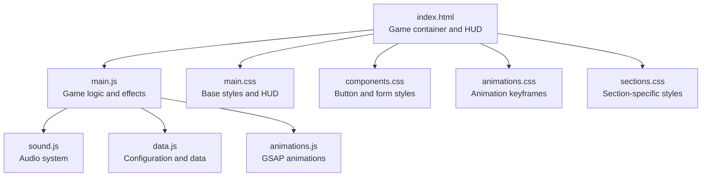
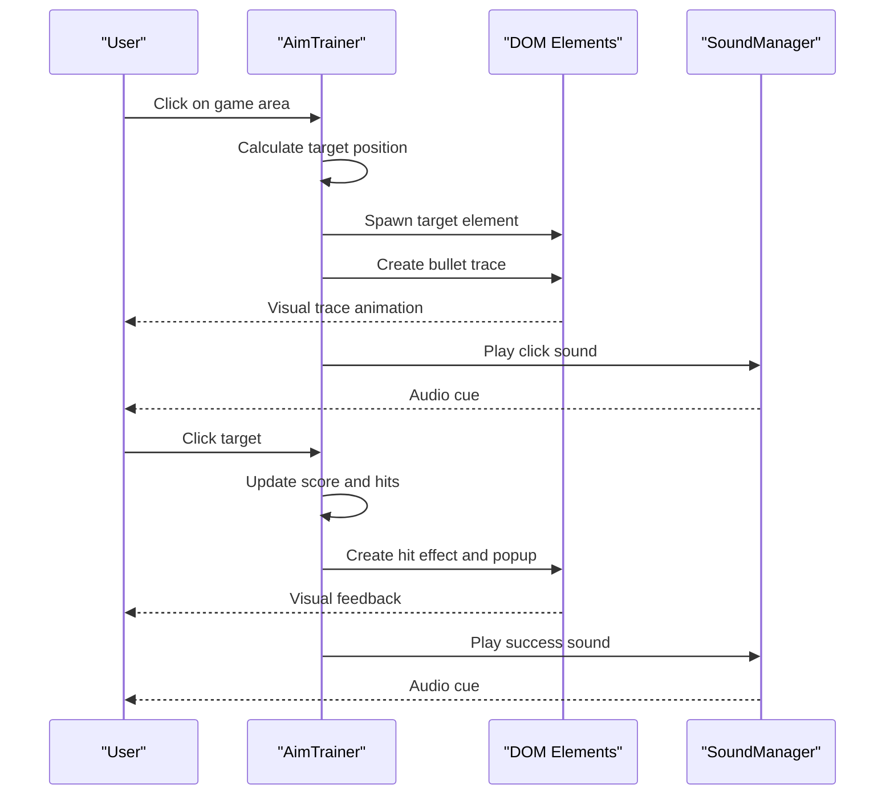
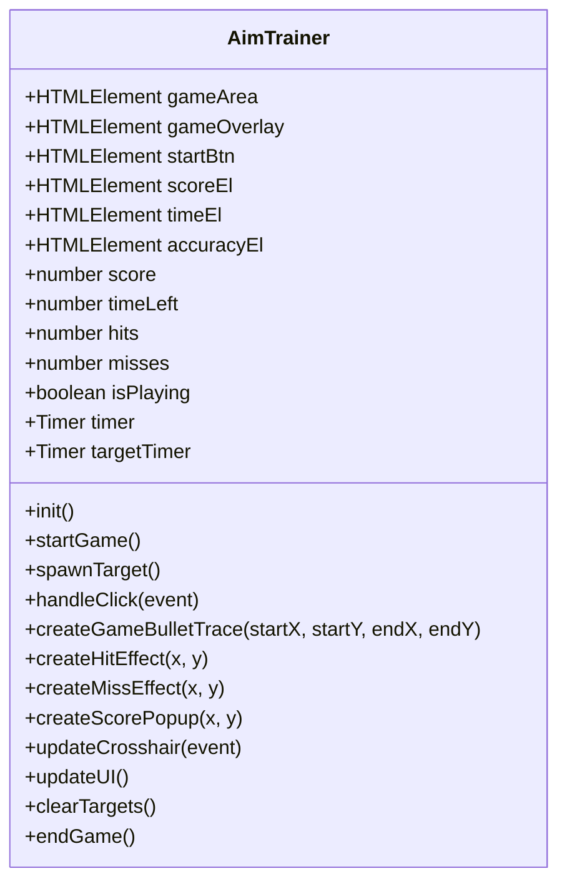
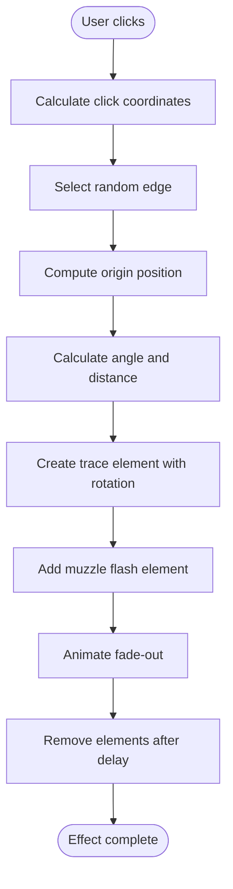
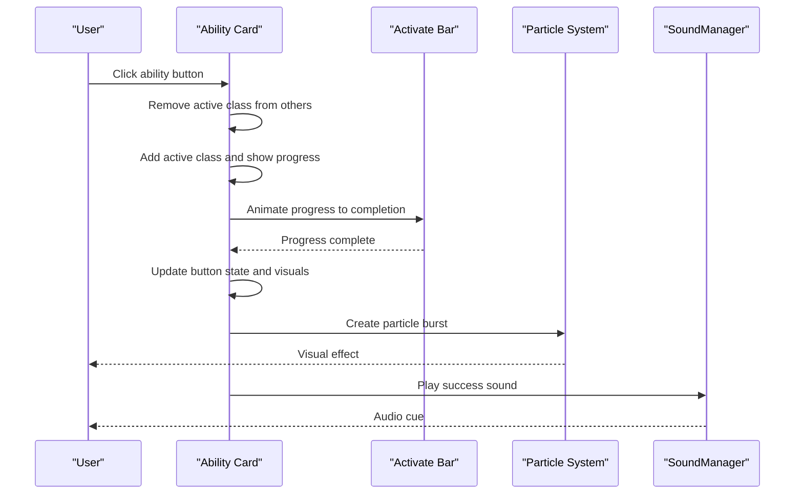
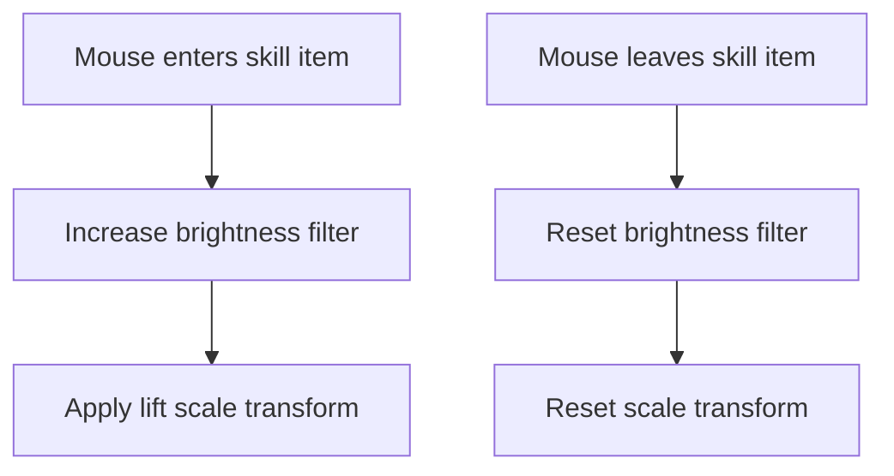
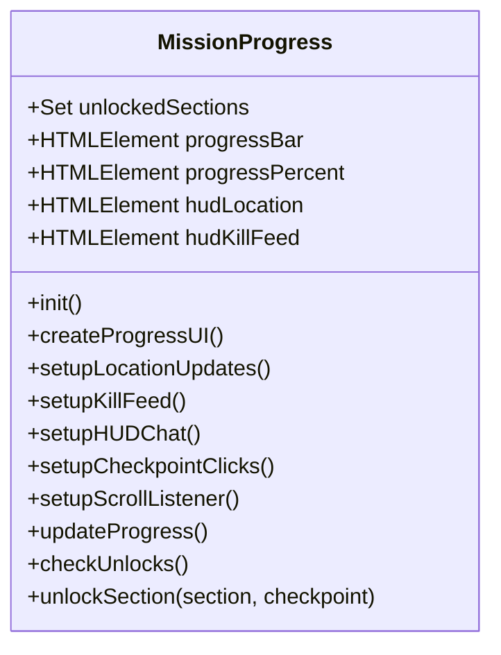
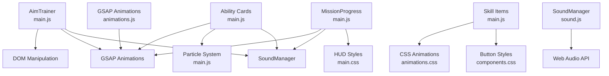

# Gaming Mechanics

<cite>
**Referenced Files in This Document**
- [index.html](file://portfolio/index.html)
- [main.js](file://portfolio/js/main.js)
- [animations.js](file://portfolio/js/animations.js)
- [sound.js](file://portfolio/js/sound.js)
- [data.js](file://portfolio/js/data.js)
- [main.css](file://portfolio/css/main.css)
- [animations.css](file://portfolio/css/animations.css)
- [components.css](file://portfolio/css/components.css)
- [sections.css](file://portfolio/css/sections.css)
</cite>

## Table of Contents
1. [Introduction](#introduction)
2. [Project Structure](#project-structure)
3. [Core Components](#core-components)
4. [Architecture Overview](#architecture-overview)
5. [Detailed Component Analysis](#detailed-component-analysis)
6. [Dependency Analysis](#dependency-analysis)
7. [Performance Considerations](#performance-considerations)
8. [Troubleshooting Guide](#troubleshooting-guide)
9. [Conclusion](#conclusion)

## Introduction
This document provides comprehensive documentation for the gaming mechanics implemented in the JAJA Portfolio, focusing on the Aim Trainer mini-game, bullet trace effects, ability activation system, skill item hover effects, and HUD integration. It explains game initialization, target spawning algorithms, scoring system, timing mechanics, collision detection, visual effects, and audio integration. The goal is to make the technical implementation accessible to both developers and designers while maintaining precise coverage of the codebase.

## Project Structure
The gaming mechanics are implemented across multiple modules:
- HTML defines the game container, UI elements, and HUD overlay
- JavaScript handles game logic, animations, audio, and interactive elements
- CSS provides visual styling, transitions, and animations for game effects

**Diagram sources**
- [index.html:672-731](file://portfolio/index.html#L672-L731)
- [main.js:610-902](file://portfolio/js/main.js#L610-L902)
- [sound.js:5-104](file://portfolio/js/sound.js#L5-L104)
- [data.js:132-159](file://portfolio/js/data.js#L132-L159)
- [animations.js:5-774](file://portfolio/js/animations.js#L5-L774)
- [main.css:363-850](file://portfolio/css/main.css#L363-L850)
- [components.css:1-1196](file://portfolio/css/components.css#L1-L1196)
- [animations.css:1-540](file://portfolio/css/animations.css#L1-L540)
- [sections.css:1-1872](file://portfolio/css/sections.css#L1-L1872)

**Section sources**
- [index.html:1-902](file://portfolio/index.html#L1-L902)
- [main.js:1-1510](file://portfolio/js/main.js#L1-L1510)
- [animations.js:1-774](file://portfolio/js/animations.js#L1-L774)
- [sound.js:1-155](file://portfolio/js/sound.js#L1-L155)
- [data.js:1-165](file://portfolio/js/data.js#L1-L165)
- [main.css:1-1173](file://portfolio/css/main.css#L1-L1173)
- [animations.css:1-540](file://portfolio/css/animations.css#L1-L540)
- [components.css:1-1196](file://portfolio/css/components.css#L1-L1196)
- [sections.css:1-1872](file://portfolio/css/sections.css#L1-L1872)

## Core Components
This section outlines the primary game systems and their responsibilities:
- Aim Trainer mini-game: manages game lifecycle, target spawning, scoring, and timing
- Bullet trace effects: generates visual trajectories from random edges to click positions
- Ability activation system: progress bars, particle bursts, and visual feedback
- Skill item hover effects: glow animations and interactive states
- HUD integration: location tracking, kill feed, and chat system

Key implementation references:
- Game initialization and lifecycle: [AimTrainer class:610-902](file://portfolio/js/main.js#L610-L902)
- Bullet trace creation: [createBulletTrace:462-528](file://portfolio/js/main.js#L462-L528)
- Ability activation: [initAbilityCards:374-459](file://portfolio/js/main.js#L374-L459)
- Skill item hover: [initSkillItems:566-590](file://portfolio/js/main.js#L566-L590)
- HUD overlay: [MissionProgress class:1058-1463](file://portfolio/js/main.js#L1058-L1463)

**Section sources**
- [main.js:610-902](file://portfolio/js/main.js#L610-L902)
- [main.js:462-528](file://portfolio/js/main.js#L462-L528)
- [main.js:374-459](file://portfolio/js/main.js#L374-L459)
- [main.js:566-590](file://portfolio/js/main.js#L566-L590)
- [main.js:1058-1463](file://portfolio/js/main.js#L1058-L1463)

## Architecture Overview
The gaming mechanics integrate several subsystems:
- Game loop: controlled by timers and event handlers
- Collision detection: performed via hit testing against generated targets
- Scoring and timing: managed through counters and UI updates
- Audio integration: triggered on game events
- Visual effects: implemented via DOM manipulation and CSS animations

**Diagram sources**
- [main.js:705-775](file://portfolio/js/main.js#L705-L775)
- [main.js:777-810](file://portfolio/js/main.js#L777-L810)
- [main.js:812-838](file://portfolio/js/main.js#L812-L838)
- [sound.js:61-79](file://portfolio/js/sound.js#L61-L79)

**Section sources**
- [main.js:705-775](file://portfolio/js/main.js#L705-L775)
- [main.js:777-810](file://portfolio/js/main.js#L777-L810)
- [main.js:812-838](file://portfolio/js/main.js#L812-L838)
- [sound.js:61-79](file://portfolio/js/sound.js#L61-L79)

## Detailed Component Analysis

### Aim Trainer Mini-Game
The Aim Trainer implements a complete mini-game with initialization, target spawning, collision detection, scoring, and timing mechanics.

**Diagram sources**
- [main.js:610-902](file://portfolio/js/main.js#L610-L902)

Key behaviors:
- Game initialization binds UI elements and event listeners
- Target spawning uses random positions within game bounds with automatic cleanup
- Collision detection leverages closest element matching for hit validation
- Scoring increments by 100 per hit with miss tracking for accuracy calculation
- Timing mechanics decrement every second until zero triggers game end

Performance considerations:
- Target limit enforced to prevent memory accumulation
- Transform scaling and opacity transitions minimize layout thrashing
- RequestAnimationFrame used for smooth trace animations

**Section sources**
- [main.js:610-902](file://portfolio/js/main.js#L610-L902)

### Bullet Trace Effects
Bullet traces are dynamically generated visual effects that originate from random screen edges and terminate at click coordinates.

**Diagram sources**
- [main.js:462-528](file://portfolio/js/main.js#L462-L528)

Implementation highlights:
- Origin positioning sampled from viewport edges with configurable offsets
- Trajectory calculation using atan2 and distance formulas
- CSS transforms applied for precise rotation alignment
- GSAP animations coordinate muzzle flash scaling and opacity

**Section sources**
- [main.js:462-528](file://portfolio/js/main.js#L462-L528)

### Ability Activation System
The ability activation system provides progress bars, particle effects, and visual feedback for ability activation.

**Diagram sources**
- [main.js:374-459](file://portfolio/js/main.js#L374-L459)
- [main.js:530-563](file://portfolio/js/main.js#L530-L563)
- [sound.js:77-79](file://portfolio/js/sound.js#L77-L79)

Visual feedback mechanisms:
- Progress bar animation with randomized intervals
- Button state changes and color transitions
- Particle burst using GSAP for radial distribution
- Glow effects and shadow enhancements

**Section sources**
- [main.js:374-459](file://portfolio/js/main.js#L374-L459)
- [main.js:530-563](file://portfolio/js/main.js#L530-L563)
- [sound.js:77-79](file://portfolio/js/sound.js#L77-L79)

### Skill Item Hover Effects
Skill item hover effects implement brightness adjustments and scaling for enhanced interactivity.

**Diagram sources**
- [main.js:566-590](file://portfolio/js/main.js#L566-L590)
- [animations.css:318-328](file://portfolio/css/animations.css#L318-L328)

Integration with existing animations:
- Hover glow class provides consistent shadow and border effects
- Scale-in transitions complement hover animations
- Brightness adjustments enhance visual prominence

**Section sources**
- [main.js:566-590](file://portfolio/js/main.js#L566-L590)
- [animations.css:318-328](file://portfolio/css/animations.css#L318-L328)

### HUD Integration and Mission Progress
The HUD provides location tracking, kill feed, progress bar, and chat functionality integrated into the footer overlay.

**Diagram sources**
- [main.js:1058-1463](file://portfolio/js/main.js#L1058-L1463)

HUD features:
- Real-time location updates based on scroll position
- Animated kill feed with periodic message rotation
- Interactive checkpoint navigation
- Chat integration with command parsing

**Section sources**
- [main.js:1058-1463](file://portfolio/js/main.js#L1058-L1463)

## Dependency Analysis
The gaming mechanics rely on coordinated interactions between modules:

**Diagram sources**
- [main.js:610-1463](file://portfolio/js/main.js#L610-L1463)
- [sound.js:5-104](file://portfolio/js/sound.js#L5-L104)
- [animations.js:5-774](file://portfolio/js/animations.js#L5-L774)
- [animations.css:1-540](file://portfolio/css/animations.css#L1-L540)
- [components.css:1-1196](file://portfolio/css/components.css#L1-L1196)
- [main.css:363-850](file://portfolio/css/main.css#L363-L850)

**Section sources**
- [main.js:610-1463](file://portfolio/js/main.js#L610-L1463)
- [sound.js:5-104](file://portfolio/js/sound.js#L5-L104)
- [animations.js:5-774](file://portfolio/js/animations.js#L5-L774)
- [animations.css:1-540](file://portfolio/css/animations.css#L1-L540)
- [components.css:1-1196](file://portfolio/css/components.css#L1-L1196)
- [main.css:363-850](file://portfolio/css/main.css#L363-L850)

## Performance Considerations
Performance optimization techniques implemented:
- Efficient DOM manipulation with batched updates
- Transform-based animations leveraging GPU acceleration
- RequestAnimationFrame for smooth 60fps animations
- Memory cleanup with element removal after effects
- Debounced scroll listeners for HUD updates
- Limited concurrent animations to prevent frame drops

Best practices:
- Prefer transform and opacity changes over layout-affecting properties
- Use CSS transitions for simple animations, GSAP for complex sequences
- Clean up event listeners and intervals on game end
- Limit DOM queries by caching element references
- Use passive listeners for scroll and resize events

## Troubleshooting Guide
Common issues and resolutions:
- Traces not appearing: verify game area dimensions and click coordinates
- Audio not playing: ensure Web Audio context is initialized on user gesture
- Animations stuttering: reduce concurrent animations or lower complexity
- Targets not spawning: check game area bounds and target limits
- HUD not updating: verify scroll event listeners and element existence

Diagnostic steps:
- Inspect console for Web Audio errors
- Monitor animation performance using browser dev tools
- Validate element selectors and event bindings
- Test cross-browser compatibility for GSAP and CSS animations

**Section sources**
- [main.js:610-902](file://portfolio/js/main.js#L610-L902)
- [sound.js:13-26](file://portfolio/js/sound.js#L13-L26)
- [animations.js:5-774](file://portfolio/js/animations.js#L5-L774)

## Conclusion
The JAJA Portfolio gaming mechanics demonstrate a cohesive integration of game logic, visual effects, and audio feedback. The Aim Trainer mini-game provides engaging gameplay with smooth animations and responsive interactions. The bullet trace system offers dynamic visual feedback, while the ability activation system delivers polished user experience through progress bars and particle effects. The HUD integration enhances immersion with location tracking, kill feed, and chat functionality. Together, these components create a performant and visually appealing gaming experience within the portfolio framework.