# Interactive Features

<cite>
**Referenced Files in This Document**
- [index.html](file://portfolio/index.html)
- [main.js](file://portfolio/js/main.js)
- [animations.js](file://portfolio/js/animations.js)
- [terminal.js](file://portfolio/js/terminal.js)
- [data.js](file://portfolio/js/data.js)
- [sound.js](file://portfolio/js/sound.js)
- [main.css](file://portfolio/css/main.css)
- [components.css](file://portfolio/css/components.css)
- [animations.css](file://portfolio/css/animations.css)
- [sections.css](file://portfolio/css/sections.css)
</cite>

## Table of Contents
1. [Introduction](#introduction)
2. [Project Structure](#project-structure)
3. [Core Components](#core-components)
4. [Architecture Overview](#architecture-overview)
5. [Detailed Component Analysis](#detailed-component-analysis)
6. [Dependency Analysis](#dependency-analysis)
7. [Performance Considerations](#performance-considerations)
8. [Troubleshooting Guide](#troubleshooting-guide)
9. [Conclusion](#conclusion)

## Introduction
This document provides comprehensive technical documentation for the JAJA Portfolio interactive features. It covers the complete user interface system including the tactical navigation HUD, scanline effects, custom cursor mechanics, and section-based scrolling. It also documents the modal-based project showcase system, skill display mechanisms, gaming-inspired animations, the aim trainer mini-game, contact form encryption simulation, and terminal chat command processing. Additional topics include responsive design approaches, mobile navigation systems, accessibility features, practical user interaction examples, visual feedback systems, and integration between interactive elements. Performance considerations for smooth animations and real-time interactions across devices and browsers are addressed throughout.

## Project Structure
The portfolio is organized into modular HTML, CSS, and JavaScript components that work together to deliver a cohesive, interactive experience. The structure emphasizes separation of concerns:
- HTML defines semantic sections and interactive elements
- CSS provides styling, animations, and responsive layouts
- JavaScript handles interactivity, animations, sound, and data-driven behaviors

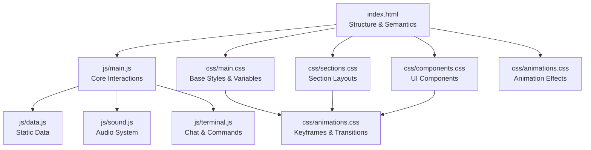

**Diagram sources**
- [index.html](file://portfolio/index.html)
- [main.js](file://portfolio/js/main.js)
- [data.js](file://portfolio/js/data.js)
- [sound.js](file://portfolio/js/sound.js)
- [terminal.js](file://portfolio/js/terminal.js)
- [main.css](file://portfolio/css/main.css)
- [components.css](file://portfolio/css/components.css)
- [sections.css](file://portfolio/css/sections.css)
- [animations.css](file://portfolio/css/animations.css)

**Section sources**
- [index.html](file://portfolio/index.html)
- [main.js](file://portfolio/js/main.js)
- [animations.js](file://portfolio/js/animations.js)
- [terminal.js](file://portfolio/js/terminal.js)
- [data.js](file://portfolio/js/data.js)
- [sound.js](file://portfolio/js/sound.js)
- [main.css](file://portfolio/css/main.css)
- [components.css](file://portfolio/css/components.css)
- [animations.css](file://portfolio/css/animations.css)
- [sections.css](file://portfolio/css/sections.css)

## Core Components
This section outlines the primary interactive systems and their responsibilities:
- Custom Cursor: Provides a stylized crosshair cursor with hover and click feedback, including recoil animations and ring effects
- Tactical HUD: Includes scanline overlays, progress indicators, and footer HUD elements for navigation and status
- Section-Based Scrolling: Implements smooth scrolling, scroll progress tracking, and navigation highlighting
- Modal System: Manages project modals with animated transitions and dynamic content injection
- Skill Display: Animated skill bars with percentage counters and hover effects
- Gaming-Inspired Animations: Glitch effects, bullet traces, muzzle flashes, and particle systems
- Aim Trainer Mini-Game: Real-time target shooting with scoring, timing, and visual feedback
- Contact Form Encryption Simulation: Animated transmission process with status updates and success feedback
- Terminal Chat System: Command-driven chat with channels, kill feed, and location indicator
- Sound System: Web Audio API-based audio effects for UI interactions and typing

**Section sources**
- [main.js](file://portfolio/js/main.js)
- [animations.js](file://portfolio/js/animations.js)
- [terminal.js](file://portfolio/js/terminal.js)
- [data.js](file://portfolio/js/data.js)
- [sound.js](file://portfolio/js/sound.js)
- [main.css](file://portfolio/css/main.css)
- [components.css](file://portfolio/css/components.css)
- [animations.css](file://portfolio/css/animations.css)
- [sections.css](file://portfolio/css/sections.css)

## Architecture Overview
The interactive architecture follows a layered approach:
- Presentation Layer: HTML structure with semantic sections and interactive elements
- Styling Layer: CSS modules for base styles, components, sections, and animations
- Behavior Layer: JavaScript modules for core interactions, animations, terminal, data, and sound
- Integration Layer: Event-driven communication between modules and DOM manipulation

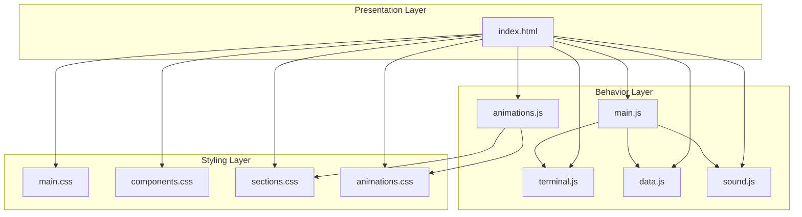

**Diagram sources**
- [index.html](file://portfolio/index.html)
- [main.js](file://portfolio/js/main.js)
- [animations.js](file://portfolio/js/animations.js)
- [terminal.js](file://portfolio/js/terminal.js)
- [data.js](file://portfolio/js/data.js)
- [sound.js](file://portfolio/js/sound.js)
- [main.css](file://portfolio/css/main.css)
- [components.css](file://portfolio/css/components.css)
- [sections.css](file://portfolio/css/sections.css)
- [animations.css](file://portfolio/css/animations.css)

## Detailed Component Analysis

### Custom Cursor Mechanics
The custom cursor system provides a high-tech crosshair experience with:
- Smooth mouse tracking using requestAnimationFrame
- Hover state detection for interactive elements
- Click recoil animations with GSAP
- Ring expansion effects synchronized with sound
- Touch device detection and fallback behavior

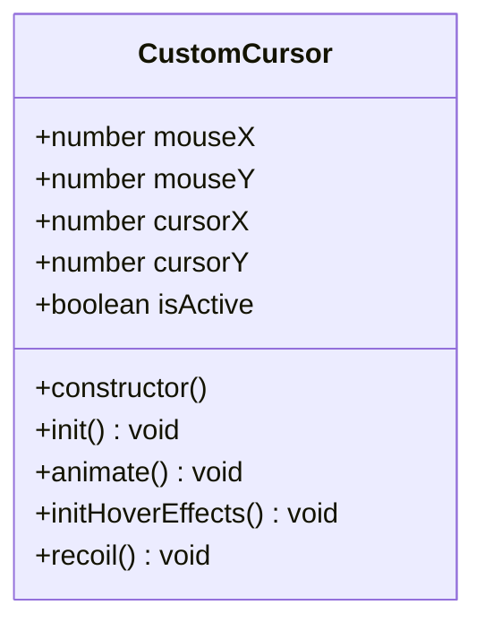

**Diagram sources**
- [main.js](file://portfolio/js/main.js)

**Section sources**
- [main.js](file://portfolio/js/main.js)
- [main.css](file://portfolio/css/main.css)

### Tactical HUD and Scanline Effects
The HUD system includes:
- Scanline overlays for CRT-like aesthetics
- Scroll progress indicator
- Footer HUD with location, kill feed, and checkpoint navigation
- Animated scanning lines and grid overlays
- Parallax effects and particle systems

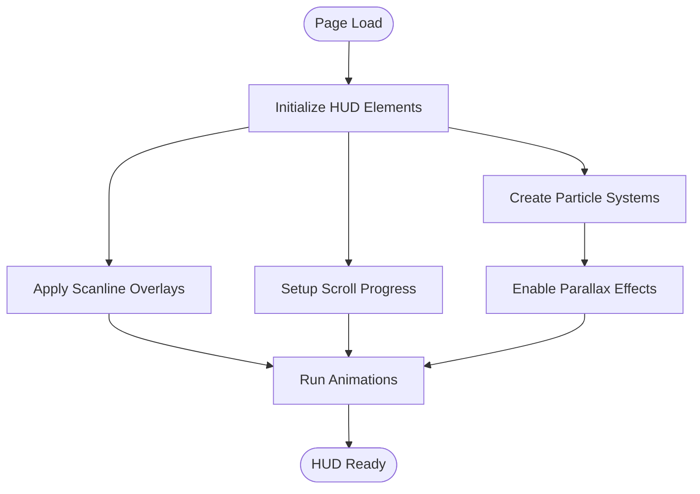

**Diagram sources**
- [animations.js](file://portfolio/js/animations.js)
- [main.css](file://portfolio/css/main.css)
- [animations.css](file://portfolio/css/animations.css)
- [sections.css](file://portfolio/css/sections.css)

**Section sources**
- [animations.js](file://portfolio/js/animations.js)
- [main.css](file://portfolio/css/main.css)
- [animations.css](file://portfolio/css/animations.css)
- [sections.css](file://portfolio/css/sections.css)

### Modal-Based Project Showcase System
The modal system manages project details with:
- Dynamic content injection from project data
- Animated entrance/exit transitions
- Close functionality via button, overlay click, and escape key
- Sound feedback for open/close actions

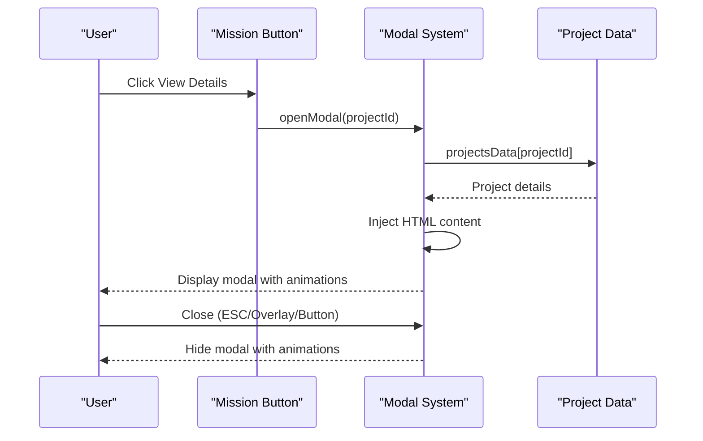

**Diagram sources**
- [main.js](file://portfolio/js/main.js)
- [data.js](file://portfolio/js/data.js)
- [components.css](file://portfolio/css/components.css)

**Section sources**
- [main.js](file://portfolio/js/main.js)
- [data.js](file://portfolio/js/data.js)
- [components.css](file://portfolio/css/components.css)

### Skill Display Mechanisms
The skill display system features:
- Animated skill bars with percentage counters
- Hover effects with glow and scaling
- Scroll-triggered animations using GSAP ScrollTrigger
- Percentage counters with snap-based animation

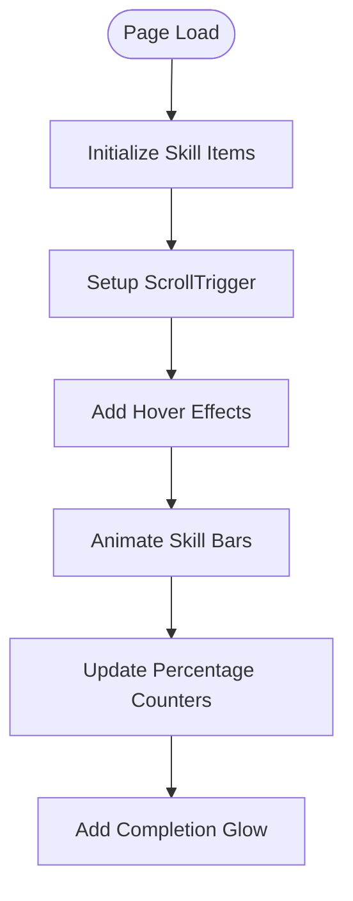

**Diagram sources**
- [animations.js](file://portfolio/js/animations.js)
- [sections.css](file://portfolio/css/sections.css)
- [animations.css](file://portfolio/css/animations.css)

**Section sources**
- [animations.js](file://portfolio/js/animations.js)
- [sections.css](file://portfolio/css/sections.css)
- [animations.css](file://portfolio/css/animations.css)

### Gaming-Inspired Animations
Key animation systems include:
- Glitch effects for text and hover states
- Bullet trace effects with muzzle flashes
- Particle systems with interactive canvas
- Target animations for the aim trainer
- Scrolling animations and transitions

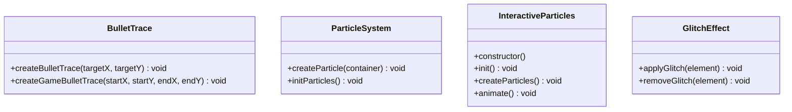

**Diagram sources**
- [main.js](file://portfolio/js/main.js)
- [animations.js](file://portfolio/js/animations.js)
- [animations.css](file://portfolio/css/animations.css)

**Section sources**
- [main.js](file://portfolio/js/main.js)
- [animations.js](file://portfolio/js/animations.js)
- [animations.css](file://portfolio/css/animations.css)

### Aim Trainer Mini-Game Implementation
The aim trainer provides real-time gameplay with:
- Target spawning with random positions and timing
- Crosshair synchronization with mouse movement
- Score tracking and accuracy calculations
- Visual feedback for hits and misses
- Animated target appearance and removal

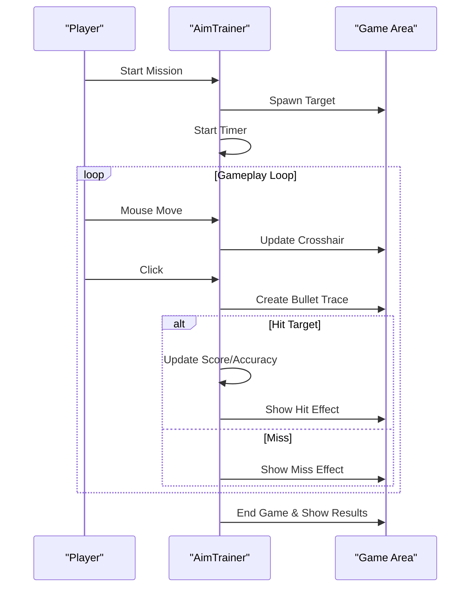

**Diagram sources**
- [main.js](file://portfolio/js/main.js)
- [sections.css](file://portfolio/css/sections.css)

**Section sources**
- [main.js](file://portfolio/js/main.js)
- [sections.css](file://portfolio/css/sections.css)

### Contact Form Encryption Simulation
The contact form simulates secure transmission with:
- Animated progress bar with status updates
- Visual feedback for encryption, upload, verification, and completion
- Success styling and reset functionality
- Sound effects synchronized with states

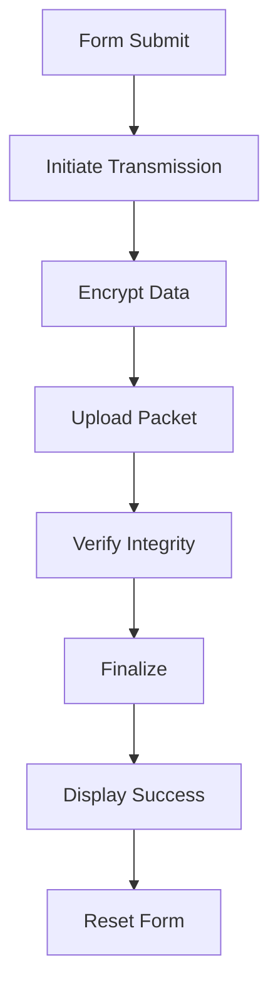

**Diagram sources**
- [main.js](file://portfolio/js/main.js)
- [components.css](file://portfolio/css/components.css)

**Section sources**
- [main.js](file://portfolio/js/main.js)
- [components.css](file://portfolio/css/components.css)

### Terminal Chat Command Processing
The terminal system provides:
- Command parsing and execution
- Channel-based messaging with kill feed
- Location indicator with zone dots
- Command history navigation
- Typewriter-style output effects

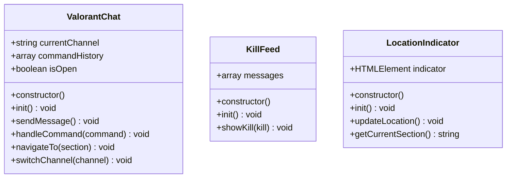

**Diagram sources**
- [terminal.js](file://portfolio/js/terminal.js)
- [components.css](file://portfolio/css/components.css)

**Section sources**
- [terminal.js](file://portfolio/js/terminal.js)
- [components.css](file://portfolio/css/components.css)

### Sound System Integration
The sound system provides:
- Web Audio API-based audio generation
- Configurable sound effects for different UI interactions
- Volume control and mute functionality
- Synchronized sound playback with visual events

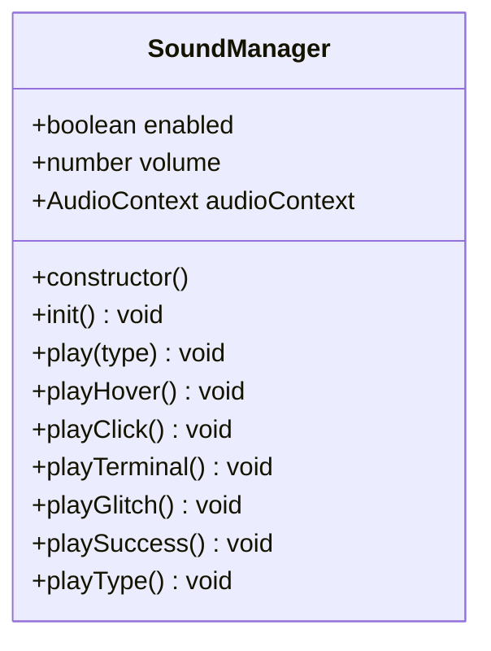

**Diagram sources**
- [sound.js](file://portfolio/js/sound.js)
- [data.js](file://portfolio/js/data.js)

**Section sources**
- [sound.js](file://portfolio/js/sound.js)
- [data.js](file://portfolio/js/data.js)

## Dependency Analysis
The interactive features depend on several key libraries and modules:
- GSAP for advanced animations and ScrollTrigger for scroll-based triggers
- Font Awesome for icons and social media links
- Web Audio API for sound synthesis
- Local data modules for static content and configuration

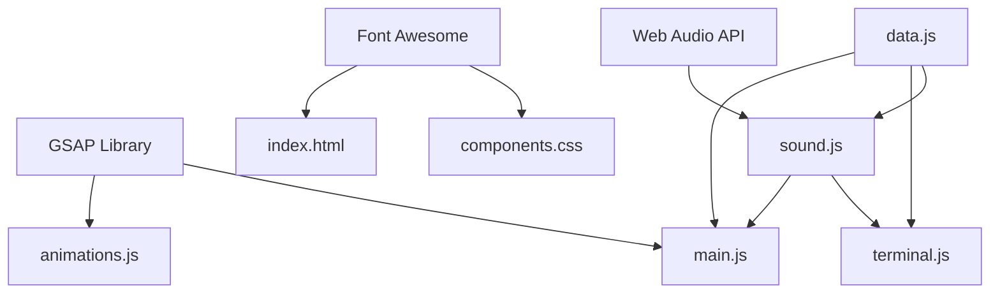

**Diagram sources**
- [index.html](file://portfolio/index.html)
- [main.js](file://portfolio/js/main.js)
- [animations.js](file://portfolio/js/animations.js)
- [terminal.js](file://portfolio/js/terminal.js)
- [data.js](file://portfolio/js/data.js)
- [sound.js](file://portfolio/js/sound.js)

**Section sources**
- [index.html](file://portfolio/index.html)
- [main.js](file://portfolio/js/main.js)
- [animations.js](file://portfolio/js/animations.js)
- [terminal.js](file://portfolio/js/terminal.js)
- [data.js](file://portfolio/js/data.js)
- [sound.js](file://portfolio/js/sound.js)

## Performance Considerations
Performance optimization strategies implemented:
- Efficient animation loops using requestAnimationFrame
- GSAP ScrollTrigger for optimized scroll-based animations
- Canvas-based particle system with proper cleanup
- Debounced event handlers for smooth interactions
- CSS transforms and opacity for GPU-accelerated animations
- Lazy initialization of heavy features
- Proper z-index management to reduce repaints

Best practices for maintaining performance:
- Monitor animation frame budgets during complex sequences
- Use will-change properties judiciously
- Optimize particle counts based on device capabilities
- Implement throttled scroll handlers
- Minimize DOM queries in animation loops
- Use CSS containment where appropriate

## Troubleshooting Guide
Common issues and resolutions:
- Audio context initialization: Ensure user interaction occurs before audio playback
- Animation stuttering: Check for layout thrashing and excessive DOM manipulation
- Mobile cursor issues: Touch device detection automatically disables custom cursor
- Modal conflicts: Ensure single modal instance and proper event delegation
- Scroll progress errors: Verify scroll event listener cleanup
- Terminal responsiveness: Check for blocked UI thread during long operations

Debugging tips:
- Use browser devtools to monitor animation performance
- Inspect z-index stacking contexts for overlapping elements
- Validate CSS variable usage across different themes
- Test cross-browser compatibility for Web Audio API
- Verify event listener cleanup to prevent memory leaks

**Section sources**
- [sound.js](file://portfolio/js/sound.js)
- [main.js](file://portfolio/js/main.js)
- [animations.js](file://portfolio/js/animations.js)

## Conclusion
The JAJA Portfolio interactive features system demonstrates a sophisticated blend of modern web technologies and gaming-inspired UI design. Through careful modularization, the system achieves high interactivity while maintaining performance and accessibility. The combination of custom cursors, animated HUD elements, modal systems, gaming-inspired effects, and integrated terminal functionality creates a cohesive and engaging user experience. The architecture supports future enhancements while providing a solid foundation for continued development and refinement.