# Navigation System

<cite>
**Referenced Files in This Document**
- [index.html](file://portfolio/index.html)
- [main.js](file://portfolio/js/main.js)
- [animations.js](file://portfolio/js/animations.js)
- [terminal.js](file://portfolio/js/terminal.js)
- [data.js](file://portfolio/js/data.js)
- [main.css](file://portfolio/css/main.css)
- [components.css](file://portfolio/css/components.css)
- [animations.css](file://portfolio/css/animations.css)
- [sections.css](file://portfolio/css/sections.css)
</cite>

## Table of Contents
1. [Introduction](#introduction)
2. [Project Structure](#project-structure)
3. [Core Components](#core-components)
4. [Architecture Overview](#architecture-overview)
5. [Detailed Component Analysis](#detailed-component-analysis)
6. [Dependency Analysis](#dependency-analysis)
7. [Performance Considerations](#performance-considerations)
8. [Troubleshooting Guide](#troubleshooting-guide)
9. [Conclusion](#conclusion)

## Introduction

The JAJA Portfolio navigation system implements a sophisticated tactical interface inspired by video game HUD (Heads-Up Display) design patterns. This system provides an immersive navigation experience through custom cursor mechanics, tactical HUD elements, and section-based scrolling controls. The navigation system integrates seamlessly with the portfolio's VALORANT-themed aesthetic while maintaining modern web standards and cross-platform compatibility.

The system encompasses several key components: a custom crosshair cursor with smooth following mechanics and recoil animations, a tactical HUD featuring scanline effects and section progress indicators, a mobile-responsive navigation system with animated hamburger menus, and intelligent section activation states during scroll navigation.

## Project Structure

The navigation system is organized across multiple JavaScript modules and CSS stylesheets, each responsible for specific navigation functionalities:

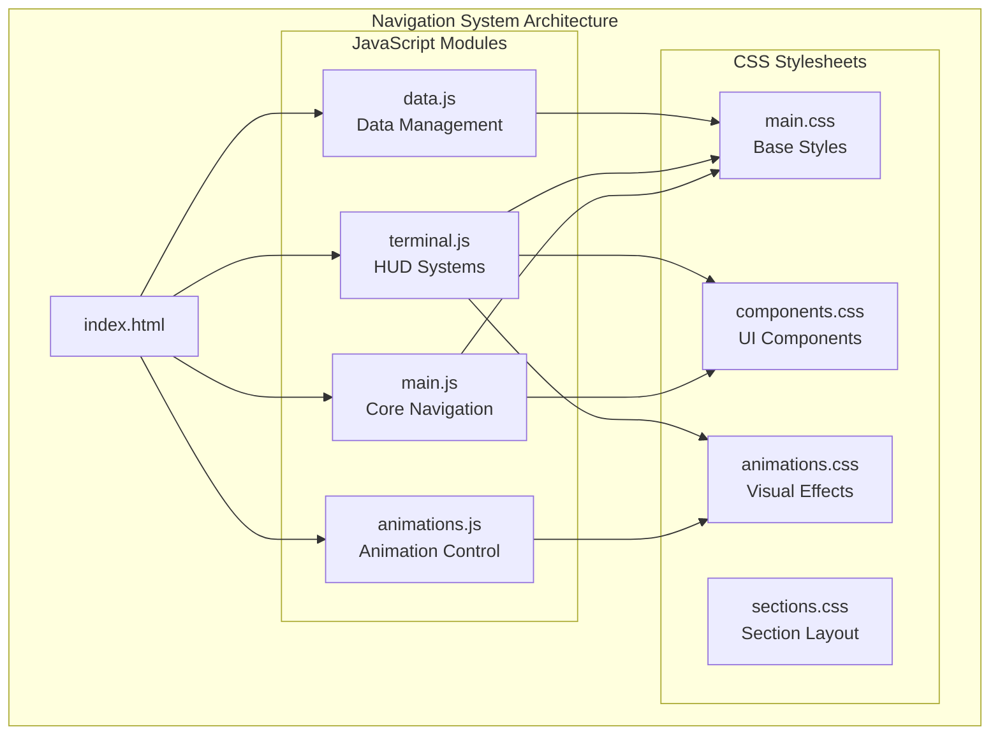

**Diagram sources**
- [index.html:1-902](file://portfolio/index.html#L1-L902)
- [main.js:1-1510](file://portfolio/js/main.js#L1-L1510)
- [animations.js:1-774](file://portfolio/js/animations.js#L1-L774)
- [terminal.js:1-683](file://portfolio/js/terminal.js#L1-L683)
- [data.js:1-165](file://portfolio/js/data.js#L1-L165)

**Section sources**
- [index.html:1-902](file://portfolio/index.html#L1-L902)
- [main.js:1-1510](file://portfolio/js/main.js#L1-L1510)

## Core Components

### Custom Crosshair Cursor System

The custom cursor implementation provides an immersive tactical experience with smooth following mechanics, hover effects, and recoil animations:

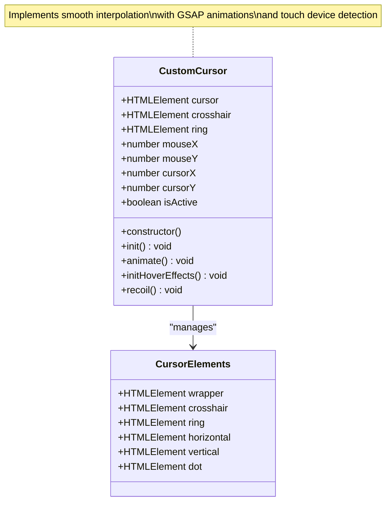

**Diagram sources**
- [main.js:6-109](file://portfolio/js/main.js#L6-L109)

The cursor system features:
- **Smooth Following Mechanics**: Uses exponential smoothing with a 15% interpolation factor
- **Touch Device Detection**: Automatically disables custom cursor on touch devices
- **Recoil Animations**: GSAP-powered recoil effects with ring expansion
- **Hover State Management**: Dynamic scaling and visual feedback

### Tactical HUD Elements

The HUD system provides comprehensive navigation feedback through multiple visual indicators:

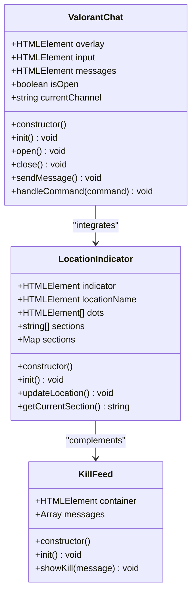

**Diagram sources**
- [terminal.js:316-385](file://portfolio/js/terminal.js#L316-L385)
- [terminal.js:269-313](file://portfolio/js/terminal.js#L269-L313)
- [terminal.js:5-267](file://portfolio/js/terminal.js#L5-L267)

### Mobile Navigation System

The mobile navigation implements a responsive hamburger menu with animated transitions:

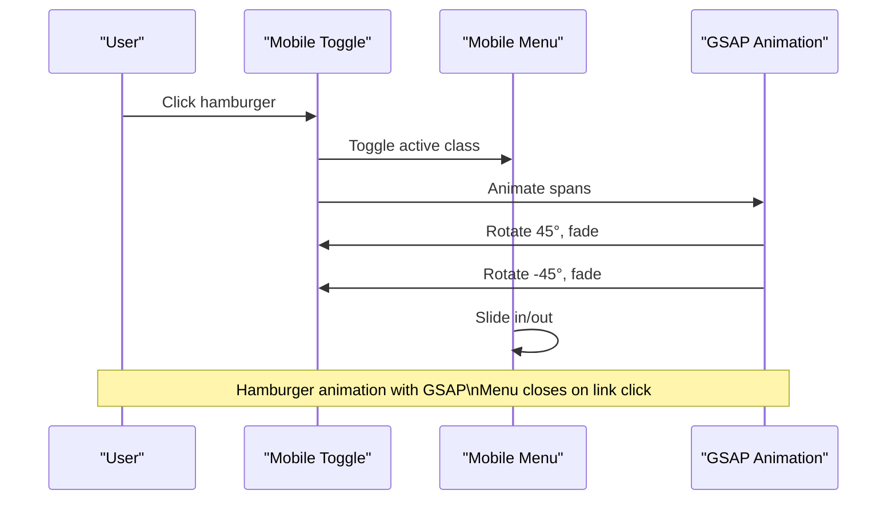

**Diagram sources**
- [main.js:112-150](file://portfolio/js/main.js#L112-L150)
- [terminal.js:405-420](file://portfolio/js/terminal.js#L405-L420)

**Section sources**
- [main.js:6-109](file://portfolio/js/main.js#L6-L109)
- [terminal.js:316-385](file://portfolio/js/terminal.js#L316-L385)

## Architecture Overview

The navigation system follows a modular architecture pattern with clear separation of concerns:

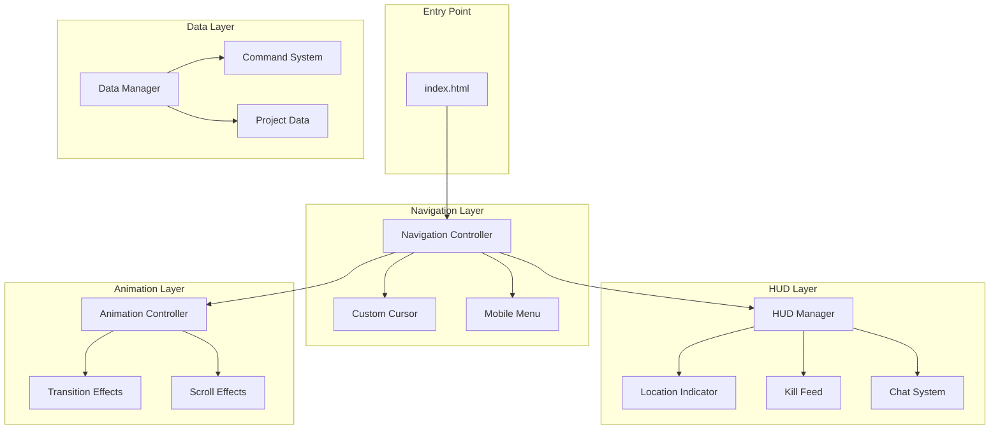

**Diagram sources**
- [index.html:65-110](file://portfolio/index.html#L65-L110)
- [main.js:329-349](file://portfolio/js/main.js#L329-L349)
- [animations.js:527-580](file://portfolio/js/animations.js#L527-L580)

## Detailed Component Analysis

### Custom Cursor Implementation

The custom cursor system provides an immersive tactical experience with sophisticated animation and interaction handling:

#### Smooth Following Mechanics

The cursor implements exponential smoothing for natural movement:

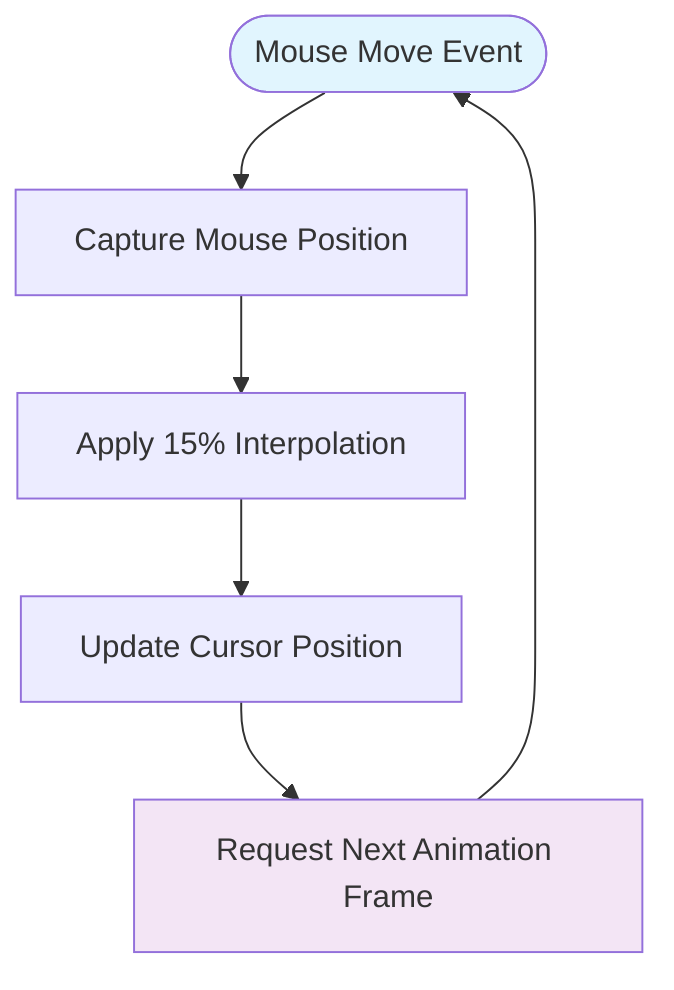

**Diagram sources**
- [main.js:53-66](file://portfolio/js/main.js#L53-L66)

#### Touch Device Compatibility

The system automatically detects and adapts to different input devices:

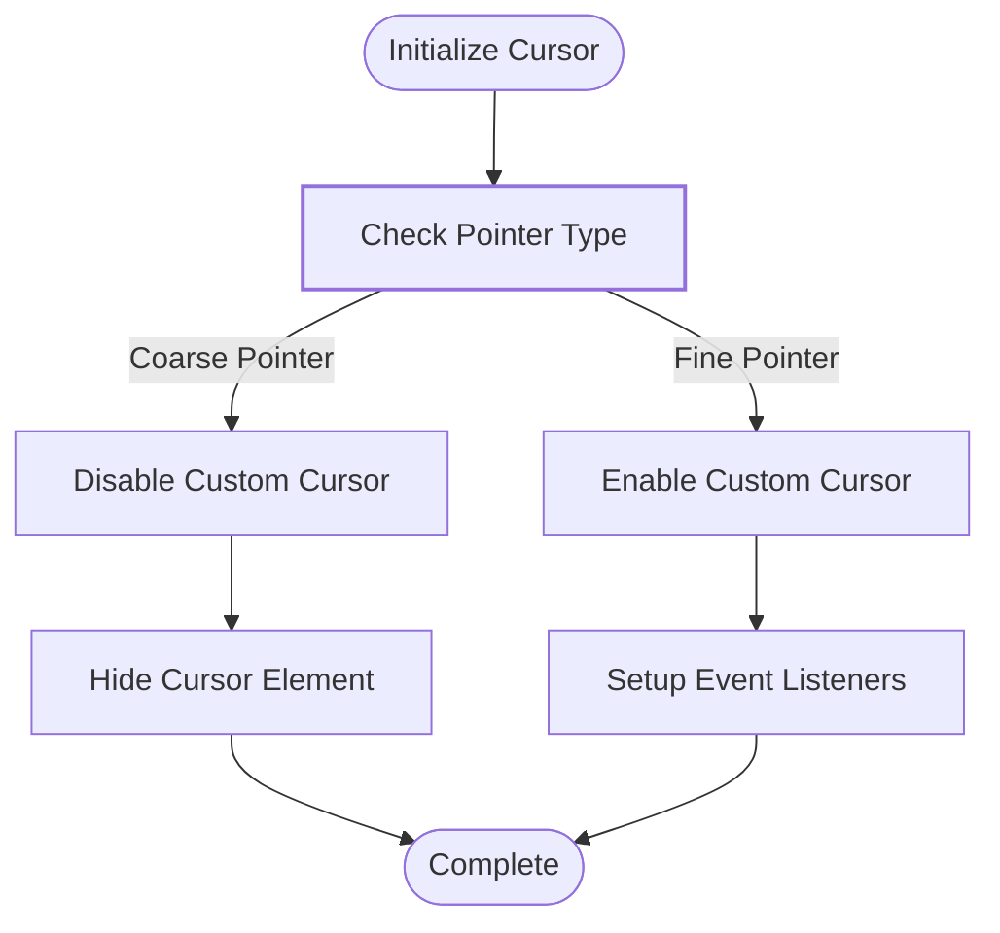

**Diagram sources**
- [main.js:21-29](file://portfolio/js/main.js#L21-L29)

#### Recoil Animation System

The recoil system provides tactile feedback through GSAP animations:

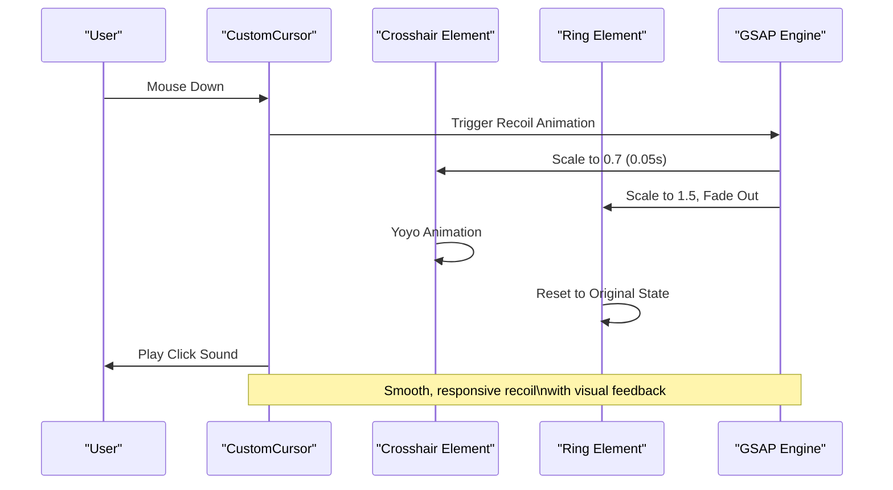

**Diagram sources**
- [main.js:82-108](file://portfolio/js/main.js#L82-L108)

### Section-Based Scrolling System

The navigation system implements intelligent section activation and smooth scrolling:

#### Smooth Scroll Implementation

The smooth scroll functionality provides seamless navigation between sections:

```mermaid
sequenceDiagram
participant User as "User"
participant Link as "Navigation Link"
participant Scroll as "Scroll Controller"
participant GSAP as "GSAP Engine"
participant Section as "Target Section"
User->>Link : Click Navigation Link
Link->>Scroll : Prevent Default Behavior
Scroll->>Section : Calculate Target Position
Scroll->>GSAP : Animate Scroll To Position
GSAP->>User : Smooth Scroll Animation
Scroll->>User : Play Click Sound
Note over Scroll,GSAP : Accounts for fixed navbar\nheight and smooth animation
```

**Diagram sources**
- [main.js:329-349](file://portfolio/js/main.js#L329-L349)

#### Navigation Active State Management

The system dynamically updates active navigation states during scroll:

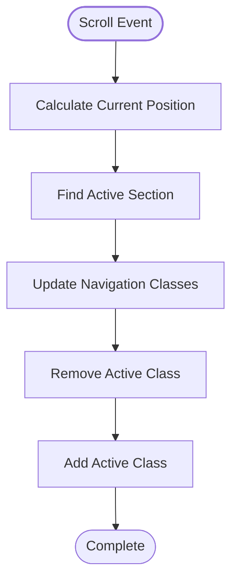

**Diagram sources**
- [animations.js:559-580](file://portfolio/js/animations.js#L559-L580)

### Mobile Menu System

The mobile navigation system provides responsive touch-friendly controls:

#### Hamburger Animation Sequence

The hamburger menu implements sophisticated GSAP animations:

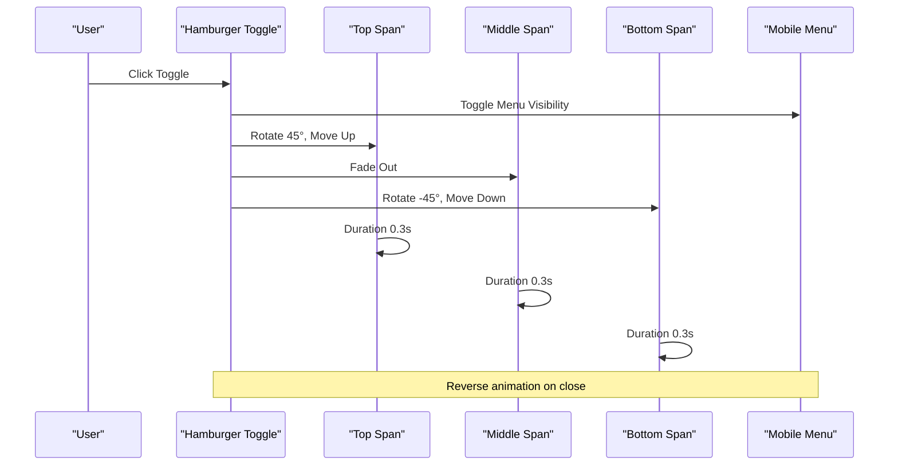

**Diagram sources**
- [main.js:119-135](file://portfolio/js/main.js#L119-L135)

#### Touch Device Handling

The mobile system includes comprehensive touch device detection and adaptation:

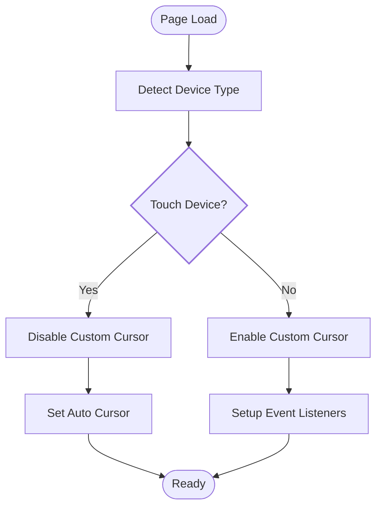

**Diagram sources**
- [main.js:21-29](file://portfolio/js/main.js#L21-L29)

### Tactical HUD Integration

The HUD system provides comprehensive navigation feedback and communication capabilities:

#### Location Indicator System

The location indicator tracks and displays current section with animated transitions:

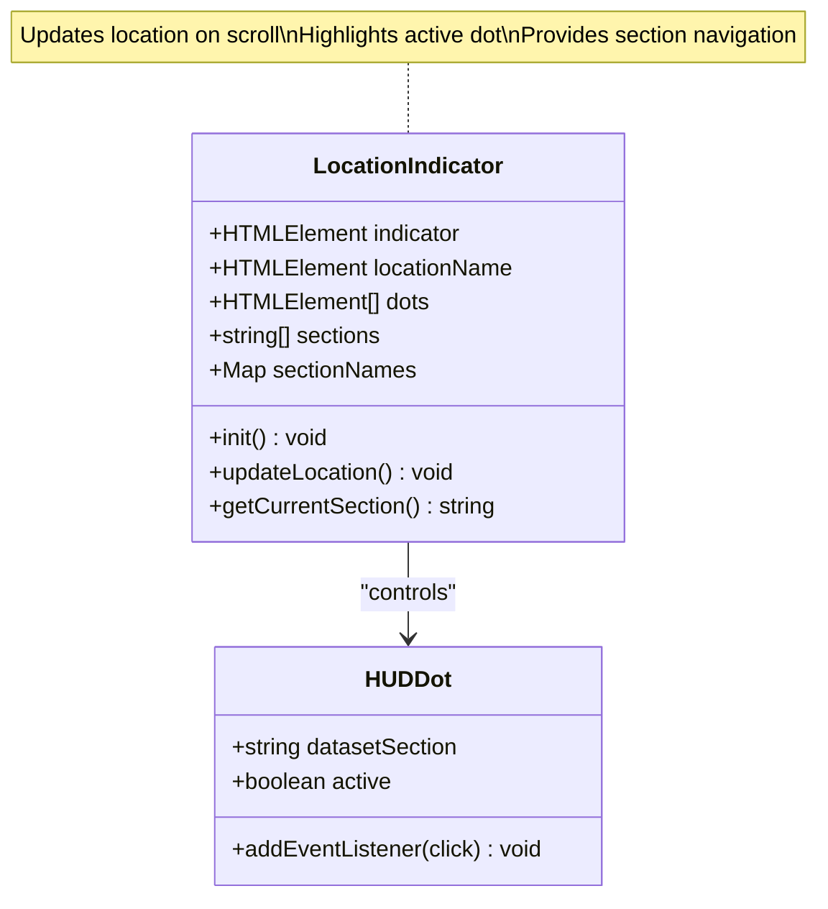

**Diagram sources**
- [terminal.js:316-385](file://portfolio/js/terminal.js#L316-L385)

#### Kill Feed System

The kill feed provides dynamic tactical notifications:

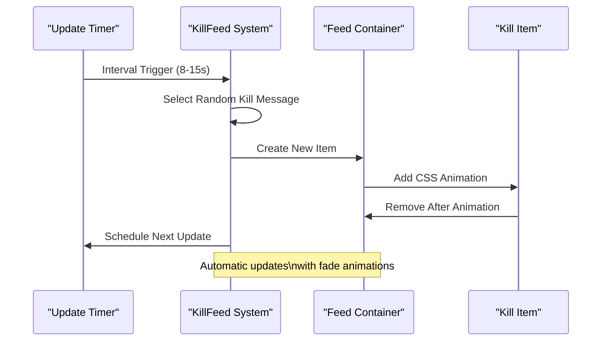

**Diagram sources**
- [terminal.js:269-313](file://portfolio/js/terminal.js#L269-L313)

**Section sources**
- [main.js:6-109](file://portfolio/js/main.js#L6-L109)
- [main.js:112-150](file://portfolio/js/main.js#L112-L150)
- [terminal.js:316-385](file://portfolio/js/terminal.js#L316-L385)

## Dependency Analysis

The navigation system exhibits well-structured dependencies with clear module boundaries:

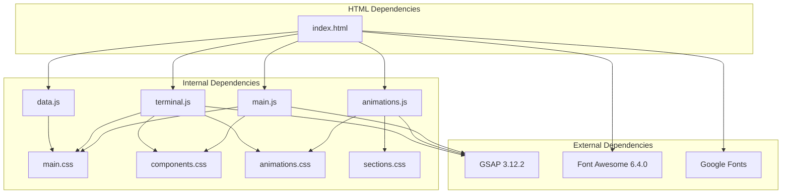

**Diagram sources**
- [index.html:17-25](file://portfolio/index.html#L17-L25)
- [main.js:1-10](file://portfolio/js/main.js#L1-L10)
- [animations.js:5-6](file://portfolio/js/animations.js#L5-L6)
- [terminal.js:1-3](file://portfolio/js/terminal.js#L1-L3)

### Module Interaction Patterns

The system demonstrates clear separation of concerns with specialized modules handling distinct responsibilities:

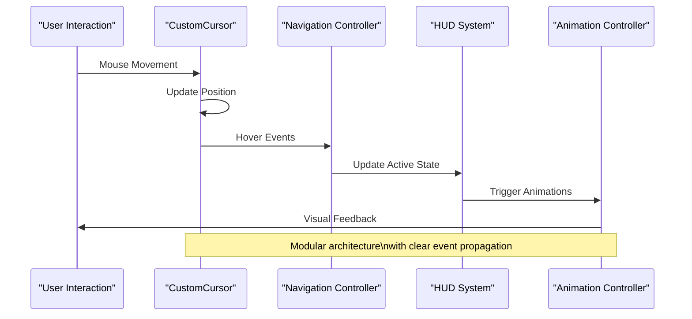

**Diagram sources**
- [main.js:20-51](file://portfolio/js/main.js#L20-L51)
- [animations.js:559-580](file://portfolio/js/animations.js#L559-L580)

**Section sources**
- [index.html:17-25](file://portfolio/index.html#L17-L25)
- [main.js:1-10](file://portfolio/js/main.js#L1-L10)

## Performance Considerations

The navigation system implements several performance optimization strategies:

### Animation Performance

- **GSAP Integration**: Utilizes GSAP's optimized rendering pipeline for smooth animations
- **requestAnimationFrame**: Custom cursor uses native browser animation frames
- **will-change Property**: Applied to cursor elements for hardware acceleration
- **Touch Device Optimization**: Disables custom cursor on touch devices to improve performance

### Memory Management

- **Event Listener Cleanup**: Proper removal of event listeners during component lifecycle
- **DOM Element Reuse**: Efficient reuse of DOM elements for HUD components
- **Animation Cancellation**: GSAP animations properly cancelled on component destruction

### Cross-Browser Compatibility

The system maintains compatibility across different browsers and devices:

- **Modern CSS Features**: Uses CSS Grid, Flexbox, and custom properties with appropriate fallbacks
- **JavaScript Polyfills**: GSAP provides polyfill support for older browsers
- **Responsive Design**: Mobile-first approach with progressive enhancement

### Optimization Recommendations

1. **Debounce Scroll Events**: Implement debouncing for scroll-based animations
2. **Intersection Observer**: Replace scroll-based triggers with Intersection Observer API
3. **CSS Custom Properties**: Continue using CSS variables for theme consistency
4. **Lazy Loading**: Implement lazy loading for non-critical resources

## Troubleshooting Guide

### Common Issues and Solutions

#### Custom Cursor Not Working

**Symptoms**: Cursor remains static or doesn't follow mouse movement
**Causes**: 
- Touch device detection triggering
- CSS pointer-events conflicts
- JavaScript errors preventing initialization

**Solutions**:
1. Verify `matchMedia('(pointer: coarse)')` detection
2. Check CSS `pointer-events: none` on cursor wrapper
3. Inspect console for JavaScript errors

#### Mobile Menu Animation Issues

**Symptoms**: Hamburger animation not working or inconsistent
**Causes**:
- GSAP library not loaded
- CSS transforms conflicting with animations
- Event listener binding failures

**Solutions**:
1. Ensure GSAP CDN loads successfully
2. Verify CSS transform properties aren't overridden
3. Check event listener registration order

#### Scroll Navigation Problems

**Symptoms**: Navigation links don't scroll smoothly or active states incorrect
**Causes**:
- Fixed navbar height calculation errors
- Section ID mismatches
- Scroll event handler conflicts

**Solutions**:
1. Verify section ID attributes match navigation links
2. Check navbar height calculations in scroll functions
3. Ensure scroll event listeners are properly bound

#### HUD Component Malfunctions

**Symptoms**: Location indicator or kill feed not updating
**Causes**:
- Section detection logic errors
- DOM element selection failures
- Animation timing issues

**Solutions**:
1. Verify section element existence and IDs
2. Check element selectors in location indicator
3. Review animation timing and completion callbacks

**Section sources**
- [main.js:21-29](file://portfolio/js/main.js#L21-L29)
- [main.js:119-135](file://portfolio/js/main.js#L119-L135)
- [terminal.js:336-349](file://portfolio/js/terminal.js#L336-L349)

## Conclusion

The JAJA Portfolio navigation system successfully implements a sophisticated tactical interface that enhances user experience through immersive visual feedback and intuitive navigation controls. The system's modular architecture ensures maintainability and extensibility while providing smooth performance across different devices and browsers.

Key achievements include the implementation of a custom crosshair cursor with realistic physics-based movement, comprehensive HUD elements for tactical feedback, responsive mobile navigation with polished animations, and intelligent section-based scrolling with active state management. The system demonstrates excellent attention to performance optimization and cross-browser compatibility while maintaining the project's distinctive VALORANT-themed aesthetic.

The navigation system serves as a robust foundation for future enhancements and provides a compelling example of modern web navigation patterns combined with gaming-inspired UI elements. Its modular design and comprehensive documentation make it an excellent reference for similar projects requiring sophisticated navigation experiences.