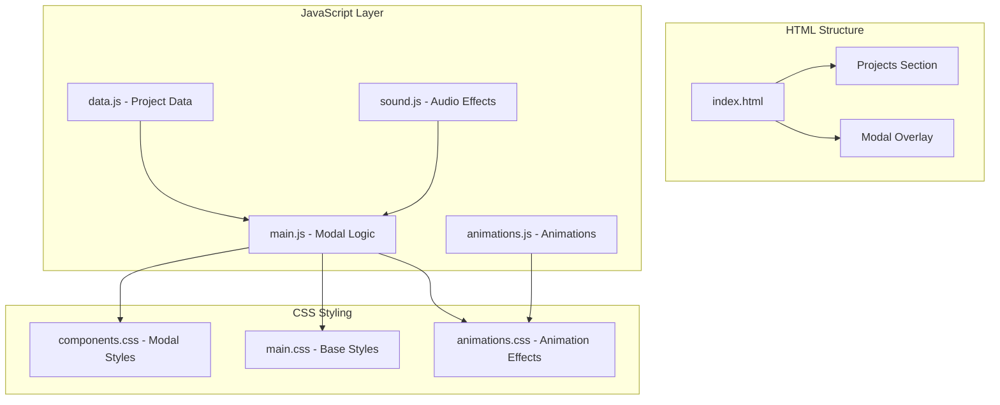
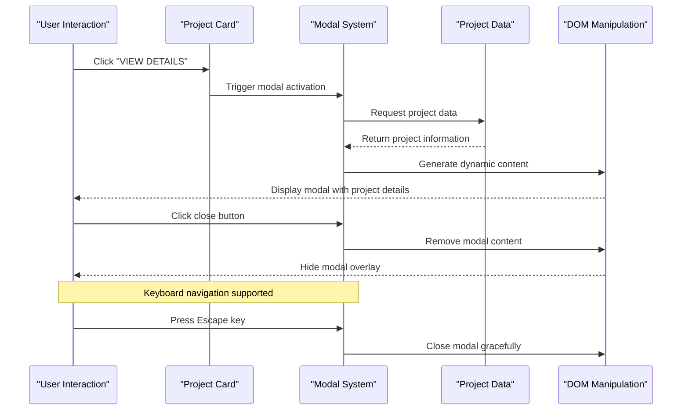
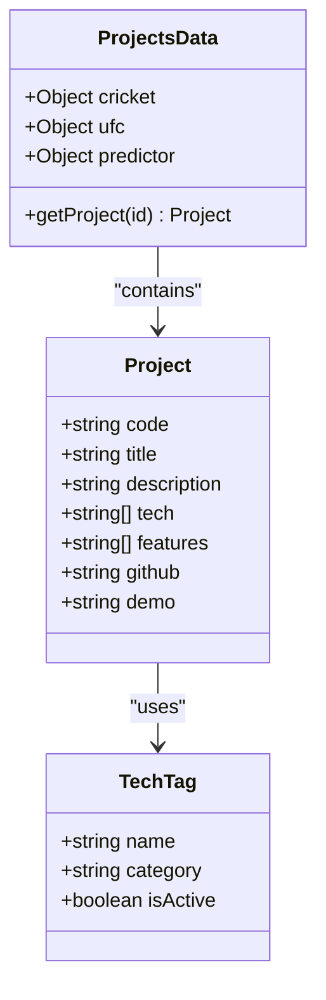
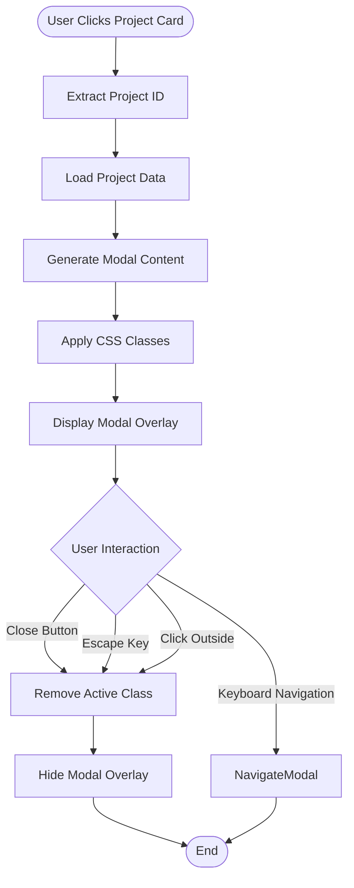
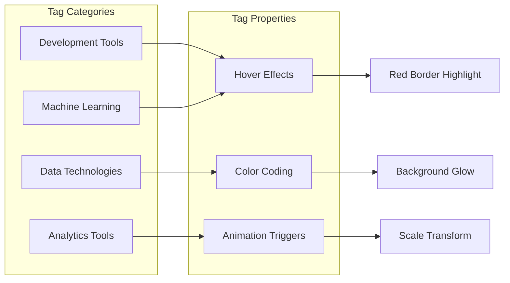
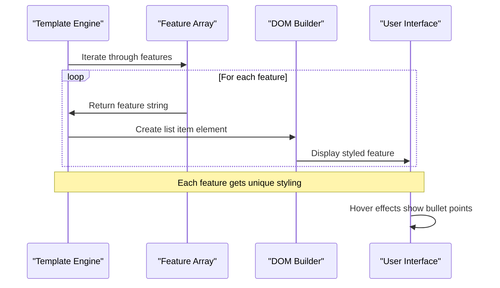
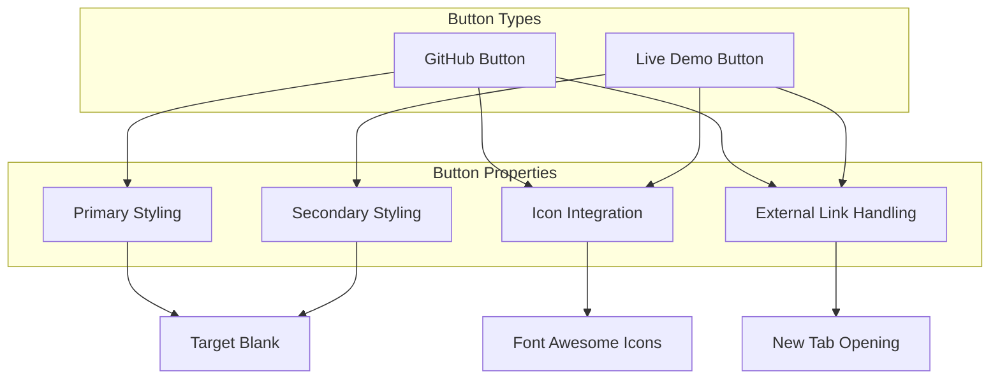
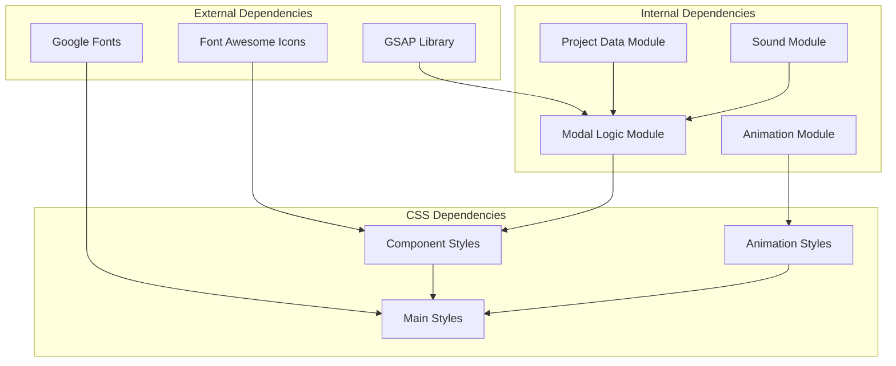

# Project Showcase System

<cite>
**Referenced Files in This Document**
- [index.html](file://portfolio/index.html)
- [data.js](file://portfolio/js/data.js)
- [main.js](file://portfolio/js/main.js)
- [components.css](file://portfolio/css/components.css)
- [main.css](file://portfolio/css/main.css)
- [animations.css](file://portfolio/css/animations.css)
</cite>

## Table of Contents
1. [Introduction](#introduction)
2. [Project Structure](#project-structure)
3. [Core Components](#core-components)
4. [Architecture Overview](#architecture-overview)
5. [Detailed Component Analysis](#detailed-component-analysis)
6. [Dependency Analysis](#dependency-analysis)
7. [Performance Considerations](#performance-considerations)
8. [Troubleshooting Guide](#troubleshooting-guide)
9. [Conclusion](#conclusion)

## Introduction

The Project Showcase System in the JAJA Portfolio is a sophisticated modal-based project presentation system that transforms static project cards into dynamic, interactive experiences. This system provides users with comprehensive project information through an elegant modal interface, featuring technology tag visualization, feature highlighting, and seamless integration with the portfolio's VALORANT-themed aesthetic.

The system consists of three primary components: project cards that serve as entry points, a modal overlay that presents detailed information, and a dynamic content generation engine that binds project data to the modal interface. The implementation leverages modern web technologies including ES6 JavaScript modules, CSS Grid/Flexbox layouts, and GSAP animations for smooth transitions.

## Project Structure

The project showcase system is organized across multiple files with clear separation of concerns:

**Diagram sources**
- [index.html:535-614](file://portfolio/index.html#L535-L614)
- [data.js:1-52](file://portfolio/js/data.js#L1-L52)
- [main.js:152-233](file://portfolio/js/main.js#L152-L233)

**Section sources**
- [index.html:535-614](file://portfolio/index.html#L535-L614)
- [data.js:1-52](file://portfolio/js/data.js#L1-L52)
- [main.js:152-233](file://portfolio/js/main.js#L152-L233)

## Core Components

### Project Card System

The project cards serve as the primary entry points for the showcase system. Each card contains:

- **Visual Elements**: Placeholder icons representing the project theme
- **Information Display**: Project code, name, brief description, and technology tags
- **Interactive Elements**: View Details button that triggers modal activation
- **Status Indicators**: Completion status badges for project visibility

### Modal Overlay Infrastructure

The modal system provides a comprehensive presentation layer with:

- **Overlay Management**: Semi-transparent backdrop with blur effects
- **Content Container**: Centered modal with scaling animations
- **Navigation Controls**: Close button with hover effects
- **Responsive Design**: Adaptive sizing for different screen dimensions

### Dynamic Content Generation Engine

The system dynamically generates modal content based on project data:

- **Template Binding**: Project data mapped to HTML templates
- **Technology Tag Rendering**: Dynamic tag creation with hover effects
- **Feature List Generation**: Unordered lists with styled bullet points
- **Action Button Creation**: GitHub and Live Demo button generation

**Section sources**
- [index.html:544-609](file://portfolio/index.html#L544-L609)
- [components.css:334-431](file://portfolio/css/components.css#L334-L431)
- [main.js:185-233](file://portfolio/js/main.js#L185-L233)

## Architecture Overview

The project showcase system follows a modular architecture pattern with clear separation between data, logic, and presentation layers:

**Diagram sources**
- [main.js:152-233](file://portfolio/js/main.js#L152-L233)
- [data.js:6-52](file://portfolio/js/data.js#L6-L52)

The system architecture demonstrates several key design patterns:

- **Observer Pattern**: Event listeners for user interactions
- **Template Method Pattern**: Consistent modal rendering process
- **Strategy Pattern**: Different modal content generation strategies
- **Module Pattern**: Encapsulated functionality in separate files

**Section sources**
- [main.js:152-233](file://portfolio/js/main.js#L152-L233)
- [data.js:6-52](file://portfolio/js/data.js#L6-L52)

## Detailed Component Analysis

### Project Data Structure

The project data is structured as a hierarchical object containing all project information:

**Diagram sources**
- [data.js:6-52](file://portfolio/js/data.js#L6-L52)

Each project object contains five essential properties:
- **Code**: Project identification code (MISSION 01, 02, 03)
- **Title**: Human-readable project name
- **Description**: Comprehensive project overview
- **Tech**: Array of technology stack tags
- **Features**: List of key project capabilities
- **GitHub/Demo**: Links to source code and live demonstrations

**Section sources**
- [data.js:6-52](file://portfolio/js/data.js#L6-L52)

### Modal Implementation Architecture

The modal system implements a sophisticated state management approach:

**Diagram sources**
- [main.js:152-233](file://portfolio/js/main.js#L152-L233)

The modal implementation includes several advanced features:

- **Animation Integration**: GSAP-powered entrance/exit animations
- **Accessibility Support**: Keyboard navigation and ARIA labels
- **Responsive Behavior**: Adaptive sizing for mobile devices
- **Performance Optimization**: Efficient DOM manipulation

**Section sources**
- [main.js:152-233](file://portfolio/js/main.js#L152-L233)
- [components.css:334-431](file://portfolio/css/components.css#L334-L431)

### Technology Tag System

The technology tag system provides visual representation of project technologies:

**Diagram sources**
- [components.css:1137-1153](file://portfolio/css/components.css#L1137-L1153)

The technology tag system features:
- **Dynamic Generation**: Tags created from project data arrays
- **Interactive Effects**: Hover animations with color transitions
- **Visual Hierarchy**: Consistent styling with project aesthetics
- **Responsive Layout**: Flexible wrapping for different screen sizes

**Section sources**
- [components.css:1137-1153](file://portfolio/css/components.css#L1137-L1153)
- [main.js:192-194](file://portfolio/js/main.js#L192-L194)

### Feature Highlighting Mechanism

The feature highlighting system creates an engaging presentation of project capabilities:

**Diagram sources**
- [main.js:195-204](file://portfolio/js/main.js#L195-L204)

The feature highlighting mechanism includes:
- **List Generation**: Dynamic unordered list creation
- **Styling Consistency**: Uniform bullet point styling
- **Visual Enhancement**: Icon-based feature indication
- **Accessibility Compliance**: Proper semantic markup

**Section sources**
- [main.js:195-204](file://portfolio/js/main.js#L195-L204)

### Action Button System

The action button system provides direct access to external resources:

**Diagram sources**
- [main.js:205-214](file://portfolio/js/main.js#L205-L214)

Both action buttons share common characteristics:
- **Consistent Styling**: Match project card design language
- **Icon Integration**: Font Awesome icons for visual enhancement
- **External Link Support**: Opens in new tabs for user convenience
- **Accessibility Features**: Proper ARIA labels and keyboard navigation

**Section sources**
- [main.js:205-214](file://portfolio/js/main.js#L205-L214)

## Dependency Analysis

The project showcase system exhibits well-managed dependencies with clear separation of concerns:

**Diagram sources**
- [index.html:17-25](file://portfolio/index.html#L17-L25)
- [main.js:1466-1510](file://portfolio/js/main.js#L1466-L1510)

The dependency structure demonstrates:
- **External Libraries**: Minimal third-party dependencies
- **Internal Modules**: Well-organized modular architecture
- **CSS Organization**: Layered styling approach
- **Event Management**: Centralized event handling

**Section sources**
- [index.html:17-25](file://portfolio/index.html#L17-L25)
- [main.js:1466-1510](file://portfolio/js/main.js#L1466-L1510)

## Performance Considerations

The project showcase system implements several performance optimization strategies:

### Memory Management
- **Event Listener Cleanup**: Proper removal of event handlers
- **DOM Element Reuse**: Efficient modal content regeneration
- **Animation Optimization**: Hardware-accelerated CSS transitions

### Loading Performance
- **Lazy Loading**: Modal content generated only when needed
- **Resource Optimization**: CDN-hosted external libraries
- **CSS Optimization**: Minimized style calculations

### User Experience Performance
- **Smooth Animations**: 60fps animation targeting
- **Responsive Design**: Adaptive layouts for different devices
- **Accessibility Features**: Keyboard navigation and screen reader support

## Troubleshooting Guide

### Common Issues and Solutions

**Modal Not Appearing**
- Verify modal overlay element exists in HTML
- Check CSS z-index values for proper layering
- Ensure JavaScript initialization occurs after DOM ready

**Project Data Not Loading**
- Confirm project ID matches data structure keys
- Validate JSON formatting in data.js
- Check browser console for JavaScript errors

**Animation Issues**
- Verify GSAP library is properly loaded
- Check CSS transform properties for conflicts
- Ensure hardware acceleration is enabled

**Responsive Design Problems**
- Test on various screen sizes and orientations
- Verify CSS media queries are functioning
- Check viewport meta tag configuration

**Section sources**
- [main.js:152-233](file://portfolio/js/main.js#L152-L233)
- [components.css:334-431](file://portfolio/css/components.css#L334-L431)

## Conclusion

The Project Showcase System in the JAJA Portfolio represents a sophisticated implementation of modal-based project presentation. The system successfully combines modern web technologies with thoughtful design principles to create an engaging user experience.

Key achievements of the system include:

- **Modular Architecture**: Clean separation of concerns with well-defined components
- **Dynamic Content Generation**: Efficient data binding with template-based rendering
- **Visual Consistency**: Cohesive design language throughout the interface
- **Performance Optimization**: Hardware-accelerated animations and efficient DOM manipulation
- **Accessibility Compliance**: Comprehensive keyboard navigation and screen reader support

The system serves as an excellent example of modern web development practices, demonstrating how to create interactive, data-driven interfaces that enhance user engagement while maintaining performance and accessibility standards.

Future enhancements could include:
- Enhanced project filtering and search capabilities
- Social sharing integration for project showcases
- Advanced analytics tracking for user interactions
- Offline caching for improved performance