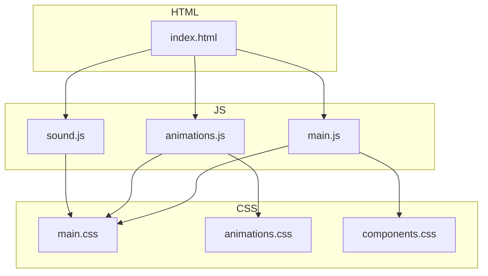
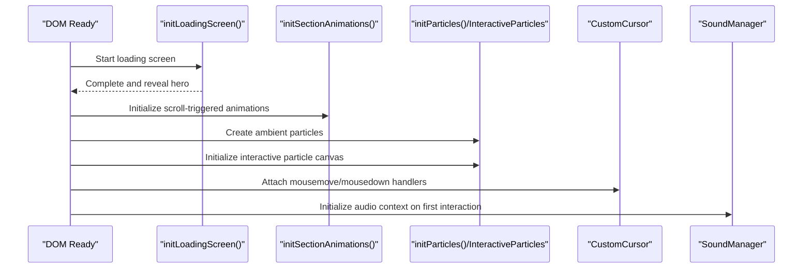
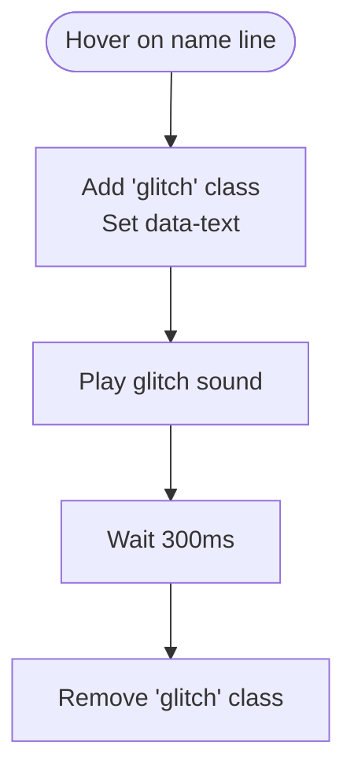
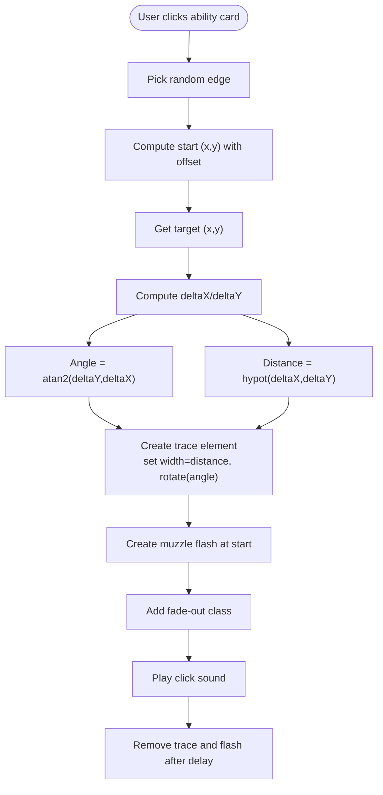
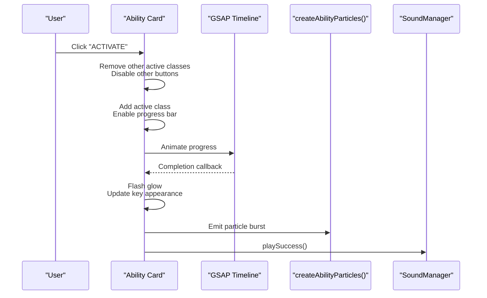
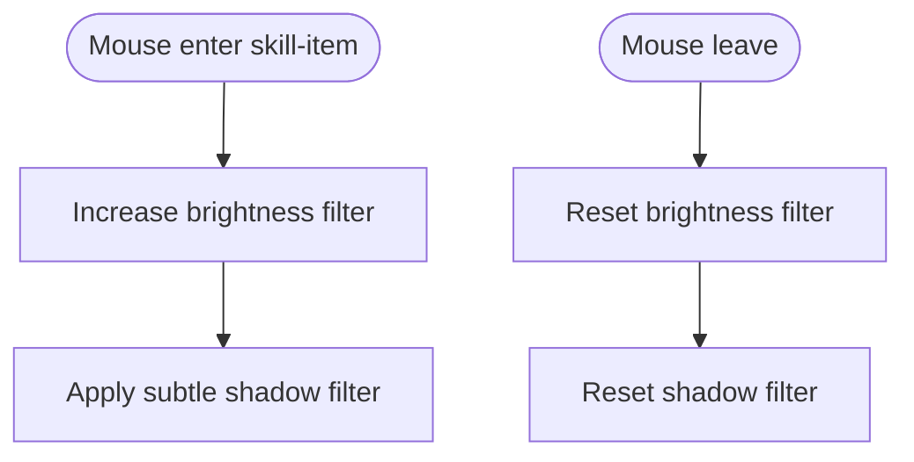
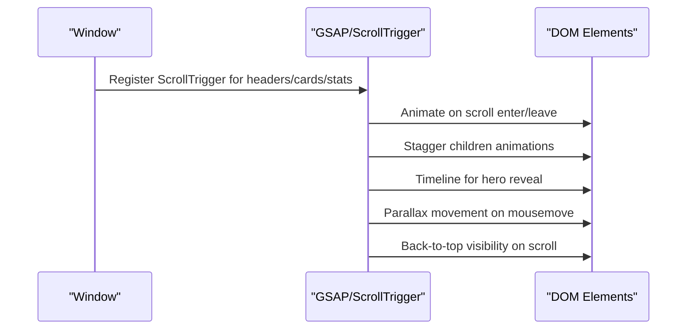
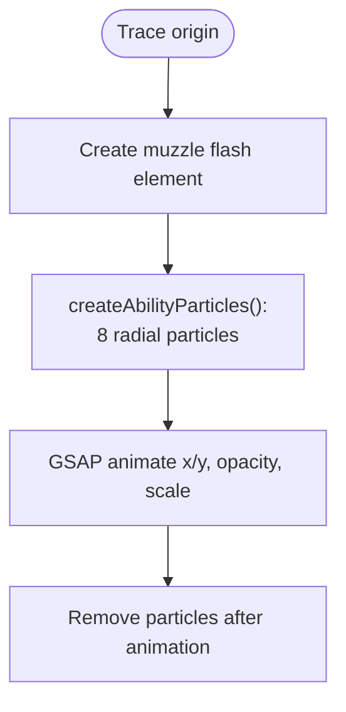
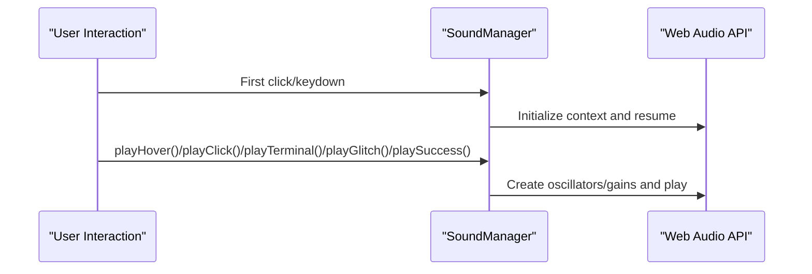
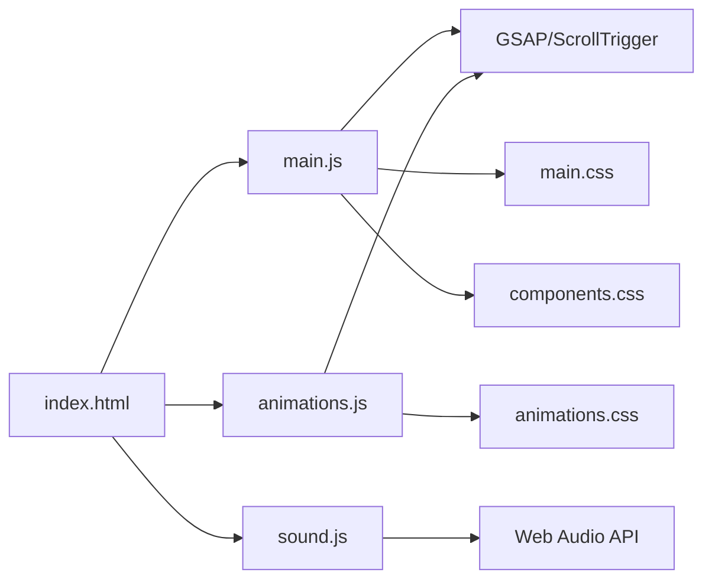

# Visual Effects & Animations

<cite>
**Referenced Files in This Document**
- [index.html](file://portfolio/index.html)
- [main.js](file://portfolio/js/main.js)
- [animations.js](file://portfolio/js/animations.js)
- [sound.js](file://portfolio/js/sound.js)
- [main.css](file://portfolio/css/main.css)
- [animations.css](file://portfolio/css/animations.css)
- [components.css](file://portfolio/css/components.css)
</cite>

## Table of Contents
1. [Introduction](#introduction)
2. [Project Structure](#project-structure)
3. [Core Components](#core-components)
4. [Architecture Overview](#architecture-overview)
5. [Detailed Component Analysis](#detailed-component-analysis)
6. [Dependency Analysis](#dependency-analysis)
7. [Performance Considerations](#performance-considerations)
8. [Troubleshooting Guide](#troubleshooting-guide)
9. [Conclusion](#conclusion)

## Introduction
This document explains the visual effects and animation systems powering the JAJA Portfolio. It covers:
- Glitch text effects with hover triggers and audio integration
- Particle systems for ambient and ability activation visuals
- Bullet trace creation algorithm with origin positioning, angle calculation, and fade-out animations
- Skill item hover effects, glow animations, and shadow enhancements
- Integration with GSAP for smooth animations, timing functions, and complex animation sequences
- Muzzle flash effects and particle physics
- Performance optimization techniques for smooth visuals across devices and browsers

## Project Structure
The visual effects are implemented across HTML templates, JavaScript animation orchestration, CSS animations/transitions, and a Web Audio-based sound manager. Key areas:
- HTML defines DOM nodes for effects (e.g., hero name lines, ability cards, bullet traces)
- JS orchestrates animations, triggers, and audio playback
- CSS provides reusable animation classes and effect primitives
- Sound manager generates short, contextual audio cues



**Diagram sources**
- [index.html:1-120](file://portfolio/index.html#L1-L120)
- [main.js:1466-1510](file://portfolio/js/main.js#L1466-L1510)
- [animations.js:762-774](file://portfolio/js/animations.js#L762-L774)
- [sound.js:103-155](file://portfolio/js/sound.js#L103-L155)
- [main.css:1-120](file://portfolio/css/main.css#L1-L120)
- [animations.css:1-60](file://portfolio/css/animations.css#L1-L60)
- [components.css:1-60](file://portfolio/css/components.css#L1-L60)

**Section sources**
- [index.html:1-120](file://portfolio/index.html#L1-L120)
- [main.js:1466-1510](file://portfolio/js/main.js#L1466-L1510)
- [animations.js:762-774](file://portfolio/js/animations.js#L762-L774)
- [sound.js:103-155](file://portfolio/js/sound.js#L103-L155)
- [main.css:1-120](file://portfolio/css/main.css#L1-L120)
- [animations.css:1-60](file://portfolio/css/animations.css#L1-L60)
- [components.css:1-60](file://portfolio/css/components.css#L1-L60)

## Core Components
- Glitch effect system: CSS-based glitch animations with dynamic text overlays and hover-triggered audio
- Particle systems: Ambient floating particles and interactive particle canvas with mouse proximity
- Bullet traces: Dynamic DOM elements sized and rotated to connect a random edge to a click/click target
- Ability activation: Animated progress bar, glow pulses, and particle bursts
- Skill item hover: Brightness and shadow enhancements
- GSAP integration: Timelines, ScrollTrigger, and complex sequences
- Sound manager: Web Audio API-based audio cues for hover, click, terminal, glitch, and success events

**Section sources**
- [animations.css:8-50](file://portfolio/css/animations.css#L8-L50)
- [animations.js:582-621](file://portfolio/js/animations.js#L582-L621)
- [animations.js:624-759](file://portfolio/js/animations.js#L624-L759)
- [main.js:461-528](file://portfolio/js/main.js#L461-L528)
- [main.js:374-459](file://portfolio/js/main.js#L374-L459)
- [main.js:565-590](file://portfolio/js/main.js#L565-L590)
- [animations.js:582-774](file://portfolio/js/animations.js#L582-L774)
- [sound.js:5-101](file://portfolio/js/sound.js#L5-L101)

## Architecture Overview
The system is event-driven:
- DOM-ready initialization wires up loaders, animations, parallax, scroll progress, back-to-top, navigation state, static particles, and interactive particles
- Hover and click events trigger animations and sounds
- Ability activation sequences combine DOM manipulation, GSAP timelines, and particle effects
- Bullet traces are generated dynamically with precise geometry calculations



**Diagram sources**
- [animations.js:762-774](file://portfolio/js/animations.js#L762-L774)
- [animations.js:582-621](file://portfolio/js/animations.js#L582-L621)
- [animations.js:624-759](file://portfolio/js/animations.js#L624-L759)
- [main.js:1466-1510](file://portfolio/js/main.js#L1466-L1510)
- [sound.js:13-26](file://portfolio/js/sound.js#L13-L26)

## Detailed Component Analysis

### Glitch Effect System
- CSS glitch effect uses pseudo-elements to overlay animated clips with color shifts
- Dynamic text overlay is applied on hover to create a layered glitch illusion
- Hover triggers a short glitch sound via the sound manager

Implementation highlights:
- CSS classes define glitch layers and keyframe animations
- JavaScript toggles the glitch class and sets data-text for pseudo-element content
- Sound plays on hover for immersive feedback



**Diagram sources**
- [animations.css:8-50](file://portfolio/css/animations.css#L8-L50)
- [main.js:352-371](file://portfolio/js/main.js#L352-L371)
- [sound.js:73-75](file://portfolio/js/sound.js#L73-L75)

**Section sources**
- [animations.css:8-50](file://portfolio/css/animations.css#L8-L50)
- [main.js:352-371](file://portfolio/js/main.js#L352-L371)
- [sound.js:73-75](file://portfolio/js/sound.js#L73-L75)

### Particle Systems
Ambient particle system:
- Creates a fixed number of small particles with randomized sizes and positions
- Applies CSS animations to float and fade out
- Recycles particles after animation completes

Interactive particle canvas:
- Dynamically creates a canvas covering the viewport
- Generates a particle count proportional to screen area
- Particles move with small velocities and wrap around edges
- Mouse proximity applies forces to attract particles
- Draws connections between nearby particles with alpha-based opacity

```mermaid
classDiagram
class ParticleSystem {
+createParticle(container)
+initParticles()
}
class InteractiveParticles {
+canvas
+ctx
+particles[]
+mouse{x,y,radius}
+createParticles()
+animate()
+resize()
}
ParticleSystem <.. InteractiveParticles : "uses"
```

**Diagram sources**
- [animations.js:582-621](file://portfolio/js/animations.js#L582-L621)
- [animations.js:624-759](file://portfolio/js/animations.js#L624-L759)

**Section sources**
- [animations.js:582-621](file://portfolio/js/animations.js#L582-L621)
- [animations.js:624-759](file://portfolio/js/animations.js#L624-L759)

### Bullet Trace Creation Algorithm
The bullet trace connects a random edge to a target point:
- Randomly selects an edge (top/right/bottom/left)
- Computes start coordinates with an offset beyond the viewport
- Calculates delta X/Y, angle, and Euclidean distance
- Creates a DOM element sized to the distance and rotated to the angle
- Adds a fade-out class and optional muzzle flash element
- Plays a click sound and cleans up after a short delay



**Diagram sources**
- [main.js:461-528](file://portfolio/js/main.js#L461-L528)

**Section sources**
- [main.js:461-528](file://portfolio/js/main.js#L461-L528)

### Ability Activation Effects
On activation:
- Removes active class from other cards and disables their buttons
- Adds active class to the clicked card and starts progress animation
- Completes activation by flashing glow, updating key appearance, and emitting particle burst
- Plays success sound



**Diagram sources**
- [main.js:374-459](file://portfolio/js/main.js#L374-L459)
- [main.js:530-563](file://portfolio/js/main.js#L530-L563)
- [sound.js:77-79](file://portfolio/js/sound.js#L77-L79)

**Section sources**
- [main.js:374-459](file://portfolio/js/main.js#L374-L459)
- [main.js:530-563](file://portfolio/js/main.js#L530-L563)
- [sound.js:77-79](file://portfolio/js/sound.js#L77-L79)

### Skill Item Hover Effects
- Brightness enhancement on hover for the skill-fill element
- Smooth transitions for brightness and shadow filters



**Diagram sources**
- [main.js:565-590](file://portfolio/js/main.js#L565-L590)

**Section sources**
- [main.js:565-590](file://portfolio/js/main.js#L565-L590)

### GSAP Integration and Scroll-Based Animations
- Loading screen progress and completion
- Hero section reveal with staggered timelines
- Scroll-triggered reveals for sections, cards, and stats
- Skill bar fills with glow pulses on completion
- Hover animations for cards, mission cards, info cards, and form inputs
- Parallax grid overlay movement
- Back-to-top button visibility and smooth scroll
- Nav active state updates



**Diagram sources**
- [animations.js:57-123](file://portfolio/js/animations.js#L57-L123)
- [animations.js:125-501](file://portfolio/js/animations.js#L125-L501)
- [animations.js:503-524](file://portfolio/js/animations.js#L503-L524)
- [animations.js:538-580](file://portfolio/js/animations.js#L538-L580)

**Section sources**
- [animations.js:57-123](file://portfolio/js/animations.js#L57-L123)
- [animations.js:125-501](file://portfolio/js/animations.js#L125-L501)
- [animations.js:503-524](file://portfolio/js/animations.js#L503-L524)
- [animations.js:538-580](file://portfolio/js/animations.js#L538-L580)

### Muzzle Flash Effects and Particle Physics
- Muzzle flash is a small DOM element positioned at the trace origin
- Particle burst emits multiple particles radially from the ability card center
- Particles animate with GSAP to scale and fade out



**Diagram sources**
- [main.js:506-511](file://portfolio/js/main.js#L506-L511)
- [main.js:530-563](file://portfolio/js/main.js#L530-L563)

**Section sources**
- [main.js:506-511](file://portfolio/js/main.js#L506-L511)
- [main.js:530-563](file://portfolio/js/main.js#L530-L563)

### Sound Integration
- Web Audio API initializes on first user interaction
- Context resumes if suspended
- Plays various sound types: hover, click, terminal, glitch, success, and typewriter-style typing
- Integrates with UI interactions (hover, click, form focus, back-to-top)



**Diagram sources**
- [sound.js:13-26](file://portfolio/js/sound.js#L13-L26)
- [sound.js:37-59](file://portfolio/js/sound.js#L37-L59)
- [sound.js:61-100](file://portfolio/js/sound.js#L61-L100)
- [main.js:550-556](file://portfolio/js/main.js#L550-L556)
- [main.js:136-151](file://portfolio/js/main.js#L136-L151)

**Section sources**
- [sound.js:13-26](file://portfolio/js/sound.js#L13-L26)
- [sound.js:37-59](file://portfolio/js/sound.js#L37-L59)
- [sound.js:61-100](file://portfolio/js/sound.js#L61-L100)
- [main.js:550-556](file://portfolio/js/main.js#L550-L556)
- [main.js:136-151](file://portfolio/js/main.js#L136-L151)

## Dependency Analysis
Key dependencies and relationships:
- HTML provides DOM nodes for effects (e.g., hero name lines, ability cards, bullet trace containers)
- JS orchestrates animations and audio; relies on GSAP and ScrollTrigger
- CSS defines reusable animations and effect primitives
- Sound manager encapsulates Web Audio API usage and integrates with UI events



**Diagram sources**
- [index.html:17-26](file://portfolio/index.html#L17-L26)
- [main.js:1466-1510](file://portfolio/js/main.js#L1466-L1510)
- [animations.js:762-774](file://portfolio/js/animations.js#L762-L774)
- [sound.js:103-155](file://portfolio/js/sound.js#L103-L155)
- [main.css:1-120](file://portfolio/css/main.css#L1-L120)
- [animations.css:1-60](file://portfolio/css/animations.css#L1-L60)
- [components.css:1-60](file://portfolio/css/components.css#L1-L60)

**Section sources**
- [index.html:17-26](file://portfolio/index.html#L17-L26)
- [main.js:1466-1510](file://portfolio/js/main.js#L1466-L1510)
- [animations.js:762-774](file://portfolio/js/animations.js#L762-L774)
- [sound.js:103-155](file://portfolio/js/sound.js#L103-L155)
- [main.css:1-120](file://portfolio/css/main.css#L1-L120)
- [animations.css:1-60](file://portfolio/css/animations.css#L1-L60)
- [components.css:1-60](file://portfolio/css/components.css#L1-L60)

## Performance Considerations
- Use requestAnimationFrame for smooth animations and avoid layout thrashing
- Prefer transform and opacity for GPU-accelerated animations
- Limit DOM manipulation frequency; batch updates when possible
- Use passive event listeners for scroll and wheel events
- Control particle counts based on viewport area to balance quality and performance
- Defer heavy computations until idle or throttle frequent handlers
- Leverage GSAP’s internal optimization and avoid redundant tweens
- Minimize reflows by reading layout properties before writing

[No sources needed since this section provides general guidance]

## Troubleshooting Guide
Common issues and resolutions:
- Audio does not play: Ensure user interaction has occurred to initialize and resume the audio context
- Animations stutter: Verify requestAnimationFrame usage and avoid synchronous layout reads in animation loops
- Particles lag: Reduce particle count or simplify physics; ensure cleanup after animation
- Bullet traces not appearing: Confirm correct origin computation and that the trace element is appended to the DOM before applying the fade-out class
- Hover sounds not triggering: Check event delegation and ensure the sound toggle is not disabling sounds

**Section sources**
- [sound.js:13-26](file://portfolio/js/sound.js#L13-L26)
- [animations.js:694-758](file://portfolio/js/animations.js#L694-L758)
- [main.js:461-528](file://portfolio/js/main.js#L461-L528)

## Conclusion
The JAJA Portfolio’s visual effects combine CSS animations, DOM-managed bullet traces, GSAP-driven sequences, and Web Audio cues to deliver a cohesive, immersive experience. The modular architecture allows for easy maintenance and extension, while performance-conscious implementations ensure smooth visuals across devices and browsers.