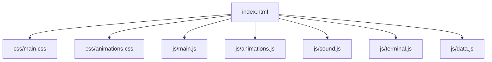
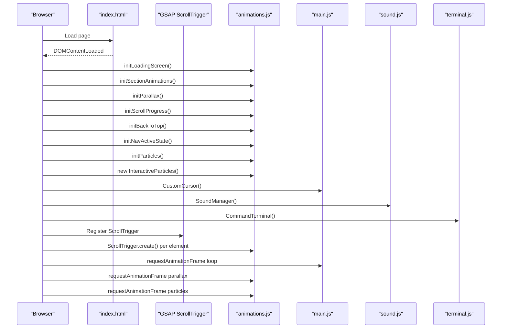
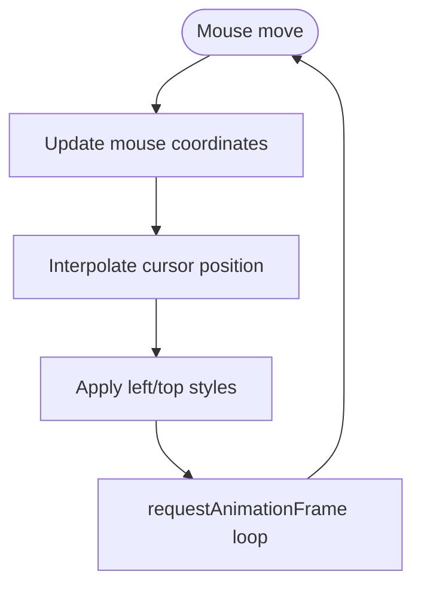
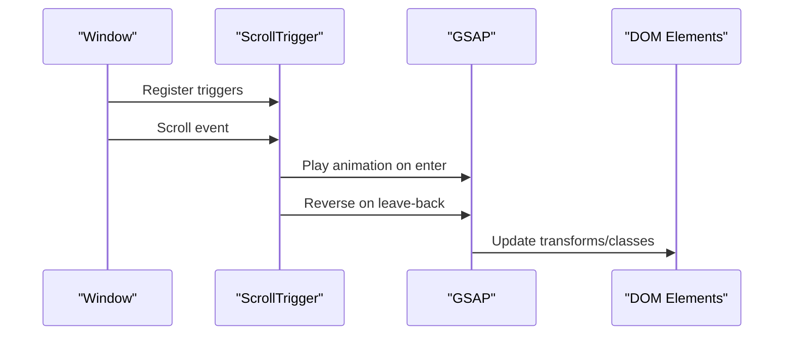
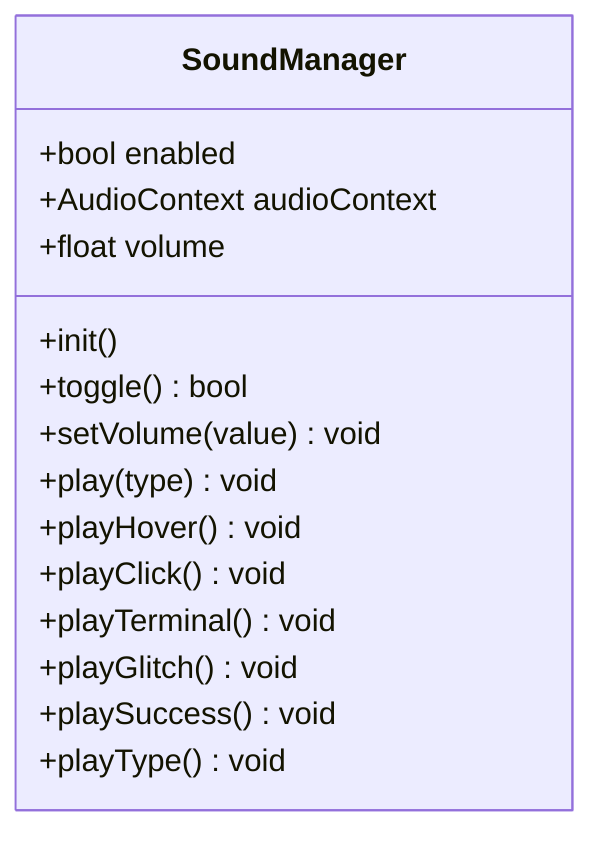
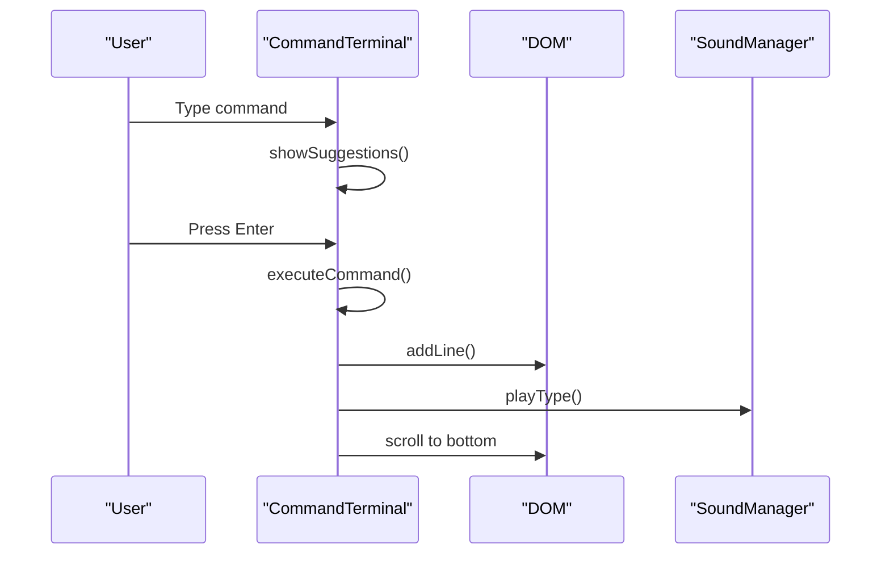
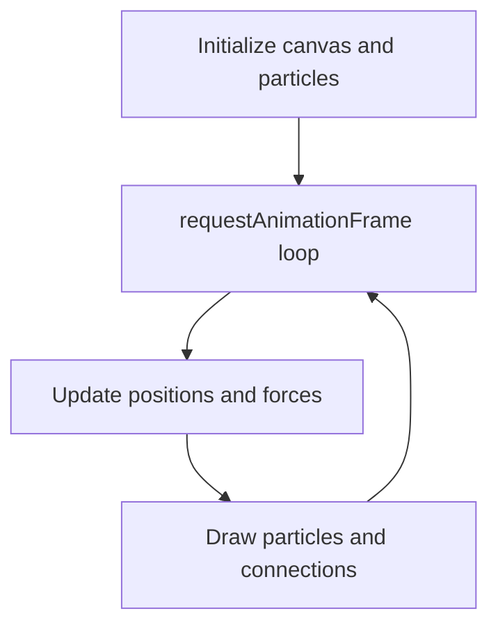
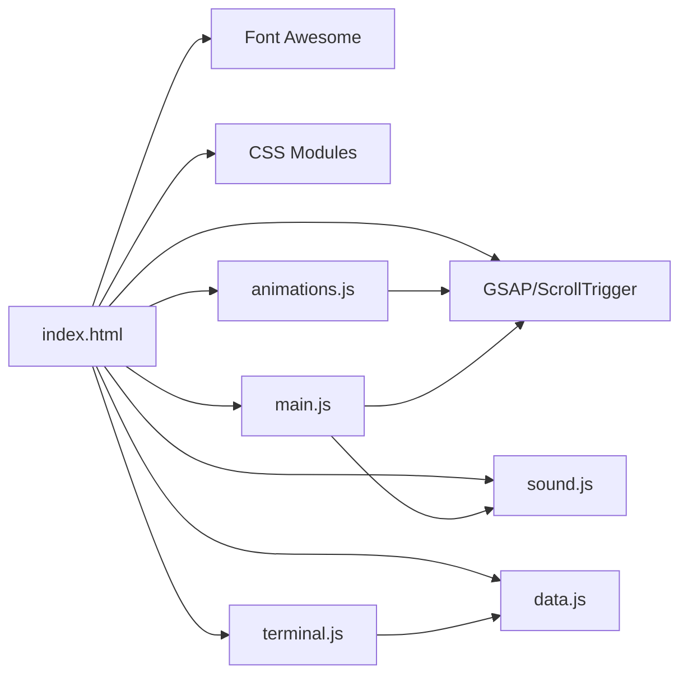

# Performance & Optimization

<cite>
**Referenced Files in This Document**
- [index.html](file://portfolio/index.html)
- [main.js](file://portfolio/js/main.js)
- [animations.js](file://portfolio/js/animations.js)
- [sound.js](file://portfolio/js/sound.js)
- [terminal.js](file://portfolio/js/terminal.js)
- [data.js](file://portfolio/js/data.js)
- [main.css](file://portfolio/css/main.css)
- [animations.css](file://portfolio/css/animations.css)
</cite>

## Table of Contents
1. [Introduction](#introduction)
2. [Project Structure](#project-structure)
3. [Core Components](#core-components)
4. [Architecture Overview](#architecture-overview)
5. [Detailed Component Analysis](#detailed-component-analysis)
6. [Dependency Analysis](#dependency-analysis)
7. [Performance Considerations](#performance-considerations)
8. [Troubleshooting Guide](#troubleshooting-guide)
9. [Conclusion](#conclusion)
10. [Appendices](#appendices)

## Introduction
This document provides a comprehensive guide to performance optimization for the JAJA Portfolio. It focuses on asset loading strategies, animation performance using GSAP ScrollTrigger, memory management for smooth interactions, browser compatibility, and mobile-specific optimizations. Practical examples for monitoring performance, identifying bottlenecks, and implementing improvements are included, along with guidelines for maintaining performance as new features are added.

## Project Structure
The portfolio is organized into modular JavaScript modules and CSS layers:
- HTML defines the page skeleton and loads external libraries (GSAP and icons).
- JS modules handle initialization, animations, sound, and interactive features.
- CSS files define styles, animations, and responsive behavior.

**Diagram sources**
- [index.html:1-26](file://portfolio/index.html#L1-L26)
- [main.js:1-120](file://portfolio/js/main.js#L1-L120)
- [animations.js:1-60](file://portfolio/js/animations.js#L1-L60)
- [sound.js:1-40](file://portfolio/js/sound.js#L1-L40)
- [terminal.js:1-40](file://portfolio/js/terminal.js#L1-L40)
- [data.js:1-40](file://portfolio/js/data.js#L1-L40)

**Section sources**
- [index.html:1-26](file://portfolio/index.html#L1-L26)
- [main.css:1-60](file://portfolio/css/main.css#L1-L60)

## Core Components
- Custom Cursor: Lightweight pointer replacement with interpolation and hover/click states; disabled on coarse-pointer devices.
- GSAP ScrollTrigger: Efficient scroll-driven animations with toggleActions for play/reverse behavior.
- Sound Manager: Web Audio API-based audio playback with lazy initialization on first user interaction.
- Terminal Chat: Animated chat interface with minimal DOM updates and throttled scrolling.
- Interactive Particles: Canvas-based particle system with mouse interaction and boundary wrapping.
- Loading Screen: Animated loader with staged progress updates.

**Section sources**
- [main.js:6-109](file://portfolio/js/main.js#L6-L109)
- [animations.js:5-120](file://portfolio/js/animations.js#L5-L120)
- [sound.js:5-101](file://portfolio/js/sound.js#L5-L101)
- [terminal.js:5-120](file://portfolio/js/terminal.js#L5-L120)
- [animations.js:624-774](file://portfolio/js/animations.js#L624-L774)

## Architecture Overview
The runtime architecture centers on modular initialization and event-driven updates:
- DOMContentLoaded triggers initialization of loaders, animations, and interactive systems.
- Scroll events drive ScrollTrigger animations and HUD updates.
- User interactions trigger targeted animations and sound effects.

**Diagram sources**
- [index.html:17-25](file://portfolio/index.html#L17-L25)
- [animations.js:5-774](file://portfolio/js/animations.js#L5-L774)
- [main.js:6-109](file://portfolio/js/main.js#L6-L109)
- [sound.js:5-101](file://portfolio/js/sound.js#L5-L101)
- [terminal.js:680-683](file://portfolio/js/terminal.js#L680-L683)

## Detailed Component Analysis

### Custom Cursor System
- Purpose: Replace default cursor with a stylized crosshair and ring, with hover and click feedback.
- Performance characteristics:
  - Uses requestAnimationFrame for smooth interpolation.
  - Disabled on coarse-pointer devices to avoid unnecessary overhead.
  - Minimal DOM manipulation; relies on style.left/top updates.
- Memory management:
  - Single class instance; no persistent timers except rAF loop.
  - No detached nodes retained; cleanup occurs via disabling on mobile.

**Diagram sources**
- [main.js:31-66](file://portfolio/js/main.js#L31-L66)

**Section sources**
- [main.js:6-109](file://portfolio/js/main.js#L6-L109)
- [main.css:219-297](file://portfolio/css/main.css#L219-L297)

### GSAP ScrollTrigger Animations
- Purpose: Scroll-driven reveals with toggleActions for play/reverse behavior.
- Performance characteristics:
  - Uses ScrollTrigger.create per element to avoid global scroll handlers.
  - Staggered animations leverage GSAP’s internal batching.
  - Percentage counters and glow pulses use onComplete callbacks sparingly.
- Memory management:
  - ScrollTrigger instances are scoped to triggers; no global lists maintained.
  - Animations are tied to DOM lifecycle; removed when triggers are removed.

**Diagram sources**
- [animations.js:126-501](file://portfolio/js/animations.js#L126-L501)

**Section sources**
- [animations.js:5-774](file://portfolio/js/animations.js#L5-L774)

### Sound Manager (Web Audio API)
- Purpose: Provide low-latency, programmable sound effects with lazy initialization.
- Performance characteristics:
  - AudioContext initialized on first user gesture to satisfy autoplay policies.
  - Short-lived oscillators with exponential gain ramps prevent resource leaks.
  - Volume and effect selection via configuration object.
- Memory management:
  - No persistent buffers or nodes; oscillators are started/stopped immediately.
  - No global state retained beyond configuration and toggles.

**Diagram sources**
- [sound.js:5-101](file://portfolio/js/sound.js#L5-L101)

**Section sources**
- [sound.js:5-155](file://portfolio/js/sound.js#L5-L155)
- [data.js:133-159](file://portfolio/js/data.js#L133-L159)

### Terminal Chat Performance
- Purpose: Animated chat with command history, suggestions, and typewriter effects.
- Performance characteristics:
  - Minimal DOM updates; messages appended and scrolled to bottom.
  - Suggestions overlay uses lightweight DOM queries and selective rendering.
  - Typewriter effect uses intervals; throttled to avoid excessive repaints.
- Memory management:
  - Command history stored as strings; trimmed as needed.
  - Overlay visibility toggled; no persistent detached nodes.

**Diagram sources**
- [terminal.js:580-677](file://portfolio/js/terminal.js#L580-L677)
- [sound.js:82-100](file://portfolio/js/sound.js#L82-L100)

**Section sources**
- [terminal.js:5-683](file://portfolio/js/terminal.js#L5-L683)

### Interactive Particle System (Canvas)
- Purpose: Lightweight particle simulation with mouse interaction and connections.
- Performance characteristics:
  - Canvas-based rendering minimizes DOM overhead.
  - Particles wrap at edges; no offscreen cleanup required.
  - Connections drawn with alpha blending; limited to nearby pairs.
- Memory management:
  - Particles recreated after animation; no long-lived arrays.
  - Resize handler updates canvas dimensions; previous canvases removed.

**Diagram sources**
- [animations.js:624-774](file://portfolio/js/animations.js#L624-L774)

**Section sources**
- [animations.js:624-774](file://portfolio/js/animations.js#L624-L774)

### Loading Screen and HUD Updates
- Purpose: Animated loader and HUD overlays for progress and navigation.
- Performance characteristics:
  - Loader uses intervals with capped progress increments.
  - HUD updates use passive scroll listeners and minimal DOM writes.
- Memory management:
  - No persistent listeners retained; cleanup on exit.

**Section sources**
- [animations.js:8-123](file://portfolio/js/animations.js#L8-L123)
- [animations.js:526-580](file://portfolio/js/animations.js#L526-L580)

## Dependency Analysis
- External dependencies:
  - GSAP and ScrollTrigger loaded via CDN in HTML head.
  - Font Awesome icons loaded via CDN.
- Internal dependencies:
  - animations.js depends on GSAP and ScrollTrigger.
  - main.js integrates cursor, modals, forms, and effects.
  - sound.js is consumed by multiple UI components.
  - terminal.js depends on data.js for command definitions.

**Diagram sources**
- [index.html:17-25](file://portfolio/index.html#L17-L25)
- [animations.js:5-7](file://portfolio/js/animations.js#L5-L7)
- [main.js:82-108](file://portfolio/js/main.js#L82-L108)
- [terminal.js:55-130](file://portfolio/js/terminal.js#L55-L130)

**Section sources**
- [index.html:17-25](file://portfolio/index.html#L17-L25)
- [animations.js:5-7](file://portfolio/js/animations.js#L5-L7)

## Performance Considerations

### Asset Loading Strategies
- Preload critical resources:
  - Fonts and icons are preconnected in HTML head to reduce DNS and handshake latency.
- Lazy loading for images:
  - Use native loading="lazy" and loading-lazy intersection observer for offscreen images.
  - Consider srcset and sizes for responsive images.
- Minimize render-blocking:
  - Keep CSS in head; defer non-critical scripts.
- Reduce third-party impact:
  - Audit CDN endpoints; consider self-hosting frequently used assets for reliability.

### Animation Performance with GSAP ScrollTrigger
- Prefer transform/opacity over layout-affecting properties.
- Use will-change hints judiciously; avoid overusing.
- Batch DOM reads/writes; minimize forced synchronous layouts.
- Use passive listeners for scroll-driven updates.

### Memory Management
- Avoid global collections; rely on DOM-scoped lifecycles.
- Clean up intervals and timeouts when components unmount.
- Reuse DOM nodes where possible; avoid frequent creation/destruction.

### Browser Compatibility
- GSAP ScrollTrigger requires modern browsers; test fallbacks for older environments.
- Web Audio API initialization via user gesture is mandatory; ensure UX accommodates this.
- CSS animations and transforms are broadly supported; verify vendor prefixes if targeting legacy browsers.

### Mobile Device Performance
- Disable heavy effects on coarse-pointer devices (already handled for cursor).
- Prefer hardware-accelerated properties (transform/opacity).
- Use passive event listeners for scroll and touch.
- Optimize touch targets and avoid overscroll thrashing.

### Progressive Enhancement
- Start with static HTML; enhance with JS progressively.
- Gracefully degrade animations and effects on lower-end devices.
- Provide reduced motion alternatives using prefers-reduced-motion.

### Monitoring and Bottlenecks
- Use browser DevTools Performance and Memory panels to identify hotspots.
- Measure frame budget; target under 16ms per frame for 60fps.
- Monitor JS heap growth; look for retained closures and detached nodes.
- Track paint and composite costs; reduce expensive filters and shadows.

## Troubleshooting Guide
- Cursor not moving:
  - Verify pointer device detection and rAF loop.
  - Check for style overrides disabling pointer events.
- Scroll animations not triggering:
  - Confirm ScrollTrigger registration and trigger element visibility.
  - Ensure passive listeners are not blocking.
- Sound not playing:
  - Confirm user gesture requirement and AudioContext state.
  - Check for autoplay policy restrictions.
- Terminal lag:
  - Limit DOM updates; batch message appends.
  - Throttle suggestion rendering and scrolling.

**Section sources**
- [main.js:21-66](file://portfolio/js/main.js#L21-L66)
- [animations.js:126-501](file://portfolio/js/animations.js#L126-L501)
- [sound.js:13-26](file://portfolio/js/sound.js#L13-L26)
- [terminal.js:580-677](file://portfolio/js/terminal.js#L580-L677)

## Conclusion
By leveraging GSAP ScrollTrigger for efficient scroll-driven animations, implementing a Web Audio API-based sound manager, optimizing the custom cursor and particle systems, and applying mobile-first strategies, the JAJA Portfolio achieves smooth, performant interactions. Adopting progressive enhancement and continuous performance monitoring ensures sustained quality as features expand.

## Appendices

### Practical Examples
- Performance monitoring:
  - Use Performance API to measure animation durations and frame drops.
  - Employ Memory timeline to detect leaks during repeated interactions.
- Identifying bottlenecks:
  - Focus on scroll handlers, animation loops, and DOM updates.
  - Inspect GPU compositing and avoid expensive repaints.
- Implementing optimizations:
  - Switch to transform/opacity where possible.
  - Use passive listeners and throttle frequent handlers.
  - Defer non-critical work until after initial load.

### Guidelines for Adding Features
- Keep new animations local to their sections; scope ScrollTrigger instances.
- Introduce sound effects conservatively; centralize via SoundManager.
- Test on multiple devices and browsers; provide reduced motion alternatives.
- Measure impact before and after; iterate based on metrics.