# Project Overview

<cite>
**Referenced Files in This Document**
- [index.html](file://portfolio/index.html)
- [main.js](file://portfolio/js/main.js)
- [data.js](file://portfolio/js/data.js)
- [animations.js](file://portfolio/js/animations.js)
- [sound.js](file://portfolio/js/sound.js)
- [terminal.js](file://portfolio/js/terminal.js)
- [main.css](file://portfolio/css/main.css)
- [components.css](file://portfolio/css/components.css)
- [animations.css](file://portfolio/css/animations.css)
- [sections.css](file://portfolio/css/sections.css)
</cite>

## Table of Contents
1. [Introduction](#introduction)
2. [Project Structure](#project-structure)
3. [Core Components](#core-components)
4. [Architecture Overview](#architecture-overview)
5. [Detailed Component Analysis](#detailed-component-analysis)
6. [Dependency Analysis](#dependency-analysis)
7. [Performance Considerations](#performance-considerations)
8. [Troubleshooting Guide](#troubleshooting-guide)
9. [Conclusion](#conclusion)

## Introduction
JAJA Portfolio is a gaming-inspired, single-page application (SPA) that showcases Aryan Sharma’s full-stack development and data analysis capabilities. It blends tactical aesthetics with interactive mechanics to create an immersive, professional presentation. The site uses a modular JavaScript architecture, a cohesive CSS framework, and integrated gaming-inspired features such as a terminal, HUD overlay, kill feed, and an aim trainer mini-game. Its unique value proposition lies in demonstrating technical competence while entertaining and engaging visitors—ideal for attracting employers and collaborators who appreciate both professionalism and innovation.

## Project Structure
The project follows a clear separation of concerns:
- HTML defines the SPA layout and sections.
- JavaScript modules encapsulate behavior: navigation, animations, sound, terminal/chat, and game mechanics.
- CSS is split into modular stylesheets for main theme, components, animations, and sections.

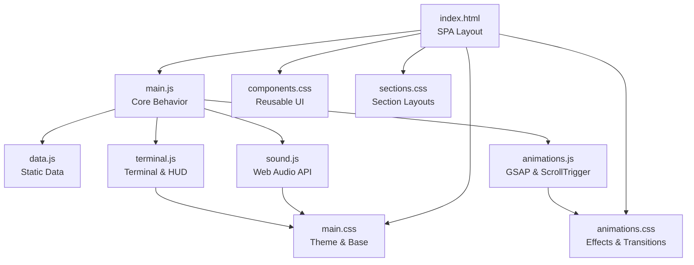

**Diagram sources**
- [index.html:1-902](file://portfolio/index.html#L1-L902)
- [main.js:1-1510](file://portfolio/js/main.js#L1-L1510)
- [data.js:1-165](file://portfolio/js/data.js#L1-L165)
- [animations.js:1-774](file://portfolio/js/animations.js#L1-L774)
- [sound.js:1-155](file://portfolio/js/sound.js#L1-L155)
- [terminal.js:1-683](file://portfolio/js/terminal.js#L1-L683)
- [main.css:1-1173](file://portfolio/css/main.css#L1-L1173)
- [components.css:1-1196](file://portfolio/css/components.css#L1-L1196)
- [animations.css:1-540](file://portfolio/css/animations.css#L1-L540)
- [sections.css:1-1872](file://portfolio/css/sections.css#L1-L1872)

**Section sources**
- [index.html:1-902](file://portfolio/index.html#L1-L902)
- [main.js:1-1510](file://portfolio/js/main.js#L1-L1510)
- [data.js:1-165](file://portfolio/js/data.js#L1-L165)
- [animations.js:1-774](file://portfolio/js/animations.js#L1-L774)
- [sound.js:1-155](file://portfolio/js/sound.js#L1-L155)
- [terminal.js:1-683](file://portfolio/js/terminal.js#L1-L683)
- [main.css:1-1173](file://portfolio/css/main.css#L1-L1173)
- [components.css:1-1196](file://portfolio/css/components.css#L1-L1196)
- [animations.css:1-540](file://portfolio/css/animations.css#L1-L540)
- [sections.css:1-1872](file://portfolio/css/sections.css#L1-L1872)

## Core Components
- Modular JavaScript modules:
  - Navigation, smooth scrolling, and mobile menu.
  - Project modals and ability card activation.
  - Contact form with “transmit” progress animation.
  - Aim Trainer game with targets, crosshair, and scoring.
  - Custom cursor with hover/click effects and recoil animations.
- Data-driven content:
  - Static project data and terminal command definitions.
- Visual and interactive systems:
  - GSAP-powered animations and ScrollTrigger-based reveals.
  - Scanline overlays, grid backgrounds, and particle systems.
  - HUD overlay with location indicator, kill feed, and progress bars.
  - Terminal and chat systems with command parsing and suggestions.
  - Web Audio API-based sound effects for UI actions.

**Section sources**
- [main.js:1-1510](file://portfolio/js/main.js#L1-L1510)
- [data.js:1-165](file://portfolio/js/data.js#L1-L165)
- [animations.js:1-774](file://portfolio/js/animations.js#L1-L774)
- [sound.js:1-155](file://portfolio/js/sound.js#L1-L155)
- [terminal.js:1-683](file://portfolio/js/terminal.js#L1-L683)

## Architecture Overview
The SPA architecture centers on a single HTML page with dynamic content updates and interactive subsystems:
- Navigation and routing-like behavior via smooth scrolling and hash-based anchors.
- Section reveal animations driven by ScrollTrigger.
- HUD overlay and minimap for contextual navigation and status.
- Terminal and chat systems for command-driven interaction.
- Aim Trainer game embedded within a dedicated section.

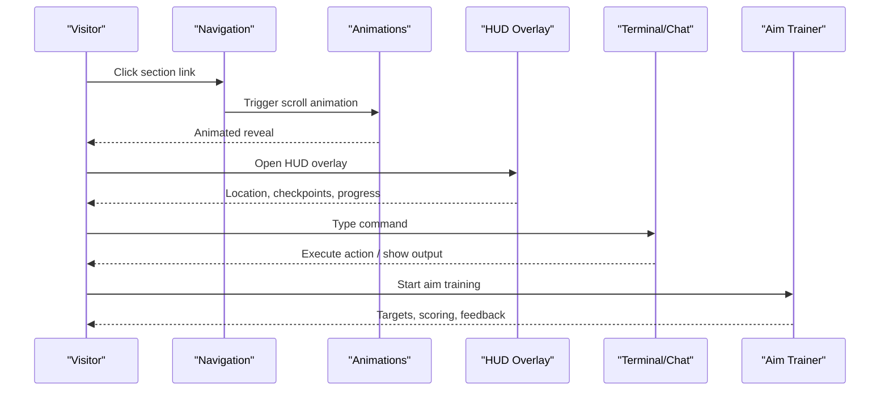

**Diagram sources**
- [index.html:64-110](file://portfolio/index.html#L64-L110)
- [animations.js:125-501](file://portfolio/js/animations.js#L125-L501)
- [terminal.js:5-683](file://portfolio/js/terminal.js#L5-L683)
- [main.js:610-800](file://portfolio/js/main.js#L610-L800)

## Detailed Component Analysis

### Single-Page Application and Navigation
- Hash-based navigation with smooth scrolling to sections.
- Active state tracking and scroll progress indicator.
- Mobile menu with animated hamburger and overlay.

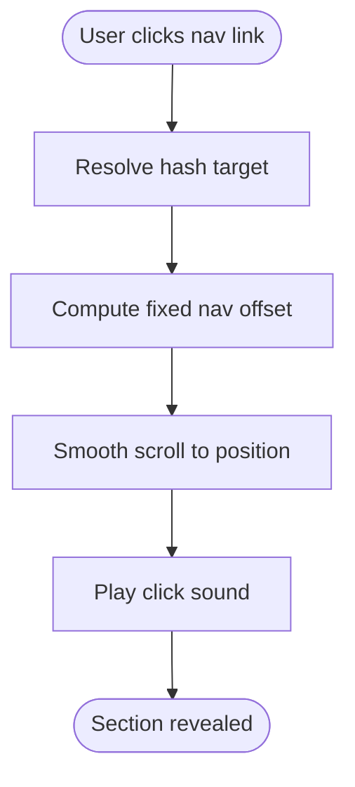

**Diagram sources**
- [index.html:64-96](file://portfolio/index.html#L64-L96)
- [main.js:328-349](file://portfolio/js/main.js#L328-L349)

**Section sources**
- [index.html:64-110](file://portfolio/index.html#L64-L110)
- [main.js:328-349](file://portfolio/js/main.js#L328-L349)

### Custom Cursor and Crosshair System
- Hardware-accelerated cursor with smooth tracking and hover/click states.
- Crosshair scaling and ring expansion on click with recoil animation.
- Integration with sound effects for tactile feedback.

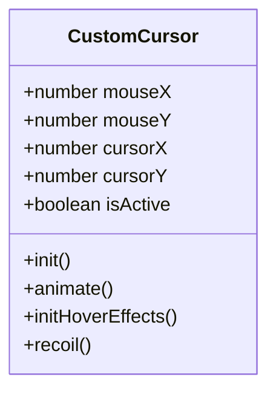

**Diagram sources**
- [main.js:5-109](file://portfolio/js/main.js#L5-L109)

**Section sources**
- [main.js:5-109](file://portfolio/js/main.js#L5-L109)

### Section Reveal and Parallax Animations
- GSAP timeline for hero section entrance.
- ScrollTrigger-based reveals for headers, cards, and lists.
- Parallax grid overlay movement with mouse.
- Particle systems and interactive canvas particles.

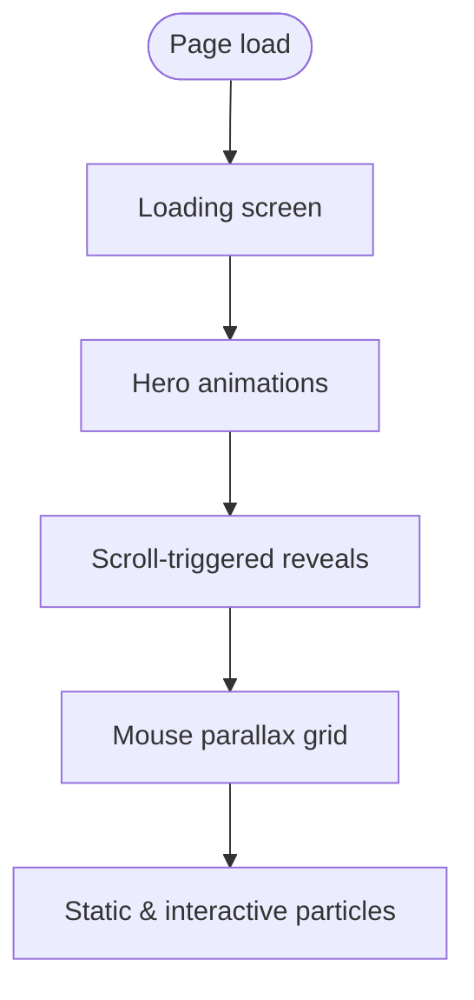

**Diagram sources**
- [animations.js:8-123](file://portfolio/js/animations.js#L8-L123)
- [animations.js:125-501](file://portfolio/js/animations.js#L125-L501)
- [animations.js:503-524](file://portfolio/js/animations.js#L503-L524)
- [animations.js:582-621](file://portfolio/js/animations.js#L582-L621)
- [animations.js:623-759](file://portfolio/js/animations.js#L623-L759)

**Section sources**
- [animations.js:8-123](file://portfolio/js/animations.js#L8-L123)
- [animations.js:125-501](file://portfolio/js/animations.js#L125-L501)
- [animations.js:503-524](file://portfolio/js/animations.js#L503-L524)
- [animations.js:582-621](file://portfolio/js/animations.js#L582-L621)
- [animations.js:623-759](file://portfolio/js/animations.js#L623-L759)

### HUD Overlay, Kill Feed, and Location Indicator
- Persistent footer HUD with location, progress, checkpoints, and chat preview.
- Kill feed messages with randomized entries and fade animations.
- Location indicator dots mapped to sections with active highlighting.

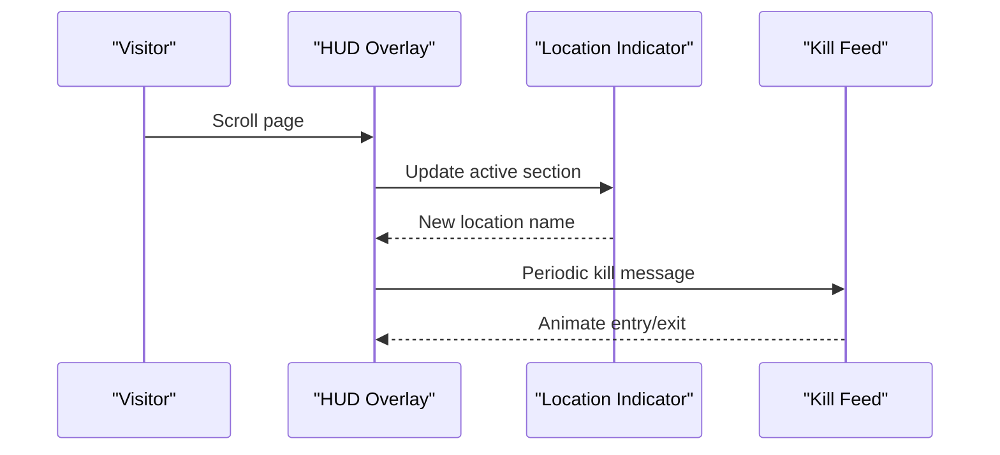

**Diagram sources**
- [terminal.js:269-313](file://portfolio/js/terminal.js#L269-L313)
- [terminal.js:315-385](file://portfolio/js/terminal.js#L315-L385)
- [main.css:363-600](file://portfolio/css/main.css#L363-L600)

**Section sources**
- [terminal.js:269-313](file://portfolio/js/terminal.js#L269-L313)
- [terminal.js:315-385](file://portfolio/js/terminal.js#L315-L385)
- [main.css:363-600](file://portfolio/css/main.css#L363-L600)

### Terminal and Chat Systems
- Command terminal with autocomplete, history, and typewriter output.
- Chat overlay with channels, message history, and keyboard shortcuts.
- Command routing to navigate sections and launch the aim trainer.

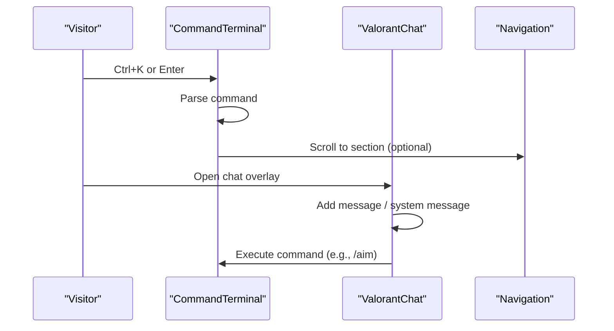

**Diagram sources**
- [terminal.js:387-683](file://portfolio/js/terminal.js#L387-L683)
- [terminal.js:5-267](file://portfolio/js/terminal.js#L5-L267)
- [data.js:54-130](file://portfolio/js/data.js#L54-L130)

**Section sources**
- [terminal.js:387-683](file://portfolio/js/terminal.js#L387-L683)
- [terminal.js:5-267](file://portfolio/js/terminal.js#L5-L267)
- [data.js:54-130](file://portfolio/js/data.js#L54-L130)

### Aim Trainer Game
- Target spawning with collision detection and scoring.
- Bullet traces from edges to click positions with muzzle flashes.
- Scoring, timing, and accuracy tracking with UI updates.

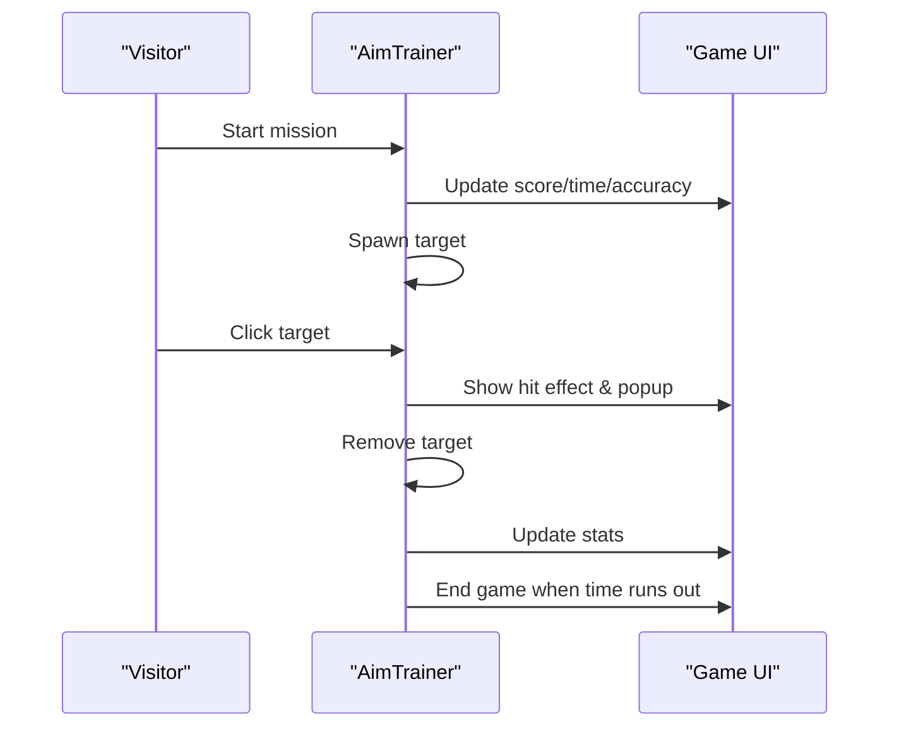

**Diagram sources**
- [main.js:610-800](file://portfolio/js/main.js#L610-L800)

**Section sources**
- [main.js:610-800](file://portfolio/js/main.js#L610-L800)

### Sound System
- Web Audio API-based sound manager with configurable volume and toggles.
- Per-action effects: hover, click, terminal typing, glitch, success.
- Lazy initialization on first user interaction.

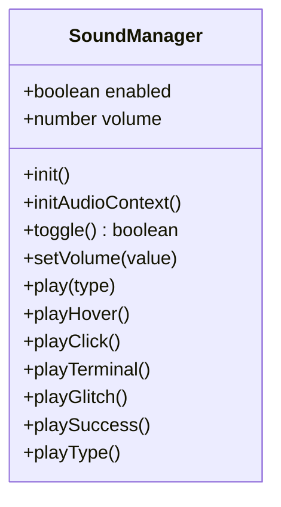

**Diagram sources**
- [sound.js:5-101](file://portfolio/js/sound.js#L5-L101)

**Section sources**
- [sound.js:5-101](file://portfolio/js/sound.js#L5-L101)

### Data Layer
- Static project data for modals and terminal commands.
- Sound effect configurations for consistent audio behavior.

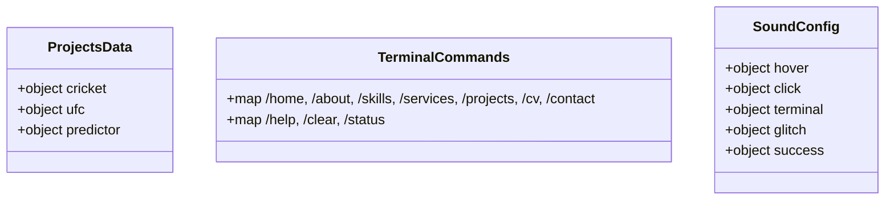

**Diagram sources**
- [data.js:5-52](file://portfolio/js/data.js#L5-L52)
- [data.js:54-130](file://portfolio/js/data.js#L54-L130)
- [data.js:132-159](file://portfolio/js/data.js#L132-L159)

**Section sources**
- [data.js:5-52](file://portfolio/js/data.js#L5-L52)
- [data.js:54-130](file://portfolio/js/data.js#L54-L130)
- [data.js:132-159](file://portfolio/js/data.js#L132-L159)

## Dependency Analysis
- Module coupling:
  - main.js orchestrates UI interactions and delegates to animations.js, sound.js, and terminal.js.
  - data.js provides static content consumed by modals and terminal.
  - animations.js depends on GSAP and ScrollTrigger for animations.
  - sound.js integrates with UI events for tactile feedback.
- External libraries:
  - GSAP and ScrollTrigger for advanced animations.
  - Font Awesome for icons.
  - Google Fonts for typography.

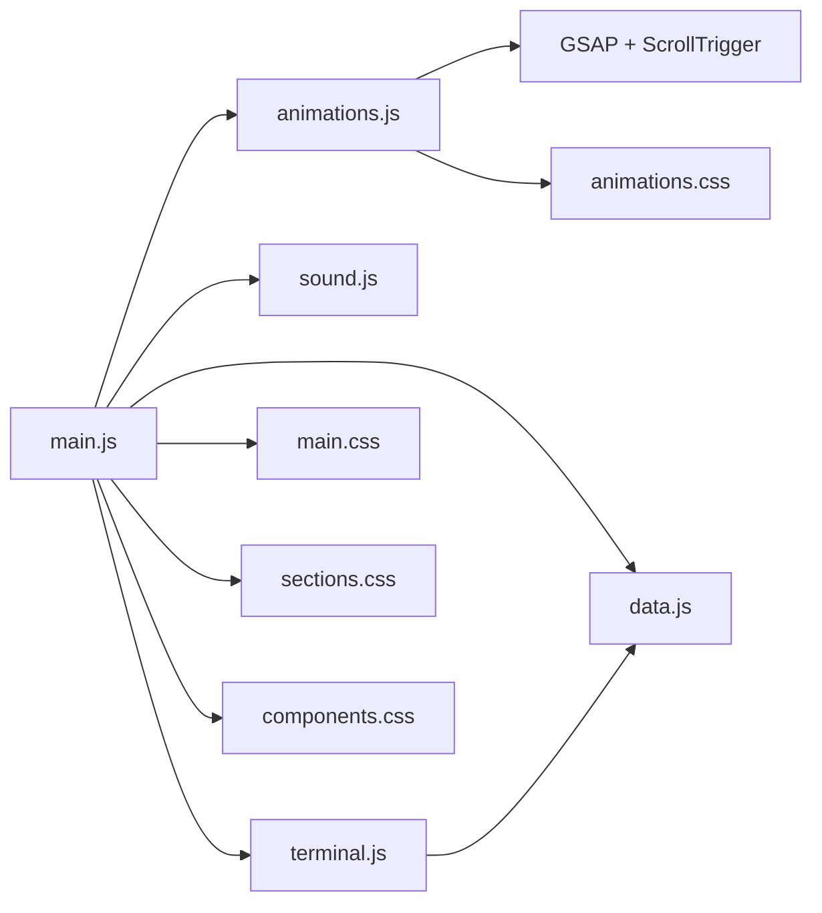

**Diagram sources**
- [main.js:1-1510](file://portfolio/js/main.js#L1-L1510)
- [animations.js:1-774](file://portfolio/js/animations.js#L1-L774)
- [sound.js:1-155](file://portfolio/js/sound.js#L1-L155)
- [terminal.js:1-683](file://portfolio/js/terminal.js#L1-L683)
- [data.js:1-165](file://portfolio/js/data.js#L1-L165)
- [main.css:1-1173](file://portfolio/css/main.css#L1-L1173)
- [animations.css:1-540](file://portfolio/css/animations.css#L1-L540)
- [sections.css:1-1872](file://portfolio/css/sections.css#L1-L1872)
- [components.css:1-1196](file://portfolio/css/components.css#L1-L1196)

**Section sources**
- [main.js:1-1510](file://portfolio/js/main.js#L1-L1510)
- [animations.js:1-774](file://portfolio/js/animations.js#L1-L774)
- [sound.js:1-155](file://portfolio/js/sound.js#L1-L155)
- [terminal.js:1-683](file://portfolio/js/terminal.js#L1-L683)
- [data.js:1-165](file://portfolio/js/data.js#L1-L165)
- [main.css:1-1173](file://portfolio/css/main.css#L1-L1173)
- [animations.css:1-540](file://portfolio/css/animations.css#L1-L540)
- [sections.css:1-1872](file://portfolio/css/sections.css#L1-L1872)
- [components.css:1-1196](file://portfolio/css/components.css#L1-L1196)

## Performance Considerations
- Use requestAnimationFrame for smooth animations and avoid layout thrashing.
- Prefer transform and opacity for animations to leverage GPU acceleration.
- Debounce or throttle scroll-related updates (e.g., HUD and parallax).
- Lazy-load heavy assets and defer non-critical scripts.
- Minimize DOM reads/writes inside tight loops; batch updates when possible.
- Consider virtualizing long lists (e.g., chat messages) if content grows.

## Troubleshooting Guide
- Audio does not play:
  - Ensure user interaction occurs before initializing the audio context.
  - Verify the sound toggle is enabled and volume is not zero.
- Animations stutter:
  - Confirm GSAP and ScrollTrigger are loaded and initialized.
  - Reduce the number of simultaneous animations or simplify effects.
- Terminal not responding:
  - Check that the overlay is present and not blocked by z-index stacking.
  - Verify command keys (Ctrl+K, Enter, Escape) are not intercepted by other handlers.
- Cursor not visible:
  - Ensure the custom cursor wrapper is appended to the DOM and not disabled on touch devices.
- HUD overlay glitches:
  - Validate active section detection logic and ensure section IDs match HUD dots.

**Section sources**
- [sound.js:13-26](file://portfolio/js/sound.js#L13-L26)
- [terminal.js:404-442](file://portfolio/js/terminal.js#L404-L442)
- [main.js:21-29](file://portfolio/js/main.js#L21-L29)
- [terminal.js:315-385](file://portfolio/js/terminal.js#L315-L385)

## Conclusion
JAJA Portfolio demonstrates a sophisticated blend of professional presentation and gaming-inspired interactivity. Its modular JavaScript architecture, rich animations, and immersive subsystems (terminal, HUD, aim trainer) collectively highlight Aryan Sharma’s technical depth and creative flair. Designed for engagement without sacrificing clarity, it serves as an ideal showcase for full-stack development and data analysis expertise, appealing to potential employers and collaborators who value both capability and compelling user experience.