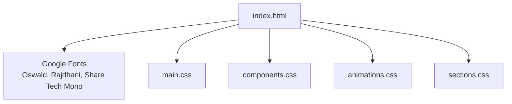
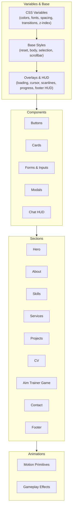
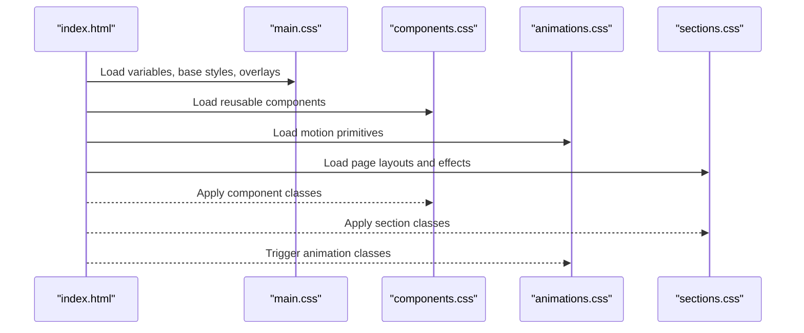
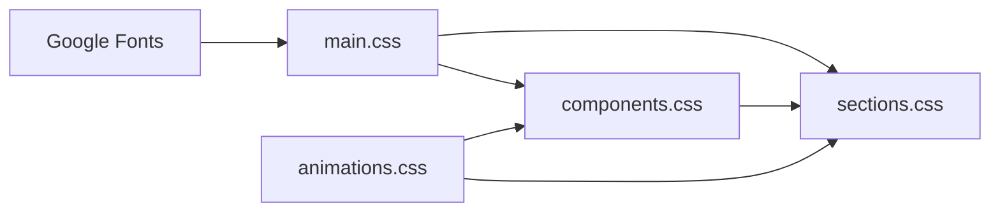

# Styling System

<cite>
**Referenced Files in This Document**
- [main.css](file://portfolio/css/main.css)
- [components.css](file://portfolio/css/components.css)
- [sections.css](file://portfolio/css/sections.css)
- [animations.css](file://portfolio/css/animations.css)
- [index.html](file://portfolio/index.html)
</cite>

## Table of Contents
1. [Introduction](#introduction)
2. [Project Structure](#project-structure)
3. [Core Components](#core-components)
4. [Architecture Overview](#architecture-overview)
5. [Detailed Component Analysis](#detailed-component-analysis)
6. [Dependency Analysis](#dependency-analysis)
7. [Performance Considerations](#performance-considerations)
8. [Troubleshooting Guide](#troubleshooting-guide)
9. [Conclusion](#conclusion)
10. [Appendices](#appendices)

## Introduction
This document describes the styling architecture of the JAJA Portfolio, a gaming-inspired personal website. The design system is built around a modular CSS structure:
- main.css defines variables, base styles, global overlays, and foundational elements.
- components.css provides reusable UI primitives (buttons, cards, forms, modals, HUD-like chat).
- sections.css implements page-specific layouts and tactical visual effects.
- animations.css encapsulates motion primitives and gameplay-inspired effects.

The system uses a cohesive color palette inspired by a tactical/gaming aesthetic, a strict typography hierarchy with Google Fonts (Oswald, Rajdhani, Share Tech Mono), and responsive breakpoints tailored to the gaming HUD theme.

## Project Structure
The styling system is organized into four primary CSS modules plus the HTML integration layer. The HTML loads fonts and links to the four CSS files in a specific order to ensure cascading precedence and consistent rendering.



**Diagram sources**
- [index.html:9-25](file://portfolio/index.html#L9-L25)
- [main.css:5-50](file://portfolio/css/main.css#L5-L50)
- [components.css:1-10](file://portfolio/css/components.css#L1-L10)
- [animations.css:1-10](file://portfolio/css/animations.css#L1-L10)
- [sections.css:1-10](file://portfolio/css/sections.css#L1-L10)

**Section sources**
- [index.html:9-25](file://portfolio/index.html#L9-L25)

## Core Components
This section outlines the modular CSS architecture and how each module contributes to the overall design system.

- main.css
  - Defines CSS custom properties for colors, typography, spacing, transitions, and z-index layers.
  - Provides global resets, base element styles, selection and scrollbar customization.
  - Implements foundational overlays: loading screen, custom cursor, scanline overlays, scroll progress bar, and a HUD-like footer overlay.
  - Establishes the base color scheme aligned with a tactical/gaming theme.

- components.css
  - Reusable UI primitives: buttons (primary, secondary, submit, ability), cards, form elements, transmit/status indicators, modals, and chat HUDs.
  - Implements scan-line effects for inputs and animated status indicators.
  - Provides VALORANT-style chat and kill feed components.

- sections.css
  - Page-specific layouts: hero, about, skills, services, projects, CV, aim trainer game, contact, and footer.
  - Tactical visual enhancements: corner brackets, scan lines, grid and radar overlays, profile glow effects, and mission status badges.
  - Responsive design with media queries targeting tablet and mobile breakpoints.

- animations.css
  - Motion primitives: glitch, text reveal, scanning line, radar sweep, grid overlay, pulse glow, floating, typing cursor, fade/slide/rotate scales, staggered children, skill bar fill, hover glow, shake/bounce, slide-in, flicker, particles, spinner, progress ring, border draw, ripple.
  - Gameplay-inspired effects: bullet traces, muzzle flashes, target appearance/pulse, hit/miss effects, score popups, and crosshair.

Practical usage patterns:
- Apply button classes (e.g., .btn-primary) to create consistent CTAs.
- Use .card for content containers with animated borders.
- Add .pulse-glow or .hover-glow to elements requiring attention.
- Attach .grid-overlay and .radar-sweep to background containers for tactical ambiance.
- Combine .scanline-overlay and .scanlines for CRT-like scanline effects.

**Section sources**
- [main.css:5-50](file://portfolio/css/main.css#L5-L50)
- [main.css:128-214](file://portfolio/css/main.css#L128-L214)
- [main.css:306-382](file://portfolio/css/main.css#L306-L382)
- [components.css:8-111](file://portfolio/css/components.css#L8-L111)
- [components.css:115-170](file://portfolio/css/components.css#L115-L170)
- [components.css:175-246](file://portfolio/css/components.css#L175-L246)
- [components.css:334-431](file://portfolio/css/components.css#L334-L431)
- [components.css:435-792](file://portfolio/css/components.css#L435-L792)
- [sections.css:8-195](file://portfolio/css/sections.css#L8-L195)
- [sections.css:386-454](file://portfolio/css/sections.css#L386-L454)
- [sections.css:458-606](file://portfolio/css/sections.css#L458-L606)
- [sections.css:610-822](file://portfolio/css/sections.css#L610-L822)
- [sections.css:877-1075](file://portfolio/css/sections.css#L877-L1075)
- [sections.css:1079-1190](file://portfolio/css/sections.css#L1079-L1190)
- [sections.css:1198-1316](file://portfolio/css/sections.css#L1198-L1316)
- [sections.css:1320-1380](file://portfolio/css/sections.css#L1320-L1380)
- [sections.css:1383-1690](file://portfolio/css/sections.css#L1383-L1690)
- [sections.css:1727-1872](file://portfolio/css/sections.css#L1727-L1872)
- [animations.css:8-63](file://portfolio/css/animations.css#L8-L63)
- [animations.css:110-127](file://portfolio/css/animations.css#L110-L127)
- [animations.css:132-152](file://portfolio/css/animations.css#L132-L152)
- [animations.css:157-168](file://portfolio/css/animations.css#L157-L168)
- [animations.css:173-184](file://portfolio/css/animations.css#L173-L184)
- [animations.css:189-196](file://portfolio/css/animations.css#L189-L196)
- [animations.css:201-205](file://portfolio/css/animations.css#L201-L205)
- [animations.css:210-224](file://portfolio/css/animations.css#L210-L224)
- [animations.css:229-259](file://portfolio/css/animations.css#L229-L259)
- [animations.css:264-278](file://portfolio/css/animations.css#L264-L278)
- [animations.css:283-304](file://portfolio/css/animations.css#L283-L304)
- [animations.css:309-316](file://portfolio/css/animations.css#L309-L316)
- [animations.css:321-328](file://portfolio/css/animations.css#L321-L328)
- [animations.css:333-340](file://portfolio/css/animations.css#L333-L340)
- [animations.css:345-353](file://portfolio/css/animations.css#L345-L353)
- [animations.css:358-365](file://portfolio/css/animations.css#L358-L365)
- [animations.css:370-398](file://portfolio/css/animations.css#L370-L398)
- [animations.css:403-415](file://portfolio/css/animations.css#L403-L415)
- [animations.css:420-442](file://portfolio/css/animations.css#L420-L442)
- [animations.css:447-458](file://portfolio/css/animations.css#L447-L458)
- [animations.css:463-481](file://portfolio/css/animations.css#L463-L481)
- [animations.css:485-513](file://portfolio/css/animations.css#L485-L513)
- [animations.css:518-540](file://portfolio/css/animations.css#L518-L540)

## Architecture Overview
The styling architecture follows a layered approach:
- Variables and base styles in main.css set the foundation.
- Components.css builds reusable primitives.
- Sections.css applies layout and tactical effects per page.
- Animations.css adds motion and gameplay cues.



**Diagram sources**
- [main.css:5-50](file://portfolio/css/main.css#L5-L50)
- [main.css:52-127](file://portfolio/css/main.css#L52-L127)
- [main.css:128-382](file://portfolio/css/main.css#L128-L382)
- [components.css:8-111](file://portfolio/css/components.css#L8-L111)
- [components.css:115-170](file://portfolio/css/components.css#L115-L170)
- [components.css:175-246](file://portfolio/css/components.css#L175-L246)
- [components.css:334-431](file://portfolio/css/components.css#L334-L431)
- [components.css:435-792](file://portfolio/css/components.css#L435-L792)
- [sections.css:8-195](file://portfolio/css/sections.css#L8-L195)
- [sections.css:386-454](file://portfolio/css/sections.css#L386-L454)
- [sections.css:458-606](file://portfolio/css/sections.css#L458-L606)
- [sections.css:610-822](file://portfolio/css/sections.css#L610-L822)
- [sections.css:877-1075](file://portfolio/css/sections.css#L877-L1075)
- [sections.css:1079-1190](file://portfolio/css/sections.css#L1079-L1190)
- [sections.css:1198-1316](file://portfolio/css/sections.css#L1198-L1316)
- [sections.css:1320-1380](file://portfolio/css/sections.css#L1320-L1380)
- [sections.css:1383-1690](file://portfolio/css/sections.css#L1383-L1690)
- [animations.css:8-63](file://portfolio/css/animations.css#L8-L63)
- [animations.css:110-127](file://portfolio/css/animations.css#L110-L127)
- [animations.css:132-152](file://portfolio/css/animations.css#L132-L152)
- [animations.css:157-168](file://portfolio/css/animations.css#L157-L168)
- [animations.css:173-184](file://portfolio/css/animations.css#L173-L184)
- [animations.css:189-196](file://portfolio/css/animations.css#L189-L196)
- [animations.css:201-205](file://portfolio/css/animations.css#L201-L205)
- [animations.css:210-224](file://portfolio/css/animations.css#L210-L224)
- [animations.css:229-259](file://portfolio/css/animations.css#L229-L259)
- [animations.css:264-278](file://portfolio/css/animations.css#L264-L278)
- [animations.css:283-304](file://portfolio/css/animations.css#L283-L304)
- [animations.css:309-316](file://portfolio/css/animations.css#L309-L316)
- [animations.css:321-328](file://portfolio/css/animations.css#L321-L328)
- [animations.css:333-340](file://portfolio/css/animations.css#L333-L340)
- [animations.css:345-353](file://portfolio/css/animations.css#L345-L353)
- [animations.css:358-365](file://portfolio/css/animations.css#L358-L365)
- [animations.css:370-398](file://portfolio/css/animations.css#L370-L398)
- [animations.css:403-415](file://portfolio/css/animations.css#L403-L415)
- [animations.css:420-442](file://portfolio/css/animations.css#L420-L442)
- [animations.css:447-458](file://portfolio/css/animations.css#L447-L458)
- [animations.css:463-481](file://portfolio/css/animations.css#L463-L481)
- [animations.css:485-513](file://portfolio/css/animations.css#L485-L513)
- [animations.css:518-540](file://portfolio/css/animations.css#L518-L540)
```

## Detailed Component Analysis

### CSS Custom Properties System
The system centralizes design tokens in :root, enabling consistent theming and easy maintenance. Key categories include:
- Color palette: primary tactical colors (red accents, dark backgrounds), HUD colors (green, blue, yellow), and neutral grays.
- Typography: display (Oswald), body (Rajdhani), and mono (Share Tech Mono).
- Spacing: section padding, container max-width, container padding.
- Transitions: fast, normal, slow durations.
- Z-index layers: cursor, loading, terminal, modal, nav, overlay.

Practical usage:
- Replace hardcoded values with var(--variable-name) for colors, fonts, spacing, and transitions.
- Adjust z-index layers globally by updating :root values.

**Section sources**
- [main.css:5-50](file://portfolio/css/main.css#L5-L50)

### Color Palette Implementation
The palette is designed for a tactical/gaming aesthetic:
- Primary red (#ff4655) for highlights, accents, and progress.
- Dark backgrounds (#0f1419, #1a1d24) for depth and contrast.
- HUD colors (green, blue, yellow) for status indicators and progress.
- Gradients and glows (e.g., val-red-glow) for motion emphasis.

Integration:
- Components and sections consistently reference these variables for unified visuals.
- Progress bars and status badges use HUD colors to signal state.

**Section sources**
- [main.css:7-27](file://portfolio/css/main.css#L7-L27)
- [components.css:48-78](file://portfolio/css/components.css#L48-L78)
- [sections.css:498-504](file://portfolio/css/sections.css#L498-L504)

### Typography Hierarchy
Typography is strictly enforced via CSS variables:
- Display: Oswald for headings and bold statements.
- Body: Rajdhani for readable text.
- Mono: Share Tech Mono for technical elements, status indicators, and code-like content.

Usage patterns:
- Apply font families using var(--font-display/body/mono) to maintain consistency across components and sections.

**Section sources**
- [main.css:28-31](file://portfolio/css/main.css#L28-L31)
- [components.css:13](file://portfolio/css/components.css#L13)
- [sections.css:268-274](file://portfolio/css/sections.css#L268-L274)

### Responsive Design Principles
Responsive breakpoints target common gaming HUD sizes:
- 1024px: Grid adjustments for services/projects/dossiers/timeline.
- 768px: Single-column layouts for mobile, reflow of stats and instructions.
- 480px: Tightened spacing, adjusted typography, and simplified navigation.

Effects:
- Flexbox and grid adapt to viewport width.
- Media queries adjust padding, font sizes, and component widths.

**Section sources**
- [sections.css:1727-1872](file://portfolio/css/sections.css#L1727-L1872)

### Gaming-Inspired Visual Effects
The site employs several gameplay-inspired visuals:
- Scanlines: .scanline-overlay and .scanlines create CRT-like scanning.
- Grid overlay: .grid-overlay adds subtle grid texture.
- Radar sweep: .radar-sweep animates a conic gradient for scanning.
- Pulse glow: .pulse-glow and hover-glow enhance interactivity.
- Floating: .floating for subtle elevation.
- Typing cursor: .typing-cursor for terminal-like feel.
- Fade/slide/rotate: .fade-in-up, .fade-in-left/right, .scale-in, .slide-in-left/right, .rotate-slow.
- Staggered children: .stagger-children for sequential reveals.
- Skill bar fill: .skill-fill with transition-based filling.
- Hover lift: .hover-lift for elevation on interaction.
- Border draw: .border-draw for animated borders.
- Ripple: .ripple for press feedback.

**Section sources**
- [main.css:306-338](file://portfolio/css/main.css#L306-L338)
- [animations.css:157-168](file://portfolio/css/animations.css#L157-L168)
- [animations.css:132-152](file://portfolio/css/animations.css#L132-L152)
- [animations.css:173-184](file://portfolio/css/animations.css#L173-L184)
- [animations.css:189-196](file://portfolio/css/animations.css#L189-L196)
- [animations.css:201-205](file://portfolio/css/animations.css#L201-L205)
- [animations.css:210-224](file://portfolio/css/animations.css#L210-L224)
- [animations.css:229-259](file://portfolio/css/animations.css#L229-L259)
- [animations.css:264-278](file://portfolio/css/animations.css#L264-L278)
- [animations.css:283-304](file://portfolio/css/animations.css#L283-L304)
- [animations.css:309-316](file://portfolio/css/animations.css#L309-L316)
- [animations.css:321-328](file://portfolio/css/animations.css#L321-L328)
- [animations.css:333-340](file://portfolio/css/animations.css#L333-L340)
- [animations.css:345-353](file://portfolio/css/animations.css#L345-L353)
- [animations.css:358-365](file://portfolio/css/animations.css#L358-L365)
- [animations.css:370-398](file://portfolio/css/animations.css#L370-L398)
- [animations.css:403-415](file://portfolio/css/animations.css#L403-L415)
- [animations.css:420-442](file://portfolio/css/animations.css#L420-L442)
- [animations.css:447-458](file://portfolio/css/animations.css#L447-L458)
- [animations.css:463-481](file://portfolio/css/animations.css#L463-L481)
- [animations.css:485-513](file://portfolio/css/animations.css#L485-L513)
- [animations.css:518-540](file://portfolio/css/animations.css#L518-L540)

### Tactical Aesthetic Implementation
Tactical elements unify the design:
- Corner brackets (.corner-tl/tr/bl/br) for profile framing.
- Scan lines (.scan-line) for profile overlays.
- Red-tinted overlays for a tactical look.
- Status badges with HUD colors (green/yellow/blue).
- Crosshair and HUD overlays emulate gaming interfaces.

**Section sources**
- [sections.css:160-201](file://portfolio/css/sections.css#L160-L201)
- [sections.css:108-131](file://portfolio/css/sections.css#L108-L131)
- [sections.css:971-993](file://portfolio/css/sections.css#L971-L993)
- [main.css:363-458](file://portfolio/css/main.css#L363-L458)

### Practical Styling Patterns
Common patterns observed across modules:
- Buttons: .btn-primary/.btn-secondary with pseudo-element hover effects and icon transitions.
- Cards: .card with animated top border and hover effects.
- Forms: .form-group with focus states, placeholder styling, and input scan-line effect.
- Modals: .modal-overlay with backdrop blur and scaling entrance.
- Chat HUD: .chat-overlay with tabs, messages, and input area styled for a gaming interface.
- Progress bars: .hud-progress-bar/.mission-progress-bar with gradient fills and pulsing effects.
- Skill bars: .skill-bar with animated fill and trailing glow.

**Section sources**
- [components.css:8-111](file://portfolio/css/components.css#L8-L111)
- [components.css:115-170](file://portfolio/css/components.css#L115-L170)
- [components.css:175-246](file://portfolio/css/components.css#L175-L246)
- [components.css:334-431](file://portfolio/css/components.css#L334-L431)
- [components.css:435-792](file://portfolio/css/components.css#L435-L792)
- [sections.css:498-504](file://portfolio/css/sections.css#L498-L504)
- [sections.css:690-727](file://portfolio/css/sections.css#L690-L727)

### Animation Techniques
Animation techniques include:
- Keyframe-driven effects: scan-down, radarRotate, progressPulse, messageSlide, targetAppear/Pulse, hitExpand/missFade, scoreFloat, and crosshair pulses.
- Transition-based fills: skill-fill, progress bars, and input scan lines.
- Utility classes: .pulse-glow, .floating, .hover-glow, .shake, .bounce, .slide-in-left/right, .flicker, .ripple, .border-draw.
- Gameplay effects: bullet-trace, muzzle-flash, and HUD overlays.

**Section sources**
- [main.css:168-214](file://portfolio/css/main.css#L168-L214)
- [main.css:429-443](file://portfolio/css/main.css#L429-L443)
- [main.css:591-600](file://portfolio/css/main.css#L591-L600)
- [animations.css:153-158](file://portfolio/css/animations.css#L153-L158)
- [animations.css:433-442](file://portfolio/css/animations.css#L433-L442)
- [sections.css:1546-1560](file://portfolio/css/sections.css#L1546-L1560)
- [sections.css:1562-1596](file://portfolio/css/sections.css#L1562-L1596)
- [sections.css:1599-1618](file://portfolio/css/sections.css#L1599-L1618)
- [sections.css:1634-1655](file://portfolio/css/sections.css#L1634-L1655)

### Integration Between Modules
The HTML integrates all CSS modules and provides hooks for JavaScript-driven interactions:
- Fonts loaded via Google Fonts.
- CSS linked in order: main.css, components.css, animations.css, sections.css.
- Sections use classes from components and animations to achieve cohesive visuals.
- JavaScript toggles classes (e.g., modal active, chat overlay active, HUD states) to drive animations and states.



**Diagram sources**
- [index.html:9-25](file://portfolio/index.html#L9-L25)
- [main.css:5-50](file://portfolio/css/main.css#L5-L50)
- [components.css:8-111](file://portfolio/css/components.css#L8-L111)
- [animations.css:8-63](file://portfolio/css/animations.css#L8-L63)
- [sections.css:8-195](file://portfolio/css/sections.css#L8-L195)

## Dependency Analysis
The styling system exhibits a clear dependency chain:
- main.css depends on Google Fonts and provides foundational tokens.
- components.css depends on main.css variables for consistent theming.
- sections.css depends on components.css for UI primitives and animations.css for motion.
- animations.css is standalone but frequently used by components and sections.



**Diagram sources**
- [index.html:9-12](file://portfolio/index.html#L9-L12)
- [main.css:5-50](file://portfolio/css/main.css#L5-L50)
- [components.css:8-111](file://portfolio/css/components.css#L8-L111)
- [animations.css:8-63](file://portfolio/css/animations.css#L8-L63)
- [sections.css:8-195](file://portfolio/css/sections.css#L8-L195)

**Section sources**
- [index.html:9-25](file://portfolio/index.html#L9-L25)

## Performance Considerations
- CSS custom properties reduce duplication and improve maintainability.
- Use will-change and transform/opacity for GPU-accelerated animations where possible.
- Limit heavy gradients and shadows on low-end devices; consider reducing blur and glow intensity.
- Prefer transform-based animations over layout-affecting properties (top/left) for smoother performance.
- Minimize repaints by batching DOM updates and avoiding frequent reflows.
- Use contain: layout/style/strict for complex sections to isolate layout costs.

[No sources needed since this section provides general guidance]

## Troubleshooting Guide
Common issues and resolutions:
- Fonts not loading: Verify Google Fonts links and preconnect tags.
- Animations stuttering: Reduce shadow/glow complexity; prefer transform/opacity; leverage will-change selectively.
- Z-index conflicts: Ensure z-index layers are correctly ordered in :root and used consistently across components.
- Scrollbar styling not applying: Confirm browser support for ::-webkit-scrollbar pseudo-elements; provide fallbacks.
- Modal not appearing: Check .modal-overlay.active class toggling and ensure z-index is above page content.
- Chat HUD not visible: Confirm .chat-overlay.active class and visibility transitions.

**Section sources**
- [index.html:9-12](file://portfolio/index.html#L9-L12)
- [main.css:110-126](file://portfolio/css/main.css#L110-L126)
- [components.css:334-370](file://portfolio/css/components.css#L334-L370)
- [components.css:435-452](file://portfolio/css/components.css#L435-L452)

## Conclusion
The JAJA Portfolio styling system delivers a cohesive, gaming-inspired aesthetic through a modular CSS architecture. By centralizing design tokens in main.css, providing reusable components in components.css, implementing page-specific layouts in sections.css, and enriching interactions with animations.css, the system achieves both visual consistency and performance. The tactical color palette, strict typography hierarchy, and responsive design ensure accessibility across devices while maintaining a compelling user experience.

[No sources needed since this section summarizes without analyzing specific files]

## Appendices

### Browser Compatibility Considerations
- CSS custom properties are widely supported in modern browsers; provide fallbacks for older environments if needed.
- @supports can be used to conditionally apply advanced features.
- WebKit-specific pseudo-elements (e.g., ::-webkit-scrollbar) require vendor prefixes and should be tested across browsers.
- Animations rely on transform and opacity; ensure hardware acceleration is available on target devices.

[No sources needed since this section provides general guidance]